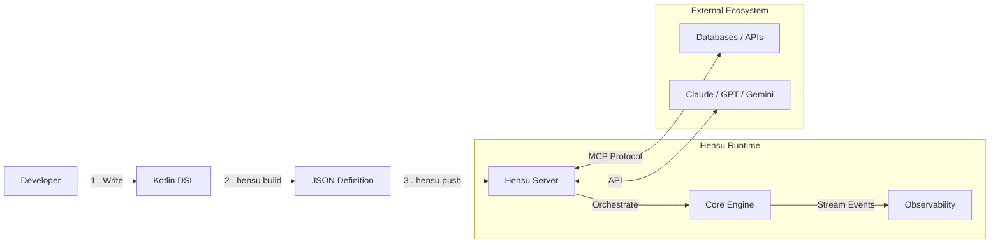

<div align="center">

# Hensu

### Open-Source Infrastructure for AI Agent Workflows

[](https://opensource.org/licenses/Apache-2.0)
[](https://jdk.java.net/)
[](https://graalvm.org/)
[](https://modelcontextprotocol.io/)
[]()

**Define. Build. Run.**<br>
Self-hosted. Developer-friendly. Zero lock-in.

[Get Started](#getting-started) • [Architecture](docs/unified-architecture.md) • [DSL Reference](docs/dsl-reference.md) • [Documentation](docs)

</div>

---

**Hensu** is a modular infrastructure stack for building and running multi-agent AI workflows. It separates the *
*definition of intelligence** (via a type-safe Kotlin DSL) from the **execution of intelligence** (via a
high-performance, native-image server).

Unlike monolithic frameworks, Hensu provides a "Build-Then-Push" architecture similar to Terraform or Docker. Workflows
are compiled locally into portable JSON execution definitions and pushed to a stateless, multi-tenant runtime that
manages the complex orchestration of LLMs, MCP tools, and human-in-the-loop gates.

## Key Capabilities

| Feature              | Description                                                                                      |
|:---------------------|:-------------------------------------------------------------------------------------------------|
| **Pure Java Core**   | Zero-dependency execution engine built on Java 25 virtual threads.                               |
| **Type-Safe DSL**    | Describe, don't implement. Define complex agent behaviors using a type-safe, declarative syntax. |
| **MCP Native**       | The server acts as an MCP Gateway. It **never** executes tools locally, ensuring security.       |
| **Multi-Tenancy**    | rigorous isolation using Java `ScopedValues` for safe SaaS deployment.                           |
| **Resilience**       | Distributed state architecture allows workflows to be paused, resumed, and migrated.             |
| **Agentic Planning** | Supports both static (pre-defined) and dynamic (LLM-generated) execution plans.                  |

---

## The Hensu Stack

Hensu strictly separates **Development** (managed by you) from **Execution** (managed by the server).

### 1. The Toolchain (Compiler & CLI)

* **[hensu-dsl](hensu-dsl/README.md):** The Source. A Kotlin DSL that compiles `.kt` files into static, versioned
  **Workflow Definitions** (JSON).
* **[hensu-cli](hensu-cli/README.md):** The Manager. Acts as a package manager for your workflows. It compiles
  definitions and synchronizes them with the Server's persistence layer (`build`, `push`, `pull`, `delete`, `list`).

### 2. The Runtime (Server & Core)

* **[hensu-core](hensu-core/README.md):** The Engine. A pure Java library that hydrates static Definitions into
  executable graphs. It handles state transitions, rubric evaluation, and agent interactions.
* **[hensu-server](hensu-server/README.md):** The Platform. A stateless, multi-tenant server that executes workflows.
  Its core feature is the **SSE Split-Pipe** for MCP: a secure, bidirectional tunnel that allows the server to request
  tool execution on tenant clients without requiring open inbound ports. It also exposes REST APIs for triggering
  instances and standard SSE for event monitoring.

---

## Architecture

The architecture follows a strict **Split-Pipe** model:

1. **Compilation:** The CLI compiles Kotlin DSL into a static **Workflow Definition** (JSON).
2. **Distribution:** The Definition is pushed to the Server's persistence layer.
3. **Execution:** The Server hydrates the Definition into an active instance. When a tool is needed, it uses the *
   *Split-Pipe** transport:
    * **Downstream (SSE):** The Server pushes a JSON-RPC tool request to the connected tenant client.
    * **Upstream (HTTP):** The Client executes the tool locally and `POST`s the result back.

**No user code runs on the server.** The server is a pure orchestrator; all side effects happen on the client via MCP.



---

## Workflow Example

Define complex, self-correcting behaviors using the Kotlin DSL. This example shows a writer/reviewer loop with a quality
gate.

```kotlin
fun contentPipeline() = workflow("ContentPipeline") {
    description = "Research, write, and review content with parallel review"
    version = "1.0.0"

    agents {
        agent("researcher") {
            role = "Research Analyst"
            model = Models.GEMINI_2_5_FLASH
            temperature = 0.3
        }

        agent("writer") {
            role = "Content Writer"
            model = Models.CLAUDE_SONNET_4_5
            temperature = 0.7
            maintainContext = true
        }

        agent("reviewer") {
            role = "Content Reviewer"
            model = Models.GPT_4O
            temperature = 0.5
        }
    }

    rubrics {
        rubric("content-quality", "content-quality.md")
    }

    graph {
        start at "research"

        node("research") {
            agent = "researcher"
            prompt = """
                Research {topic} and provide key facts.
                Output as JSON: {"fact1": "...", "fact2": "...", "fact3": "..."}
            """.trimIndent()

            outputParams = listOf("fact1", "fact2", "fact3")

            onSuccess goto "write"
            onFailure retry 2 otherwise "end_failure"
        }

        node("write") {
            agent = "writer"
            prompt = """
                Write an article about {topic} using these facts:
                - {fact1}
                - {fact2}
                - {fact3}
            """.trimIndent()

            onSuccess goto "parallel-review"
        }

        parallel("parallel-review") {
            branch("quality-review") {
                agent = "reviewer"
                prompt = "Review for quality: {write}"
            }
            branch("accuracy-review") {
                agent = "reviewer"
                prompt = "Review for accuracy: {write}"
            }

            consensus {
                strategy = ConsensusStrategy.MAJORITY_VOTE
                threshold = 0.5
            }

            onConsensus goto "end_success"
            onNoConsensus goto "write"
        }

        end("end_success", ExitStatus.SUCCESS)
        end("end_failure", ExitStatus.FAILURE)
    }
}
```

---

## Getting Started

### Prerequisites

- JDK 25+ (for building source)
- Docker (optional, for running the native server)
- API Keys (Anthropic, Gemini, OpenAI, etc.)

### 1. Installation

```shell
git clone [https://github.com/hensu-project/hensu.git](https://github.com/hensu-project/hensu.git) && cd hensu
./gradlew build -x test
```

### 2. Run the Server

```shell
java -jar hensu-server/build/quarkus-app/quarkus-run.jar
```

### 3. Build & Deploy a Workflow

```shell
# Create a new workflow file
echo 'fun flow() = workflow("hello") { ... }' > hello.kt

# Compile DSL to JSON
./hensu build hello.kt -d .

# Push to the local server
./hensu push hello --server http://localhost:8080
```

### 4. Execute

```shell
curl -X POST http://localhost:8080/api/v1/executions \
  -H "X-Tenant-ID: tenant-1" \
  -d '{"workflowId": "hello", "context": {"topic": "AI Agents"}}'
```

---

## Security & MCP

Hensu is designed for Zero-Trust environments.

- No Local Execution: The server does not support local shell execution. All side effects must be routed through the
  Model Context Protocol (MCP).
- Tenant Isolation: Workflow execution contexts are isolated using Java ScopedValues, preventing data leakage between
  concurrent executions.

<div align="center">

Built with

Java 25+ • Kotlin DSL • Quarkus • GraalVM Native Image • MCP Protocol

</div>