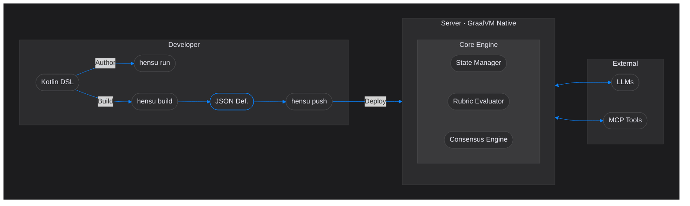

<div align="center">
    <br>

# Hensu

### Terraform for AI Agents.

[](https://opensource.org/licenses/Apache-2.0)
[](https://jdk.java.net/)
[](https://github.com/hensu-project/hensu/actions/workflows/ci.yml)
[](https://github.com/hensu-project/hensu/actions/workflows/native.yml)
[](https://modelcontextprotocol.io/)
[]()

</div>

---

Hensu defines AI agent workflows as directed graphs in a type-safe Kotlin DSL, compiles them to
portable JSON artifacts, and executes them on a GraalVM native server. The CLI and the server share
the same core engine — a workflow that passes locally deploys to production without modification.

<div align="center">

[Get Started](#getting-started) • [Architecture](docs/unified-architecture.md) • [DSL Reference](docs/dsl-reference.md) • [Documentation](docs)

</div>

---

## Getting Started

### 1. Install the CLI

```bash
curl -sSL https://raw.githubusercontent.com/hensu-project/hensu/main/hensu-cli/scripts/install.sh | bash
```

Supported on **Linux**, **macOS**, and **Windows** (WSL2 or Git Bash).

### 2. Clone the example workflows

```bash
git clone https://github.com/hensu-project/hensu.git && cd hensu
```

```
working-dir/
├── workflows/                  # Kotlin DSL workflow definitions
│   └── content-pipeline.kt
├── prompts/                    # agent prompt templates
│   └── agent-prompt.md
├── rubrics/                    # markdown scoring criteria
│   └── content-quality.md
└── build/                      # compiled output (hensu build)
    └── content-pipeline.json
```

### 3. Set an API key

The bundled example workflows use Google Gemini models. You can obtain a free
`GOOGLE_API_KEY` from [Google AI Studio](https://aistudio.google.com/app/apikey).

```bash
hensu credentials set GOOGLE_API_KEY
```

### 4. Run a workflow

```bash
hensu run content-pipeline -d working-dir -v -c '{"topic": "The Fermi Paradox"}'
```

### 5. Deploy to the server

Pre-built binaries are available for **Linux x86_64**. On macOS or Windows,
[build from source](docs/developer-guide-server.md#building-the-native-image).

```bash
# Download the server binary
curl -L https://github.com/hensu-project/hensu/releases/download/server/v0.1.0-beta.1/hensu-server-linux-x86_64 \
  -o hensu-server-v0.1.0-beta.1 && chmod +x hensu-server-v0.1.0-beta.1

# The server needs provider API keys as environment variables
export GOOGLE_API_KEY=<your-key>

# Start in in-memory mode (no database, no JWT)
QUARKUS_PROFILE=inmem ./hensu-server-v0.1.0-beta.1

# In a second terminal — build, push, execute:
hensu build content-pipeline -d working-dir
hensu push content-pipeline -d working-dir --server http://localhost:8080
curl -s -X POST http://localhost:8080/api/v1/executions \
  -H "Content-Type: application/json" \
  -d '{"workflowId": "content-pipeline", "context": {"topic": "AI Agents"}}'
```

For production setup with JWT auth and PostgreSQL, see the
[Server Developer Guide](docs/developer-guide-server.md#local-development).

---

## Workflow Example

Two agents, two quality layers: a rubric scores the draft automatically; a reviewer agent
approves or sends it back for revision.

```kotlin
fun contentPipeline() = workflow("content-pipeline") {
    agents {
        agent("writer")   { role = "Content Writer";   model = Models.GEMINI_3_1_FLASH_LITE }
        agent("reviewer") { role = "Content Reviewer"; model = Models.GEMINI_3_1_PRO }
    }

    rubrics { rubric("content-quality", "content-quality.md") }

    state {
        input("topic", VarType.STRING)
        variable("draft", VarType.STRING, "the full written article text")
    }

    graph {
        start at "write"

        node("write") {
            agent  = "writer"
            prompt = "Write a short article about {topic}. {recommendation}"
            writes("draft")
            rubric = "content-quality"
            onScore {
                whenScore lessThan 70.0 goto "write"  // score too low – retry
            }
            onSuccess goto "review"
        }

        node("review") {
            agent  = "reviewer"
            prompt = "Review this article: {draft}. Is it good enough to publish?"
            writes("draft")
            onApproval  goto "done"
            onRejection goto "write"                  // rejected – loop back
        }

        end("done", ExitStatus.SUCCESS)
    }
}
```

The [DSL Reference](docs/dsl-reference.md) covers parallel branches, consensus, dynamic planning,
fork/join, and sub-workflows.

---

## How It Compares

| Alternative                           | Trade-off                                                                                                       | Hensu's approach                                                                                                 |
|:--------------------------------------|:----------------------------------------------------------------------------------------------------------------|:-----------------------------------------------------------------------------------------------------------------|
| **Temporal / Camunda / Airflow**      | General-purpose durable execution with significant worker setup and serialization contracts up front.           | Workflows are standalone compiled artifacts — local execution and production share the same engine.              |
| **LangGraph / CrewAI / AutoGen**      | Single-threaded execution model; AI logic tends to couple tightly with application code.                        | Java 25 virtual threads enable parallel branch execution. Workflows are independent of the application codebase. |
| **LangChain4J / Spring AI / Embabel** | Graph construction lives inside application code — the workflow and the application are entangled from day one. | The DSL compiles to a portable JSON definition that can be validated, versioned, and deployed independently.     |
| **Custom in-house orchestrators**     | Mixing orchestration with tool execution creates an implicit remote-execution surface that grows over time.     | The MCP split-pipe enforces a hard boundary: the server orchestrates, tools execute on tenant clients.           |

---

## Capabilities

### Execution Model

- **Shared engine.** The CLI and server both run `hensu-core`. A workflow tested locally is the same
  artifact that runs in production.
- **Virtual-thread parallelism.** Parallel branches, consensus evaluation, and multi-tenant workloads
  run on Java 25 virtual threads.
- **Non-linear flow.** Loops, conditional branches, parallel fan-out with consensus (majority,
  unanimous, weighted, judge-decides), fork/join, and sub-workflows.

### Quality & Review

- **Rubric evaluation.** Automated quality gates score outputs against markdown rubric definitions
  and route on thresholds — self-correcting loops without custom parsing code.
- **Agentic planning.** Static (predefined) or dynamic (LLM-generated) execution plans within nodes,
  with mid-plan review gates.
- **Time-travel backtracking.** Rewind to any previous node mid-flight, optionally edit the prompt
  in `$EDITOR`, and re-execute. Full audit trail via `ExecutionHistory`.
- **Human review.** Optional or required approval checkpoints at any workflow step.

### Operations

- **Resilience.** PostgreSQL-backed checkpoints with atomic lease recovery — if the server restarts
  mid-execution, it resumes from the last checkpoint automatically.
- **Tenant isolation.** Java 25 `ScopedValues` enforce strict context boundaries between concurrent
  workflows.
- **Local daemon.** `hensu run` starts a warm resident process. Detach with `Ctrl+C`, re-attach
  with `hensu attach` — output is never lost.
- **Native binary.** The server ships as a GraalVM native image. No JVM to manage, no classpath to
  debug.

---

## Architecture

Hensu separates **authoring** (developer machine) from **execution** (server). The Kotlin compiler
runs client-side only — the server receives pre-compiled JSON and has no ability to execute
arbitrary code.


```mermaid
flowchart LR
    subgraph bg["‍"]
        direction LR
        subgraph dev["Developer"]
            dsl(["Kotlin DSL"])
            run(["hensu run"])
            build(["hensu build"])
            json(["JSON Def."])
            push(["hensu push"])
        end

        subgraph srv["Server · GraalVM Native"]
            subgraph engine["Core Engine"]
                sm(["State Manager"])
                re(["Rubric Evaluator"])
                ce(["Consensus Engine"])
            end
        end

        subgraph ext["External"]
            llms(["LLMs"])
            mcp(["MCP Tools"])
        end

        dsl -->|"Author"| run
        dsl -->|"Build"| build
        build --> json --> push -->|"Deploy"| srv
        srv <--> llms
        srv <--> mcp
    end

    style bg     fill:#1c1c1e, stroke:none
    style dev    fill:#2c2c2e, stroke:#3a3a3c, color:#ebebf5, stroke-width:1px
    style srv    fill:#2c2c2e, stroke:#3a3a3c, color:#ebebf5, stroke-width:1px
    style engine fill:#3a3a3c, stroke:#48484a, color:#ebebf5, stroke-width:1px
    style ext    fill:#2c2c2e, stroke:#3a3a3c, color:#ebebf5, stroke-width:1px
    style json   fill:#2c2c2e, stroke:#0A84FF, color:#ebebf5, stroke-width:1px

    style dsl    fill:#2c2c2e, stroke:#48484a, color:#ebebf5, stroke-width:1px
    style run    fill:#2c2c2e, stroke:#48484a, color:#ebebf5, stroke-width:1px
    style build  fill:#2c2c2e, stroke:#48484a, color:#ebebf5, stroke-width:1px
    style push   fill:#2c2c2e, stroke:#48484a, color:#ebebf5, stroke-width:1px
    style sm     fill:#2c2c2e, stroke:#48484a, color:#ebebf5, stroke-width:1px
    style re     fill:#2c2c2e, stroke:#48484a, color:#ebebf5, stroke-width:1px
    style ce     fill:#2c2c2e, stroke:#48484a, color:#ebebf5, stroke-width:1px
    style llms   fill:#2c2c2e, stroke:#48484a, color:#ebebf5, stroke-width:1px
    style mcp    fill:#2c2c2e, stroke:#48484a, color:#ebebf5, stroke-width:1px

    linkStyle default stroke:#0A84FF, stroke-width:1px
```

1. **Author.** Workflows are written in the Kotlin DSL and tested locally with `hensu run`.
2. **Build.** `hensu build` compiles the DSL into a static Workflow Definition (JSON).
3. **Push.** `hensu push` delivers the Definition to the server.
4. **Execute.** The server hydrates the Definition and runs it. When a tool call is needed, the
   split-pipe pushes the request to the tenant client via SSE; the client executes locally and
   posts the result back.

### Modules

| Module                                                   | Role                                                                                                              |
|:---------------------------------------------------------|:------------------------------------------------------------------------------------------------------------------|
| **[hensu-core](hensu-core/README.md)**                   | Pure Java execution engine. State transitions, rubric evaluation, agent interactions. Zero external dependencies. |
| **[hensu-dsl](hensu-dsl/README.md)**                     | Kotlin DSL that compiles `.kt` files into versioned Workflow Definitions (JSON).                                  |
| **[hensu-cli](hensu-cli/README.md)**                     | Local execution via `hensu run`. Server lifecycle: `build`, `push`, `pull`, `delete`, `list`.                     |
| **[hensu-server](hensu-server/README.md)**               | Multi-tenant GraalVM native server. SSE split-pipe for MCP tool routing.                                          |
| **[hensu-serialization](hensu-serialization/README.md)** | Jackson-based JSON serialization shared by the CLI and server.                                                    |

---

## Security

The server is a pure orchestrator. It has no shell, no `eval`, no script runner.

| Principle              | Implementation                                                                                                                                                                               |
|:-----------------------|:---------------------------------------------------------------------------------------------------------------------------------------------------------------------------------------------|
| **MCP split-pipe**     | All tool calls route through SSE to tenant clients. The server never executes side effects locally.                                                                                          |
| **Tenant isolation**   | Every execution runs inside a `ScopedValue` boundary. No state leaks between concurrent workflows.                                                                                           |
| **No inbound ports**   | Tenant clients connect outbound via SSE. No firewall rules required on the client side.                                                                                                      |
| **Externalized state** | Workflow state lives in pluggable repositories. The server can restart at any point without data loss.                                                                                       |
| **Input validation**   | API inputs are validated at the boundary. Identifiers use a restricted character set; free-text fields are sanitized against control character injection.                                    |
| **Output validation**  | LLM-generated outputs are checked before entering workflow state. Control characters, Unicode manipulation sequences (RTL overrides, zero-width chars), and oversized payloads are rejected. |
| **Native binary**      | GraalVM native image eliminates classpath scanning, reflection, and dynamic class loading as attack surfaces.                                                                                |

---

## Integration Example

The [`integrations/spring-reference-client`](integrations/spring-reference-client/README.md)
directory contains a Spring Boot application demonstrating end-to-end integration with the server:
MCP split-pipe connectivity, stub tool implementations, SSE event streaming, and a
human-in-the-loop review gate.

**Scenario:** a credit risk analyst agent evaluates a fictional credit-limit increase for
customer `C-42`. Complete the [Getting Started](#getting-started) steps before running this example.

```bash
QUARKUS_PROFILE=inmem ./hensu-server-v0.1.0-beta.1
hensu build risk-assessment -d integrations/spring-reference-client/working-dir && \
hensu push risk-assessment -d integrations/spring-reference-client/working-dir --server http://localhost:8080
cd integrations/spring-reference-client && ./gradlew bootRun
```

See the [reference client README](integrations/spring-reference-client/README.md) for the full
walkthrough.

---

## Current Limitations

Hensu is in **pre-beta**, working toward beta stability.

- Pre-built server binaries are Linux x86_64 only. macOS and ARM targets are planned.
- No observability integration yet (OpenTelemetry, metrics export).
- No native image integration tests yet. The native build is verified by CI, but test coverage runs in JVM mode only.
- OpenAI and DeepSeek models are defined in the DSL but have not been tested end-to-end. Only Anthropic and Google Gemini models are verified.
- APIs and DSL surface may change before beta.

---

<div align="center">

[License](LICENSE) · [Notice](NOTICE) · [Trademark](https://github.com/hensu-project/.github/blob/main/TRADEMARK.md) · [Contributing](https://github.com/hensu-project/.github/blob/main/CONTRIBUTING.md)

---

Java 25 · Kotlin DSL · Quarkus · GraalVM Native Image · MCP

<sub>Hensu™ and the axolotl logo are trademarks of Aleksandr Suvorov.<br>
Copyright 2025–2026 Aleksandr Suvorov. All rights reserved.</sub>

</div>
