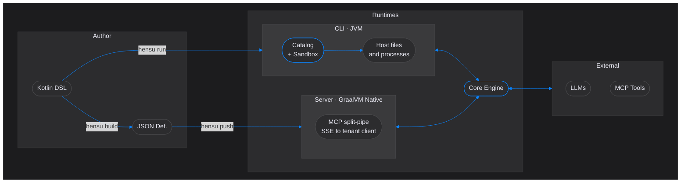

<div align="center">
    <br>

# Hensu

### Terraform for AI Agents.

[](https://opensource.org/licenses/Apache-2.0)
[](https://jdk.java.net/)
[](https://github.com/hensu-project/hensu/actions/workflows/ci.yml)
[](https://github.com/hensu-project/hensu/actions/workflows/native.yml)
[](https://modelcontextprotocol.io/)
[]()

</div>

---

Hensu applies the Terraform pattern to agent workflows. You declare the workflow as a directed
graph in a type-safe Kotlin DSL, `hensu build` compiles it to a portable JSON artifact, and the
same artifact runs unchanged wherever you apply it.

One core engine runs that artifact in two places with deliberately different powers. The server is
a multi-tenant GraalVM native binary that executes nothing locally and routes every side effect to
tenant-owned MCP servers. The CLI runs on your own machine and may run the commands you wrote down
in a catalog – builds, tests, deploys – each one contained by an OS sandbox rather than by
convention. A workflow that passes locally deploys to production without modification.

<div align="center">

[Get Started](#getting-started) • [Architecture](docs/unified-architecture.md) • [DSL Reference](docs/dsl-reference.md) • [Documentation](docs)

</div>

---

## What a Workflow Looks Like

Two agents and two quality gates. A rubric scores every draft and sends a weak one back with the
scorer's feedback. A reviewer agent then approves the article or returns it for revision, up to
three times, before the run fails cleanly instead of looping forever.

```kotlin
fun contentPipeline() = workflow("content-pipeline") {
    description = "Two-agent content pipeline: writer drafts, reviewer approves or loops back"
    version = "1.0.0"

    agents {
        agent("writer")   { role = "Content Writer";   model = Models.GEMINI_3_1_FLASH_LITE }
        agent("reviewer") { role = "Content Reviewer"; model = Models.GEMINI_3_1_FLASH_LITE }
    }

    state {
        input("topic", VarType.STRING)
        variable("draft", VarType.STRING, "the full written article text")
    }

    graph {
        start at "write"

        node("write") {
            agent  = "writer"
            prompt = "Write a short article about {topic}."
            writes("draft")
            rubric = "content-quality.md"
            onScore {
                whenScore lessThan 70.0 goto "write" withFeedback   // weak draft: retry with feedback
            }
            onSuccess goto "review"
        }

        node("review") {
            agent  = "reviewer"
            prompt = "Review this article: {draft}. Is it good enough to publish?"
            writes("draft")
            onApproval  goto "done"
            onRejection revise "write" retry 3 otherwise "needs-work"
        }

        end("done", ExitStatus.SUCCESS)
        end("needs-work", ExitStatus.FAILURE)
    }
}
```

That is `working-dir/workflows/content-pipeline.kt` in this repository, minus its file header. The
[DSL Reference](docs/dsl-reference.md) covers condition-based routing (`onCondition`, for bounded
self-revising work loops), tool-equipped agents, parallel branches, consensus, fork/join, and
sub-workflows.

---

## What a Run Looks Like

`-v` prints the resolved node, then every prompt in and every response out, as they happen. The
transcript below is a `--no-color` run; a terminal shows the same output styled.

```console
$ hensu run content-pipeline -d working-dir -v -c '{"topic": "The Antikythera Mechanism"}'

✓ content-pipeline loaded
  agents   2
  nodes    4

┌─ write (STANDARD)
│  agent     writer
│  rubric    7 criteria
│  → write          score LT 70.0
│  → review         on success
└─
┌─ input · write → writer ───────────────────────────────────────────
  Write a short article about The Antikythera Mechanism.
└────────────────────────────────────────────────────────────────────

┌─ output · write ← writer · OK ─────────────────────────────────────
  A Greek shipwreck gave up a corroded lump of bronze in 1901. It
  took a century to accept what it was: a geared computer. […]
└────────────────────────────────────────────────────────────────────

✓ Workflow completed successfully
  status      SUCCESS
  steps       2
  backtracks  0
```

Drop `-v` and the run is silent except for routing warnings. Add `--interactive` and the review
gate becomes a prompt in the terminal.

---

## Getting Started

### Prerequisites

- **Java 25 or newer** on your `PATH`. The installer checks for it, and the launcher it writes
  enables preview features for you.
- For workflows that run commands: **bubblewrap** on Linux (Ubuntu 24.04 also needs the AppArmor
  profile in [`tools/apparmor/bwrap`](tools/apparmor/bwrap)); nothing extra on macOS. See
  [Host setup](docs/command-catalog.md#host-setup). LLM-only workflows need neither.

### 1. Install the CLI

```bash
curl -sSL https://raw.githubusercontent.com/hensu-project/hensu/main/hensu-cli/scripts/install.sh | bash
```

Supported on **Linux**, **macOS**, and **Windows through WSL2**.

### 2. Clone the repository for the example project

```bash
git clone https://github.com/hensu-project/hensu.git && cd hensu
```

Its `working-dir/` is a complete example project. The parts that matter:

```
working-dir/
├── workflows/                  # Kotlin DSL workflow definitions
│   └── content-pipeline.kt
├── prompts/                    # agent prompt templates
├── rubrics/                    # markdown scoring criteria
│   └── content-quality.md
├── commands.yaml               # the command catalog: everything a local run may execute
└── build/                      # compiled output of `hensu build`
    └── content-pipeline.json
```

### 3. Set an API key

The bundled example workflows use Google Gemini models. You can obtain a free `GOOGLE_API_KEY`
from [Google AI Studio](https://aistudio.google.com/app/apikey).

```bash
hensu credentials set GOOGLE_API_KEY
```

### 4. Run a workflow

```bash
hensu run content-pipeline -d working-dir -v -c '{"topic": "The Antikythera Mechanism"}'
```

`-d` points at the working directory, `-c` seeds the workflow's input variables, and `-v` shows
each agent's inputs, outputs, and tool calls as they happen.

### 5. Deploy to the server

Pre-built binaries are available for **Linux x86_64**. On macOS or Windows,
[build from source](docs/developer-guide-server.md#building-the-native-image).

```bash
# Download the server binary
curl -L https://github.com/hensu-project/hensu/releases/download/server/v0.1.0-beta.1/hensu-server-linux-x86_64 \
  -o hensu-server-v0.1.0-beta.1 && chmod +x hensu-server-v0.1.0-beta.1

# The server needs provider API keys as environment variables
export GOOGLE_API_KEY=<your-key>

# Start in in-memory mode (no database, no JWT)
QUARKUS_PROFILE=inmem ./hensu-server-v0.1.0-beta.1

# In a second terminal: build, push, execute
hensu build content-pipeline -d working-dir
hensu push content-pipeline -d working-dir --server http://localhost:8080
curl -s -X POST http://localhost:8080/api/v1/executions \
  -H "Content-Type: application/json" \
  -d '{"workflowId": "content-pipeline", "context": {"topic": "AI Agents"}}'
```

For production setup with JWT auth and PostgreSQL, see the
[Server Developer Guide](docs/developer-guide-server.md#local-development).

---

## How It Compares

| Alternative                           | Trade-off                                                                                                             | Hensu's Approach                                                                                                                                          |
|:--------------------------------------|:----------------------------------------------------------------------------------------------------------------------|:----------------------------------------------------------------------------------------------------------------------------------------------------------|
| **Temporal / Camunda / Airflow**      | General-purpose durable execution. Workers, activities, and serialization contracts come before the first agent runs. | A workflow is a standalone compiled artifact. Local runs and production share one engine, and checkpoints come with it.                                   |
| **LangGraph / CrewAI / AutoGen**      | The graph is built inside the Python application, and tools reach whatever the process can reach.                     | The workflow is a versioned artifact independent of any application. Tool reach is declared in a catalog and enforced by the kernel.                      |
| **LangChain4j / Spring AI / Embabel** | Graph construction lives inside application code. The workflow and the application are entangled from day one.        | The DSL compiles to a JSON definition that is validated, versioned, and deployed on its own.                                                              |
| **Custom in-house orchestrators**     | Orchestration and tool execution grow together into an implicit execution surface.                                    | Execution is declared, never accreted. The server executes nothing and routes via MCP; the CLI runs only what `commands.yaml` names, under an OS sandbox. |

---

## Capabilities

### Shared engine

- **One artifact, two runtimes.** The CLI and the server both run `hensu-core`. The artifact you
  tested locally is the artifact that runs in production.
- **Parallel by default.** Parallel branches, consensus evaluation, and multi-tenant workloads run
  on Java 25 virtual threads.
- **Non-linear flow.** Condition-routed loops with bounded revise budgets, conditional branches,
  parallel fan-out with consensus (majority, unanimous, weighted, judge-decides), fork/join, and
  sub-workflows.
- **Rubric evaluation.** Markdown rubrics score outputs and route on thresholds, so a node can send
  weak work back with feedback and no custom parsing code.
- **Agent-native tool loop.** Agents drive their own tool calls within a per-node budget. Tools come
  from the runtime – MCP on the server, the command catalog on the CLI – and every call and result
  reaches the execution listener.
- **Human review.** Optional or required approval checkpoints at any step, in the terminal or over
  the API.
- **Time-travel backtracking.** Rewind to any earlier node mid-flight, optionally edit the prompt in
  `$EDITOR`, and re-execute. The full history stays in the audit trail.
- **Model providers.** Anthropic and Google Gemini are verified end to end. OpenAI and DeepSeek
  model ids exist in the DSL but are untested – see [Current Limitations](#current-limitations).

### Local execution (CLI)

- **Only the commands you declared.** `commands.yaml` is the complete set of operations a local run
  may execute, and each node grants an agent only the subset it needs. Every command runs inside an
  OS sandbox. How both gates work: [the CLI executes what you granted](#the-cli-executes-what-you-granted).
- **Warm starts.** `hensu daemon start` keeps a JVM and Kotlin compiler resident, so `hensu run`
  starts in milliseconds. Detach with `Ctrl+C`, re-attach with `hensu attach`; output is never lost.
- **Run management.** `hensu ps` lists live executions, `hensu attach` follows one, `hensu cancel`
  ends it.

### Remote execution (server)

- **MCP split-pipe.** Tool calls travel outbound over SSE to the tenant's own client, which runs
  them against its own MCP servers and posts the result back.
- **Live execution stream.** Execution events stream to callers over SSE as the workflow runs.
- **Resilience.** PostgreSQL-backed checkpoints with atomic lease recovery. If the server restarts
  mid-execution, it resumes from the last checkpoint.
- **Tenant isolation.** Each execution carries its own scoped boundary, so concurrent tenants never
  observe one another's state.
- **Single binary.** Ships as a GraalVM native image – no JVM to manage, no classpath to debug.
  What that removes from the attack surface: [the server executes nothing](#the-server-executes-nothing).

---

## Architecture

Hensu separates **authoring** from **execution**, then offers two execution runtimes with
deliberately different powers. The Kotlin compiler runs client-side only, so the server receives
pre-compiled JSON and has no ability to execute arbitrary code.

Both runtimes embed the **same** core engine – `hensu-core` is a single module with zero third-party
dependencies. Orchestration semantics are therefore identical whether a workflow runs locally or
remotely; only the capabilities wrapped around the engine differ.


```mermaid
flowchart LR
    subgraph bg["‍"]
        direction LR
        subgraph dev["Author"]
            dsl(["Kotlin DSL"])
            json(["JSON Def."])
        end

        subgraph rt["Runtimes"]
            direction TB
            subgraph cli["CLI · JVM"]
                direction LR
                gate(["Catalog<br/>+ Sandbox"])
                host(["Host files<br/>and processes"])
            end

            core(["Core Engine"])

            subgraph srv["Server · GraalVM Native"]
                pipe(["MCP split-pipe<br/>SSE to tenant client"])
            end
        end

        subgraph ext["External"]
            llms(["LLMs"])
            mcp(["MCP Tools"])
        end

        dsl -->|"hensu run"| cli
        dsl -->|"hensu build"| json
        json -->|"hensu push"| srv
        cli <--> core
        srv <--> core
        core <--> ext
        gate --> host
    end

    style bg   fill:#1c1c1e, stroke:none
    style dev  fill:#2c2c2e, stroke:#3a3a3c, color:#ebebf5, stroke-width:1px
    style rt   fill:#2c2c2e, stroke:#3a3a3c, color:#ebebf5, stroke-width:1px
    style ext  fill:#2c2c2e, stroke:#3a3a3c, color:#ebebf5, stroke-width:1px
    style cli  fill:#3a3a3c, stroke:#48484a, color:#ebebf5, stroke-width:1px
    style srv  fill:#3a3a3c, stroke:#48484a, color:#ebebf5, stroke-width:1px
    style core fill:#2c2c2e, stroke:#0A84FF, color:#ebebf5, stroke-width:1px
    style gate fill:#2c2c2e, stroke:#0A84FF, color:#ebebf5, stroke-width:1px

    style dsl  fill:#2c2c2e, stroke:#48484a, color:#ebebf5, stroke-width:1px
    style json fill:#2c2c2e, stroke:#48484a, color:#ebebf5, stroke-width:1px
    style host fill:#2c2c2e, stroke:#48484a, color:#ebebf5, stroke-width:1px
    style pipe fill:#2c2c2e, stroke:#48484a, color:#ebebf5, stroke-width:1px
    style llms fill:#2c2c2e, stroke:#48484a, color:#ebebf5, stroke-width:1px
    style mcp  fill:#2c2c2e, stroke:#48484a, color:#ebebf5, stroke-width:1px

    linkStyle default stroke:#0A84FF, stroke-width:1px
```

1. **Author.** Write the workflow in the Kotlin DSL.
2. **Run locally.** `hensu run` compiles the DSL in-process and executes it on your machine – no
   separate build step required. Commands come from `commands.yaml` and launch inside an OS
   sandbox, under the two gates described in [Security](#the-cli-executes-what-you-granted).
3. **Build.** `hensu build` compiles the workflow into a static Workflow Definition (JSON).
4. **Push.** `hensu push` delivers the definition to the server.
5. **Execute remotely.** The server hydrates the definition and orchestrates it. When a tool call
   is needed, the MCP *split-pipe* pushes the request down an SSE stream to the tenant's client,
   which runs it against its own MCP servers and posts the result back.

### Modules

| Module                                                     | Role                                                                                                                                                                                                                         |
|:-----------------------------------------------------------|:-----------------------------------------------------------------------------------------------------------------------------------------------------------------------------------------------------------------------------|
| **[hensu-core](hensu-core/README.md)**                     | Pure Java execution engine. State transitions, rubric evaluation, agent interactions. Zero external dependencies.                                                                                                            |
| **[hensu-dsl](hensu-dsl/README.md)**                       | Kotlin DSL that compiles `.kt` files into versioned Workflow Definitions (JSON).                                                                                                                                             |
| **[hensu-cli](hensu-cli/README.md)**                       | Local execution runtime and workflow tooling: `run`, `validate`, `visualize`, `build`, `push`/`pull`/`delete`/`list`, plus `daemon`, `ps`, `attach`, `cancel`, and `credentials`. Runs catalog commands under an OS sandbox. |
| **[hensu-server](hensu-server/README.md)**                 | Multi-tenant GraalVM native server. SSE split-pipe for MCP tool routing. SSE execution event streaming.                                                                                                                      |
| **[hensu-serialization](hensu-serialization/README.md)**   | Jackson-based JSON serialization shared by the CLI and server.                                                                                                                                                               |
| **[hensu-mcp](hensu-mcp/README.md)**                       | Runtime-agnostic MCP protocol layer. JSON-RPC messages, schema conversion, result rendering.                                                                                                                                 |
| **[hensu-langchain4j-adapter](hensu-langchain4j-adapter)** | Bridges the `hensu-core` Agent abstraction with LangChain4j `ChatModel` implementations.                                                                                                                                     |

---

## Security

Two runtimes, two different answers to the question of what a running workflow may do.

### The server executes nothing

It is a pure orchestrator: no shell, no `eval`, no script runner.

| Principle              | Implementation                                                                                                                                                                                                         |
|:-----------------------|:-----------------------------------------------------------------------------------------------------------------------------------------------------------------------------------------------------------------------|
| **MCP split-pipe**     | All tool calls route through SSE to tenant clients. The server never executes side effects locally.                                                                                                                    |
| **Tenant isolation**   | Every execution runs inside a `ScopedValue` boundary established when it starts and discarded when it ends.                                                                                                            |
| **No inbound ports**   | Tenant clients connect outbound via SSE. No firewall rules required on the client side.                                                                                                                                |
| **Externalized state** | Workflow state lives in pluggable repositories. The server can restart at any point without data loss.                                                                                                                 |
| **Input validation**   | API inputs are validated at the boundary. Identifiers use a restricted character set; free-text fields are sanitized against control character injection.                                                              |
| **Output validation**  | LLM-generated outputs are checked before entering workflow state. Control characters, Unicode manipulation sequences (RTL overrides, zero-width chars), and oversized payloads are rejected. Applies to both runtimes. |
| **Native binary**      | GraalVM native image eliminates classpath scanning, reflection, and dynamic class loading as attack surfaces.                                                                                                          |

### The CLI executes what you granted

Running a workflow locally is the point of the CLI: it can build, test, convert, deploy – whatever
you wrote down. What you write down is a catalog entry:

```yaml
commands:
  run-tests:
    description: "Run the suite so the implementer can check its own work"
    exec: ["./gradlew", "test", "--tests", "{filter}"]
    timeout: 120000
    sandbox:
      network: false
      write: ["build", ".gradle"]
      cache: ["~/.gradle/caches"]
    tool:
      description: "Run the tests. Pass a class name to narrow the run."
      params:
        filter: { type: string, required: false, pattern: "^[A-Za-z0-9_.*]+$", maxLength: 128 }
```

Two gates decide what that entry means, and they answer different questions. The catalog decides
*which binary* may run and with what argument shape. The sandbox decides *how far* the resulting
process tree reaches.

> **What the catalog can and cannot promise.** Wherever a granted binary executes *content the agent
> can write* – an interpreter running a script, a build tool running a build file, a migration runner
> running migrations – the catalog has already granted arbitrary code execution inside the sandbox,
> whether or not a rung exists. On those paths the sandbox is the security boundary and the catalog's
> job is governing *grants*. Everywhere else the catalog is a genuine allowlist. Hensu documents
> which is which instead of claiming the stronger property everywhere.

| Principle                         | Implementation                                                                                                                                                                                                                                                                     |
|:----------------------------------|:-----------------------------------------------------------------------------------------------------------------------------------------------------------------------------------------------------------------------------------------------------------------------------------|
| **The catalog is the allowlist**  | `commands.yaml` is exactly the set of binaries a deployment may run. Workflows and agents submit a command id and parameter values, never command text. Executables resolve to absolute paths when the file loads, and one bad entry fails the whole catalog with its line number. |
| **No shell on the argument path** | Parameters bind as whole argv elements handed to `execve`. `&&`, `$()`, `\|` and newlines inside an argument are inert bytes. There is nothing to escape because nothing downstream re-parses them.                                                                                |
| **OS containment**                | Every command launches inside a kernel sandbox, bubblewrap on Linux and Seatbelt on macOS, so the policy binds children and grandchildren, not just what the agent typed. No working backend means the command is refused, never quietly run unsandboxed.                          |
| **Closed by default**             | No network, no writable path beyond the call's own private `$HOME`, no host cache. Every widening is explicit in configuration a human wrote.                                                                                                                                      |
| **The catalog is immune**         | `commands.yaml` and `mcp.yaml` are re-bound read-only *after* the writable subtrees, so a command granted `write: ["."]` still cannot rewrite the allowlist that decides what it may run.                                                                                          |
| **Hermetic environment**          | The child's environment is built from an allowlist rather than inherited. A credential that was never copied cannot leak.                                                                                                                                                          |
| **A declared escape hatch**       | A *rung* (`rung: true`) is the one entry whose command line the agent writes, for the operations no catalog can enumerate. It does not exist unless you declare it, and it is pinned to the closed policy with no way for configuration to widen it.                               |

Full model: [Architecture § Decision 4](docs/unified-architecture.md). Operator reference:
[Command Catalog](docs/command-catalog.md).

---

## Integration Example

The [`integrations/spring-reference-client`](integrations/spring-reference-client/README.md)
directory contains a Spring Boot application demonstrating end-to-end integration with the server:
MCP split-pipe connectivity, stub tool implementations, SSE event streaming, and a
human-in-the-loop review gate.

**Scenario:** a credit risk analyst agent evaluates a fictional credit-limit increase for
customer `C-42`. Complete the [Getting Started](#getting-started) steps before running this example.

```bash
QUARKUS_PROFILE=inmem ./hensu-server-v0.1.0-beta.1
hensu build risk-assessment -d integrations/spring-reference-client/working-dir && \
hensu push risk-assessment -d integrations/spring-reference-client/working-dir --server http://localhost:8080
cd integrations/spring-reference-client && ./gradlew bootRun
```

See the [reference client README](integrations/spring-reference-client/README.md) for the full
walkthrough.

---

## Current Limitations

Hensu is in **pre-beta**, working toward beta stability.

- Pre-built server binaries are Linux x86_64 only. macOS and ARM targets are planned.
- Local command execution needs a containment backend (see [Prerequisites](#prerequisites)).
  Without one, commands are refused rather than run unsandboxed. Windows has no native backend yet;
  run the CLI under WSL2, where bubblewrap is available.
- No observability integration yet (OpenTelemetry, metrics export).
- No native image integration tests yet. The native build is verified by CI, but test coverage runs
  in JVM mode only.
- OpenAI and DeepSeek models are defined in the DSL but have not been tested end-to-end. Only
  Anthropic and Google Gemini models are verified.
- APIs and DSL surface may change before beta.

---

<div align="center">

[License](LICENSE) · [Notice](NOTICE) · [Trademark](https://github.com/hensu-project/.github/blob/main/TRADEMARK.md) · [Contributing](https://github.com/hensu-project/.github/blob/main/CONTRIBUTING.md)

---

Java 25 · Kotlin DSL · Quarkus · GraalVM Native Image · MCP

<sub>Hensu™ and the axolotl logo are trademarks of Aleksandr Suvorov.<br>
Copyright 2025–2026 Aleksandr Suvorov. All rights reserved.</sub>

</div>
