# Command Catalog Guide

How to declare the commands a Hensu deployment may run, and what each part of the declaration
buys you.

**This is a CLI-only mechanism.** `commands.yaml` and `mcp.yaml` are read by the `hensu` CLI, the
runtime that executes workflows on the operator's own machine. The server runtime never reads either
file and cannot: it has no local shell, so an `execute(...)` action fails there at runtime, and the
tools an agent sees come from the tenant's own MCP servers instead. Throughout this guide,
"a deployment" means one CLI install and the working directory it runs in.

Commands live in `commands.yaml` in the working directory. Workflows reference them by ID
through `execute(...)` actions, and agents call the ones marked agent-visible as tools. Nothing
in a workflow, a prompt, or an agent response ever supplies command text.

---

## Table of Contents

- [The two gates](#the-two-gates)
- [Adding a command](#adding-a-command)
- [Grammar reference](#grammar-reference)
- [Chaining and composition](#chaining-and-composition)
- [Parameters](#parameters)
- [Sandbox policy](#sandbox-policy)
- [Approval and unattended runs](#approval-and-unattended-runs)
- [Exposing a command to agents](#exposing-a-command-to-agents)
- [The environment a command receives](#the-environment-a-command-receives)
- [MCP servers (`mcp.yaml`)](#mcp-servers-mcpyaml)
- [Failure modes](#failure-modes)
- [Host setup](#host-setup)

---

## The two gates

Command execution is guarded twice, and the two gates answer different questions.

The **catalog** answers *which binary may run*. It is an allowlist: the set of programs a
deployment can execute is exactly the set written in `commands.yaml`, resolved to absolute paths
when the file loads.

The **sandbox policy** answers *how far that binary reaches*. It compiles to kernel mechanisms —
mount and network namespaces under bubblewrap on Linux, an SBPL profile under `sandbox-exec` on
macOS — so it constrains the whole process tree rather than inspecting what the command does.

Neither gate is sufficient alone. A catalog without a sandbox permits an allowed binary to read
anything on the host. A sandbox without a catalog contains a process that should never have
started. The pairing is the security model.

```mermaid
flowchart LR
    subgraph bg [" "]
        direction LR
        req(["execute / tool call"])
        cat(["Catalog<br/>which binary"])
        par(["Schema<br/>argument shape"])
        sbx(["Sandbox<br/>how far it reaches"])
        proc(["Process"])
    end

    req --> cat --> par --> sbx --> proc

    style bg   fill:#1c1c1e, stroke:none
    style req  fill:#2c2c2e, stroke:#48484a, color:#ebebf5, stroke-width:1px
    style cat  fill:#2c2c2e, stroke:#0A84FF, color:#ebebf5, stroke-width:1px
    style par  fill:#2c2c2e, stroke:#48484a, color:#ebebf5, stroke-width:1px
    style sbx  fill:#2c2c2e, stroke:#0A84FF, color:#ebebf5, stroke-width:1px
    style proc fill:#2c2c2e, stroke:#48484a, color:#ebebf5, stroke-width:1px

    linkStyle default stroke:#0A84FF, stroke-width:1px
```



Between the two sits a third, narrower check: the parameter schema, which rejects malformed
arguments before a process exists. It is not a gate in the same sense — a valid argument still
faces the sandbox — but it is where most configuration mistakes surface.

---

## Adding a command

### 1. Write the entry

```yaml
commands:
  run-tests:
    description: "Run the suite so the implementer can check its own work"
    exec: ["./gradlew", "test"]
    timeout: 120000
```

Three things are required: an ID, a `description:`, and exactly one command form (`exec:` here).
Everything else has a closed default.

The `description:` addresses whoever reads this file next. An allowlist stays an allowlist only
while somebody can still tell which entries are needed; an entry whose purpose is unwritten is
indistinguishable from one that has outlived its caller, so nobody dares delete it and the
catalog grows into a permanent grant of everything it ever held. Say why the entry exists, not
what the binary does.

### 2. Give it the filesystem it needs

The default policy is closed: no network, and nothing writable outside the private `$HOME` the
runner creates for the call. A test run needs to write its build directory and wants the host's
Gradle cache:

```yaml
    sandbox:
      network: false
      write: ["build", ".gradle"]
      cache: ["~/.gradle/caches"]
```

### 3. Decide who may call it

Without a `tool:` block the command is invisible to agents and callable only from a
workflow-authored `execute("run-tests")`. Adding one exposes it, and requires a second
description — that one is written for the model:

```yaml
    tool:
      description: "Run the tests. Pass a class name to narrow the run."
      params:
        filter: { type: string, required: false, pattern: "^[A-Za-z0-9_.*]+$", maxLength: 128 }
```

Then reference the parameter in the argv template:

```yaml
    exec: ["./gradlew", "test", "--tests", "{filter}"]
```

### 4. Load it

The catalog compiles when the CLI starts. A mistake fails the whole file with the offending
line:

```
line 12: command 'run-tests' references undeclared parameter 'filter'; declare it under tool: params:
```

Fix and re-run. There is no partial load — see [Failure modes](#failure-modes).

---

## Grammar reference

```yaml
commands:
  <command-id>:                      # [A-Za-z0-9_.-]+
    description: "why this entry exists"     # required, for human readers

    # exactly one command form:
    exec: ["binary", "arg", "{param}"]       # argv form
    # -- or --
    shell: true                              # shell form
    command: "git log --oneline | head -20"
    pipeline: last-stage-status              # required when the text contains a pipe
    # -- or --
    rung: true                               # rung form; the agent writes the command line

    timeout: 120000                          # ms, default 30000, must be positive
    env:
      CI: "true"                             # extra variables for the child

    tool:                                    # optional; omit to hide from agents
      description: "what the model is told"
      params:
        name: { type: string, required: true, maxLength: 256 }

    sandbox:                                 # optional; omitted means fully closed
      network: false
      write: ["build"]                       # working-directory-relative
      cache: ["~/.gradle/caches"]            # absolute, outside the working directory

    unattended: true                         # default; false means a human must be present
    approval: none                           # or "required"
```

Block mappings may nest at most **4 levels** below the document root, which is exactly what
`commands:` → id → `tool:` → `params:` needs. Deeper structure is rejected rather than silently
flattened.

### The three command forms

**Argv form** (`exec:`) is the default and should be your first choice. Each element is either a
literal or carries one `{param}` placeholder, and placeholders are substituted as whole elements
before reaching `execve`. No shell parses them, so metacharacters inside an argument are inert
bytes rather than syntax. This is why the catalog needs no escaping layer — there is nothing to
escape.

Rules the loader enforces:

- Element zero must be a literal. `exec: ["{binary}", …]` is rejected — the executable is
  resolved to an absolute path at load time, so it cannot be chosen at run time.
- One placeholder per element. `"{a}{b}"` is rejected.
- A `list` parameter must occupy its element alone. `"--files={files}"` is rejected, because a
  list expands to one argv token per item and there is no coherent way to prefix each.
- Every placeholder must name a parameter declared under `tool: params:`.

**Shell form** (`shell: true` with `command:`) exists for the case argv cannot express: a
pipeline in the fixed part of a command. The text is human-authored and must contain no
placeholders at all — parameters reach it only as `HENSU_PARAM_*` environment variables, which no
shell re-parses.

```yaml
  summarise-history:
    description: "Summarise recent commits for the changelog node"
    shell: true
    command: "git log --oneline | head -20"
    pipeline: last-stage-status
```

Writing `command:` without `shell: true` is rejected. That single-string form used to mean
"parse this as a command line", and it carried no argv structure, so it is gone rather than
deprecated.

**Rung form** (`rung: true`) is the one form whose command line an agent writes. It takes no
`exec:`, no `command:`, and no `sandbox:` block, and the loader rejects `sandbox:` and `env:` on
it outright:

```yaml
  shell-rung:
    description: "Ad-hoc operations the catalog cannot enumerate; closed policy, no elevation"
    rung: true
    timeout: 60000
    tool:
      description: "Run one shell command line in the working directory. No network access."
```

A catalog enumerates the operations a deployment knows it wants. It cannot enumerate the tail of a
general capability – the one-off check, the ad-hoc probe, the step that only matters once – and an
unattended run has no operator to add an entry mid-run.

Refusing it also buys less than it appears to, because many ordinary entries already execute
*content* rather than a fixed program: an interpreter runs a script, a build tool runs a build file,
a migration runner runs migrations, a query tool runs SQL. Wherever the agent can write that
content, the catalog has already granted arbitrary code execution inside the sandbox – it arrives as
data rather than as a command line, which changes how it looks and not what it can do. On such an
entry the rung adds almost nothing, so it is less an added risk than an honest one, and what
actually contains it is the sandbox.

Unattended software development is the sharpest instance of that, and the one worth designing the
policies against: the agent's whole job is editing the files a build then executes, and nobody is
watching. It is an example of the rule rather than the reason for it.

Its policy is therefore fixed rather than merged: no network, no cache mounts, writes confined to
the working directory and the call's private `$HOME`. Elevation stays reachable only through named
entries whose text a human wrote. The rung does not exist unless an operator declares it, its
`tool:` block is required (a rung nobody can call is dead configuration carrying a live
capability), and its `params:` are not the author's to write – it takes one fixed parameter,
`command`, capped at 4096 characters.

What it costs, stated rather than discovered later: anything reached through the rung is invisible
to per-entry `unattended:` and `approval:` policy, and the audit record degrades from a command ID
with bound parameters to an opaque command line. If one shape keeps recurring, write it down as a
named entry.

---

## Chaining and composition

Agents chain by habit. Left to write their own command lines they produce `grep … | head -5`,
`mkdir -p x && cd x && …`, `a && b || c` — one call instead of ten, which is cheaper in latency
and in tokens and is the single strongest habit a model brings to a shell.

They cannot do it here, and the reason is structural rather than a filter: an agent submits a
command **ID and parameter values**. There is no field in which a shell operator could arrive as
syntax.

### In argv form, operators are bytes

Given `exec: ["/bin/echo", "{message}"]`, every payload below came back verbatim and none had an
effect:

```
message = "hello; touch /tmp/pwned"          -> hello; touch /tmp/pwned
message = "hello && touch /tmp/pwned"        -> hello && touch /tmp/pwned
message = "hello | tee /tmp/pwned"           -> hello | tee /tmp/pwned
message = "hello > /tmp/pwned"               -> hello > /tmp/pwned
message = "$(touch /tmp/pwned)"              -> $(touch /tmp/pwned)
```

The launched argv ends `--, /bin/echo, hello; touch /tmp/pwned`: the payload is a single token.
`execve` takes an array, and no shell exists to find an operator inside it. This is enforced
structurally as well as by construction — `NoShellOnTheAgentPathTest` walks the main sources of
`hensu-cli` and `hensu-core` and fails the build if the literal `"/bin/sh"` appears anywhere but
`CommandRunner.java`, the one place permitted to build a shell command line.

### In shell form, chaining is allowed — to the author

`shell: true` runs `/bin/sh -c <text>`, so operators work normally:

```yaml
  history:
    description: "Summarise recent commits for the changelog node"
    shell: true
    command: "git log --oneline | head -20"
    pipeline: last-stage-status
```

The text is human-authored, and the loader rejects any `{placeholder}` inside it. Parameters
reach it only as `HENSU_PARAM_*` environment variables.

An expansion of one of those variables is not re-scanned for operators — POSIX does not re-parse
the result of a substitution — so a `;` or `|` arriving through a parameter stays literal even
when the author writes `$HENSU_PARAM_MSG` unquoted. Quote it anyway: unquoted expansion still
performs word-splitting and pathname expansion, so a value containing spaces or `*` will arrive
as the wrong *arguments*, even though it can never become the wrong *syntax*.

### Where composition belongs instead

Every shell idiom has a home; the difference is who writes it.

| Shell idiom          | Hensu equivalent                                      | Authored by      |
|----------------------|-------------------------------------------------------|------------------|
| `a \| b`             | one shell-form catalog entry                          | the operator     |
| ad-hoc diagnosis     | the rung, where a deployment declares one             | the agent        |
| `a && b`             | `execute("a")` with an `onSuccess goto` to a node running `b` | the workflow author |
| `a \|\| b`           | an `onFailure` arm                                    | the workflow author |
| adaptive sequencing  | successive tool calls, each informed by the last      | the agent        |

`&&` means "run B if A succeeded", which in this engine is a routing decision, not a command
feature — nodes do work, transitions route.

**There are no pipes between nodes.** Inside a shell-form entry `|` streams normally. Between
nodes, data moves through state variables: B receives A's captured output as a value, not as a
stream. A workflow that genuinely needs to stream a large intermediate between two steps should
express both steps as one shell-form entry.

### Grant outcomes, not binaries

The cost of forbidding agent-side chaining is that the composition has to be anticipated. Done
badly, the catalog fills with `build-and-test`, `format-then-verify`, `pull-and-migrate` — the
agent's chaining pressure leaking into configuration one entry at a time.

The lever is granularity. Declare one entry per *outcome* rather than per binary, and let shell
form carry the pipeline:

```yaml
  verify:
    description: "Format, compile and test in one pass; the gate before review"
    shell: true
    command: "./gradlew spotlessApply compileJava test 2>&1 | tail -40"
    pipeline: last-stage-status
```

The agent makes one call, the chain is real, and a human wrote it. All three hold at once, which
is why shell form is in the grammar at all.

### A pipeline reports its last stage, and you have to say you know

`/bin/sh -c 'false | tail -1'` exits 0. The entry above is that shape, so without care it would
report a failed build as a success and `onSuccess` would route a broken run forward – the one
failure an unattended run cannot recover from.

There is no `pipefail` to reach for. `/bin/sh` is `dash` on Debian and Ubuntu, `set -o pipefail`
is not POSIX before Issue 8, and dash treats it as a special-builtin error that kills the shell
outright; launching `/bin/bash` instead would trade a correctness bug for a host dependency. So
the catalog asks for an acknowledgement instead: shell text containing `|` fails to load unless
the entry declares `pipeline: last-stage-status`.

```
line 6: command 'verify' pipes in shell text without declaring pipeline: last-stage-status;
        a pipeline reports its last stage's status, so a failing first stage would be routed
        as success
```

The check is a plain character scan and over-approximates on purpose – a `|` inside a quoted
string trips it too – because the remedy is one key and the alternative is a shell lexer. When the
status matters more than the pipe, don't pipe: let the command write its output and read it in a
later step.

If entries named `x-and-y` start accumulating, treat it as a signal that the granularity is set
too low — not as an argument for letting arguments reach a shell.

### Tell the model, so it stops trying

An agent that attempts a chain passes `"test && deploy"` as a parameter value and receives a
literal string back. Nothing breaks, but a turn is wasted and the model may retry a variation of
the same idea. Say it in the tool description, where the model will actually read it:

```yaml
    tool:
      description: "Run the tests. One command only; shell operators are not interpreted."
```

### What this costs, honestly

Ten calls are more expensive than one. The compensation is that ten calls produce ten typed
outcomes, each attributable to a step, whereas a failed chain produces one merged blob —
`CommandResult.output()` merges stdout and stderr, so a diagnostic from step two arrives
interleaved with output from step one. For unattended runs, where nobody is watching to untangle
it, legibility is worth more than the saved round trips.

That trade is worth revisiting only for read-only exploration, which is the one place chaining is
nearly free. That work belongs to the agent's file tools rather than to this catalog.

---

## Parameters

Parameters are declared under `tool: params:` and validated before a process is created. A
rejected value costs the agent a failed tool result, not a launch.

| Key         | Applies to        | Meaning                                              |
|-------------|-------------------|------------------------------------------------------|
| `type`      | all               | `string`, `number`, `boolean`, or `list`             |
| `required`  | all               | whether a value must be supplied                     |
| `pattern`   | string, list, num | regular expression the whole value must match        |
| `enum`      | string, list, num | the closed set of permitted values                   |
| `maxLength` | string, list, num | longest permitted textual form                       |
| `secret`    | all               | the value carries a credential and is never audited  |

`pattern`, `enum`, and `maxLength` constrain textual form and are ignored for `boolean`. A `list`
binds one argv token per element, and every element is checked against the same constraints.

### Bound anything an interpreter will read

This is the rule that matters most, and the loader cannot enforce it for you.

A parameter with no `enum` and no `pattern` accepts arbitrary text. On most binaries that is
merely broad. On a binary that interprets its arguments it is a full remote code execution grant
wearing a catalog's clothes:

```yaml
# Do not do this. Gradle executes build-script code; the catalog is now decoration.
    exec: ["./gradlew", "{task}"]
    params:
      task: { type: string }

# Do not do this either. This is a shell with extra steps.
    exec: ["python3", "-c", "{code}"]
```

Constrain them:

```yaml
    exec: ["./gradlew", "{task}"]
    params:
      task: { type: string, enum: ["build", "test", "spotlessApply"] }
```

The same care applies to anything that can spawn a subprocess or read a script: `find -exec`,
`docker`, `ssh`, `make`, `npm run`, and every language runtime. When in doubt, ask what the
binary does with a string it does not recognise. If the answer is "runs it", the parameter needs
a closed set.

### Two descriptions, two readers

A command with a `tool:` block carries two description fields, and they are not redundant:

| Field                | Reader   | Answers                                        |
|----------------------|----------|------------------------------------------------|
| `description:`       | a person | should this entry still be in the catalog?     |
| `tool: description:` | a model  | should I call this right now, and with what?   |

Operator prose ("stand-in for a deployment step, irreversible, so it goes through review") makes
a poor tool description, and instructional prose ("Run the tests. Pass a class name to narrow the
run.") tells a future reviewer nothing about whether the entry is still needed. Write both.

---

## Sandbox policy

```yaml
    sandbox:
      network: false
      write: ["build", "reports/out"]
      cache: ["~/.gradle/caches"]
```

Omitting the block entirely gives the closed default: no network, no writable path beyond the
call's private `$HOME`, no host cache.

### `network`

`network: false` puts the process in a namespace holding only loopback. That removes the
internet, and with it every host-local service — a database on `localhost`, a Testcontainers
daemon, an HTTP proxy. There is no middle setting; a command that needs any of those declares
`network: true`.

### `write:` versus `cache:`

Both widen the filesystem and they are deliberately not interchangeable.

`write:` entries are working-directory-relative subtrees — the command's own output. A path that
escapes the working directory is rejected at load. Directories that do not exist yet are created,
so a command may declare `build/reports` before anything has produced it.

`cache:` entries are absolute host directories *outside* the working directory, so that a
hermetic private home does not force every build to re-download the world. A relative path is
rejected, a path inside the working directory is rejected (use `write:`), and `~` alone —
the home directory itself — is rejected.

Because a cache mount reaches outside the project, it is only ever accepted from human-authored
configuration. No agent argument can produce one.

### The catalog re-masks itself

Mounts are applied in order and the last one wins, so `commands.yaml` and `mcp.yaml` are re-bound
read-only *after* the `write:` subtrees. A command granted `write: ["."]` still cannot rewrite the
catalog that decides what it is allowed to run.

---

## Approval and unattended runs

Two independent flags describe when a command may run.

```yaml
    unattended: false     # default true
    approval: required    # default none
```

`unattended` says an automated run with no human present may invoke this, and it is true unless
the entry says otherwise. Declare `unattended: false` for anything whose blast radius you would
not accept without supervision – the exception, not the baseline, because a catalog whose entries
all need a human is a catalog no unattended run can use.

`approval: required` says an attended run must route this through review before it executes.
Use it for the irreversible: deployments, releases, anything that writes to a system outside the
sandbox's reach.

The two are orthogonal. A command can be safe unattended and still worth a confirmation when
somebody is watching, and a command can be approval-gated precisely so it never runs unattended.

### The run decides the other half

A run is attended when it was started with `--interactive`, and unattended otherwise. `--unattended`
says the same thing explicitly, for a script or a CI job; the two flags contradict each other and
are refused together.

| Run mode   | Entry declares                       | Outcome                                                              |
|------------|--------------------------------------|----------------------------------------------------------------------|
| attended   | `approval: none`                     | runs                                                                 |
| attended   | `approval: required`                 | routed to the reviewer; approval runs it, rejection returns `DENIED` |
| unattended | `unattended: true`, `approval: none` | runs                                                                 |
| unattended | `unattended: false`                  | capability gap; nothing is launched                                  |
| unattended | `approval: required`                 | capability gap; nothing is launched, whatever `unattended:` says     |

`unattended: false` is not "ask anyway". In a run with no human there is nobody to ask, so the call
is refused with a typed outcome the workflow can route on — never silently skipped, and never run
on the assumption that somebody will notice. A run whose review channel disconnects mid-call refuses
for the same reason: a question that could not be asked is not an approval.

The reviewer sees the fully resolved argv, one token per line, rather than the template. Approving
`git push --force origin main` approves those five tokens; approving `git {args}` would approve a
shape and trust the binding, which is the trust the argv-only form exists to avoid.

The same matrix governs the servers in `mcp.yaml`, at the server level — a long-lived server
process cannot be gated per call.

### A refusal reaches the graph

Every refusal appends a record to the reserved state key `_capability_gaps` and keeps
`_capability_gap_count` in step, so a workflow can route a blocked run with an ordinary condition:

```kotlin
onCondition("_capability_gap_count") {
    whenValue greaterThanOrEqual 1 goto "escalate"
}
```

Records carry the tool name, the refusing gate, the asking node and the argument **key** names —
never their values, so a `secret:` parameter cannot leak into state that outlives the call. The run
summary prints the aggregate at the end, and omits the section when there is nothing to report.

See [`docs/cli-tool-execution-security-model.md`](cli-tool-execution-security-model.md) for the
full model.

---

## Exposing a command to agents

A command is agent-visible if and only if it declares a `tool:` block. Without one it remains
fully usable from a workflow-authored `execute("id")` action while staying invisible to every
model.

That distinction maps onto who decides:

- **`execute("run-tests")`** — the *workflow* decides. A step in the graph that always happens at
  that point, authored by you, no model judgment involved.
- **`tool:` block** — the *agent* decides, mid-loop, from the description and schema.

A node doing open-ended work wants the second: it cannot know in advance how many times it needs a
given step, or which of several it needs at all. A fixed pipeline step wants the first.

### Narrow per node

The catalog is the deployment-wide allowlist. Each agent then opts into the subset it needs:

```kotlin
agent("implementer") {
    tools = listOf("run-tests", "format")
}
```

So a twenty-entry catalog never shows any one agent more than the two or three commands it
actually uses. The review node does not get `run-tests`; the deploy node does not get `format`.
Declare broadly once, grant narrowly per node.

---

## The environment a command receives

The child's environment is built from nothing rather than inherited. A credential that was never
copied cannot leak, and an inherited `HENSU_PARAM_*` variable cannot impersonate a declared
parameter.

What a command gets:

| Source                                                    | Variables                                       |
|-----------------------------------------------------------|-------------------------------------------------|
| Passed through from the host                              | `PATH`, `LANG`, `LC_ALL`, `TZ`, `TMPDIR`        |
| Pointed at the call's private home                        | `HOME`, `XDG_CACHE_HOME`, `XDG_CONFIG_HOME`, `XDG_DATA_HOME`, `GRADLE_USER_HOME`, `npm_config_cache` |
| Redirected by a declared `cache:` mount                   | whichever of `GRADLE_USER_HOME`, `npm_config_cache`, `XDG_CACHE_HOME` the mount owns |
| The entry's own `env:` block                              | as written                                      |
| Declared parameters, in shell form                        | `HENSU_PARAM_<NAME>`                            |

`HOME` is always the call's own private directory, never the operator's. A cache mount replaces
the private location for the tool that owns it, matched on the directory's own basename —
`.gradle` sets `GRADLE_USER_HOME`, `.npm` sets `npm_config_cache`, `.cache` sets
`XDG_CACHE_HOME`. Anything else is mounted without a variable pointing at it.

The `HENSU_PARAM_` prefix is reserved end to end: an `env:` block may not declare a key inside it,
and the runner never forwards a host variable carrying it. The only way such a variable reaches a
command is through its own declared schema.

Parameter names map to variables by upper-casing and replacing every character outside
`[A-Za-z0-9]` with an underscore, so `user_name` and `user-name` collide. That is caught when the
catalog loads, not by one silently overwriting the other at run time.

---

## MCP servers (`mcp.yaml`)

An MCP server is the other way a deployment hands tools to an agent, and it sits beside the catalog
in the same directory:

```yaml
servers:
  filesystem:
    command: ["/usr/local/bin/mcp-server-filesystem", "{workdir}"]
    timeout: 30000        # per-request ms, default 30000
    unattended: true      # default false
    approval: required    # default none
    env:
      LOG_LEVEL: warn
    sandbox:
      network: false
      write: ["."]
```

| Key          | Meaning                                                                                                                                                                                                                                                                                                       |
|--------------|---------------------------------------------------------------------------------------------------------------------------------------------------------------------------------------------------------------------------------------------------------------------------------------------------------------|
| `command`    | The launch argv, required. A server runs with the working directory as its cwd, so a relative path to a script beside `mcp.yaml` is enough and stays portable. `{workdir}` is the only placeholder, expanding to the absolute working directory as one whole token — it cannot be embedded in a longer string |
| `timeout`    | Milliseconds one request may take, default 30000. It covers both legs: a server that stops reading its standard input fails the call as surely as one that stops answering                                                                                                                                    |
| `unattended` | Whether an automated run may use this server, **default false**                                                                                                                                                                                                                                               |
| `approval`   | `required` or `none`, default `none`                                                                                                                                                                                                                                                                          |
| `env`        | Variables added to the hermetic base. The `HENSU_PARAM_` namespace is reserved                                                                                                                                                                                                                                |
| `sandbox`    | `network`, `write` and `cache`, read exactly as [above](#sandbox-policy)                                                                                                                                                                                                                                      |
| `url`        | Reserved. An HTTP endpoint is rejected at load, because the CLI launches servers rather than dialling them                                                                                                                                                                                                    |

### Where it differs from a command

The grammar is smaller on purpose: a server is one decision, not a family of parameterised
invocations. Four differences follow from a process that outlives the call:

- **Containment is decided once, at launch.** There is no per-call sandbox, so a host with no
  working backend starts no servers at all and says so, rather than starting them uncontained.
- **`unattended` defaults to false, the opposite of a command's default.** A catalog entry is a
  reviewed invocation; a server is a whole surface whose tool list the operator has not read.
- **Each server gets its own private `$HOME`**, deleted when the run ends. The working directory is
  never handed over as a home, because a home is bound writable and that would grant writes the
  server's own `sandbox:` block never declared.
- **The executable is not resolved at load.** A catalog entry naming a missing binary fails the
  whole catalog; a server that is not installed simply does not start, its tools are absent, and the
  run reports the gap. An MCP server is a runtime dependency of the deployment, not part of the
  grant the catalog expresses.

Servers start lazily, on the first node whose tools have to be resolved, so a run that never reaches
an agent never pays for one.

### A package runner needs the network it was denied

`npx some-mcp-server` resolves and downloads on first run, so declaring it under `network: false`
produces a server that cannot start. That is a warning rather than an error: a warm package cache
mounted through `cache:` makes the offline form legal, and refusing it outright would outlaw the one
shape that is both offline and reproducible.

### A missing file is not an error

A malformed `mcp.yaml` names the line to fix, in the run's **Tool sources** section. It does not fail
the run: a provider that aborts an execution is worse than one that offers nothing, so the servers
stay unstarted, their tools stay absent, and the node that declared one fails on the
declared-versus-available diff with the reason printed beside it. An absent file is the normal case —
a deployment that wired no servers gets no tools from this file, and the built-in file tools plus the
catalog are unaffected.

---

## Failure modes

**One bad entry fails the whole catalog.** There is no partial load and no skipping of broken
entries. A deployment either has the allowlist its operator wrote or it refuses to start, because
a half-loaded allowlist is one whose contents nobody has actually reviewed.

**A missing binary fails the whole file.** Executables resolve to absolute paths at load time, so
a command naming a binary absent from this machine is a configuration error surfaced at startup
rather than a mysterious failure in front of an agent later. This also pins the binary: a later
`PATH` change cannot swap it.

**Errors carry a line number.** Every rejection reports the offending line of `commands.yaml`:

```
line 4: command 'run-tests' references undeclared parameter 'filter'; declare it under
        tool: params:
line 6: command 'build' declares write: '../outside' which resolves outside the working
        directory /home/me/project; use cache: for host directories outside the project
line 5: command 'greet' splices placeholder '{name}' into shell text; shell-mode
        parameters arrive as HENSU_PARAM_* environment variables only
line 3: command 'demo' must declare a description explaining why it exists
```

**An unavailable sandbox demotes the command to approval, and never runs it uncontained.** If no
containment backend works on the host, an attended run puts the uncontained invocation in front of
the reviewer and runs it only if they approve; an unattended run has nobody to ask, so the call
becomes a capability gap and nothing is launched. The deployment-wide escape hatch is the system
property `-Dtoolexec.allowUnsandboxed=true`, which exists for development on hosts that cannot
sandbox at all. It logs loudly and should never be set in a deployment.

---

## Host setup

Linux containment uses bubblewrap, which needs permission to create user namespaces. Ubuntu 24.04
denies that to unconfined binaries by default, so install the project's AppArmor profile:

```bash
sudo apt-get install -y bubblewrap
sudo install -m 644 tools/apparmor/bwrap /etc/apparmor.d/bwrap
sudo apparmor_parser -r /etc/apparmor.d/bwrap
```

Verify with:

```bash
bwrap --ro-bind / / --unshare-user --dev-bind /dev /dev true
```

CI loads the same file, so a developer machine and the pipeline agree on what commands were
tested against. macOS uses `sandbox-exec` and needs no setup.

---

## See also

- [`docs/cli-tool-execution-security-model.md`](cli-tool-execution-security-model.md) — what each
  layer of the CLI execution model enforces, the unattended × approval matrix, and the decisions an
  operator has to make
- [`docs/dsl-reference.md`](dsl-reference.md) — the `action { execute(...) }` node that calls
  these commands
- [`working-dir/commands.yaml`](../working-dir/commands.yaml) — a worked catalog
- [`hensu-mcp/README.md`](../hensu-mcp/README.md) — the MCP client these declarations launch
- [`hensu-cli/README.md`](../hensu-cli/README.md) — how the CLI locates the working directory
