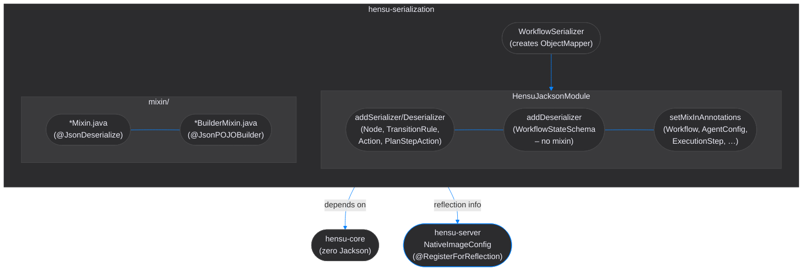
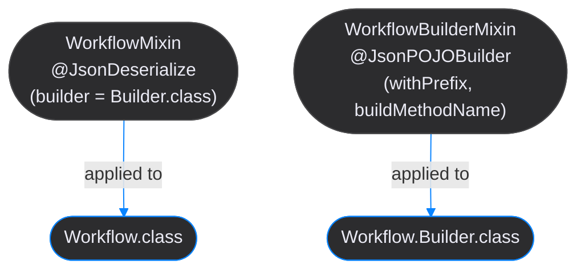

# Hensu Serialization Developer Guide

This guide covers the design, rules, and extension patterns for the `hensu-serialization` module.

## Table of Contents

- [Design Philosophy](#design-philosophy)
- [Module Architecture](#module-architecture)
- [HensuJacksonModule](#hensujacksonmodule)
  - [Mixin/Builder Pattern](#mixinbuilder-pattern)
  - [Custom Deserializer Pattern](#custom-deserializer-pattern)
- [The `treeToValue` Rule](#the-treetovalue-rule)
- [Adding a New Serializable Type](#adding-a-new-serializable-type)
  - [Sealed Hierarchy (polymorphic)](#sealed-hierarchy-polymorphic)
  - [Builder-pattern domain object](#builder-pattern-domain-object)
- [Native Image Implications](#native-image-implications)
- [Key Classes Reference](#key-classes-reference)

---

## Design Philosophy

`hensu-serialization` exists so that `hensu-core` stays framework- and library-agnostic:

- **`hensu-core`** — zero Jackson imports. Domain objects are plain Java records and builder classes.
- **`hensu-serialization`** — owns all Jackson `Module`, `JsonSerializer`, `JsonDeserializer`, and mixin definitions.
- **`hensu-server`** — owns all GraalVM reflection registrations needed by the serialization module.

This three-layer boundary means a CLI or embedded deployment can swap in a different serialization library without touching the core engine. It also means Quarkus native-image metadata never pollutes the domain model.

---

## Module Architecture



---

## HensuJacksonModule

`HensuJacksonModule` is registered once in `WorkflowSerializer.createMapper()`. It uses two distinct patterns depending on the type's structure.

### Mixin/Builder Pattern

Used for **immutable domain objects** that are constructed via an inner `Builder` class with a private constructor. Jackson cannot call `new Builder()` directly without reflection, so a mixin connects the dots at build time.

**How it works:**



At deserialization time Jackson:
1. Reads `WorkflowMixin` → finds `@JsonDeserialize(builder = Workflow.Builder.class)`
2. Instantiates `Workflow.Builder` (via **reflection** — private constructor)
3. Reads `WorkflowBuilderMixin` → finds `@JsonPOJOBuilder(withPrefix = "", buildMethodName = "build")`
4. Calls each setter by name (via **reflection**)
5. Calls `builder.build()` (via **reflection**)

Because `hensu-core` builders have `private` constructors, all three reflection calls require native-image registration. This is handled in `NativeImageConfig` in `hensu-server` — never in `hensu-core` itself.

**Registration in `HensuJacksonModule`:**

```java
context.setMixInAnnotations(Workflow.class, WorkflowMixin.class);
context.setMixInAnnotations(Workflow.Builder.class, WorkflowBuilderMixin.class);
```

**Why `quarkus-jackson` cannot help:** The Quarkus Jackson extension only registers classes that carry Jackson annotations *directly*. `Workflow` has none — the annotations live on the mixin class. The mixin mapping is a runtime event inside `setupModule()`, invisible to Quarkus build-time scanning.

### Custom Deserializer Pattern

Used in two distinct cases:

**Case A — Sealed polymorphic hierarchies** where a `"type"` discriminator field determines the concrete subtype:

| Type             | Serializer                  | Deserializer                  |
|------------------|-----------------------------|-------------------------------|
| `Node`           | `NodeSerializer`            | `NodeDeserializer`            |
| `TransitionRule` | `TransitionRuleSerializer`  | `TransitionRuleDeserializer`  |
| `Action`         | `ActionSerializer`          | `ActionDeserializer`          |
| `PlanStepAction` | `PlanStepActionSerializer`  | `PlanStepActionDeserializer`  |

**Case B — Native-image performance** where the mixin/builder pattern would require registering a private constructor and builder class for reflection, but the type is a single concrete class that can be deserialized more efficiently by direct field extraction:

| Type                  | Deserializer                      | Reason                                              |
|-----------------------|-----------------------------------|-----------------------------------------------------|
| `WorkflowStateSchema` | `WorkflowStateSchemaDeserializer` | Single concrete class; avoids mixin reflection cost |

`WorkflowStateSchemaDeserializer` reads the `variables` list from the JSON tree directly into `StateVariableDeclaration` objects — no `@JsonCreator`, no private constructor registration, no native-image mixin overhead.

Each polymorphic deserializer (Case A) follows the same skeleton:

```java
@Override
public Node deserialize(JsonParser p, DeserializationContext ctxt) throws IOException {
    ObjectMapper mapper = (ObjectMapper) p.getCodec();
    JsonNode root = mapper.readTree(p);          // 1. read the whole tree
    String type = root.get("type").asText();     // 2. read discriminator
    return switch (type) {                        // 3. branch on type
        case "standard" -> deserializeStandard(mapper, root);
        // ...
        default -> throw new IOException("Unknown type: " + type);
    };
}
```

Nested primitive/enum/string fields are extracted directly from `JsonNode`. See the `treeToValue` rule below for how to handle nested complex types.

---

## The `treeToValue` Rule

`mapper.treeToValue(jsonNode, SomeClass.class)` delegates deserialization of a subtree to Jackson's standard POJO machinery. This works in JVM mode but **requires reflection registration** in GraalVM native image, because Jackson calls the constructor and field setters reflectively.

### Rule

> Custom deserializers in `hensu-serialization` must **not** call `treeToValue` for simple `hensu-core` records. Extract fields manually from `JsonNode` instead.

**Simple** means: all fields are primitives, `String`, enums, or nullable wrappers of the above.

**Correct — manual extraction (no reflection):**

```java
// ReviewConfig(ReviewMode mode, boolean allowBacktrack, boolean allowEdit)
if (root.has("reviewConfig")) {
    JsonNode rc = root.get("reviewConfig");
    b.reviewConfig(new ReviewConfig(
            ReviewMode.valueOf(rc.get("mode").asText()),
            rc.get("allowBacktrack").asBoolean(),
            rc.get("allowEdit").asBoolean()));
}
```

**Wrong — treeToValue (reflection required):**

```java
if (root.has("reviewConfig")) {
    b.reviewConfig(mapper.treeToValue(root.get("reviewConfig"), ReviewConfig.class));
}
```

### When `treeToValue` is acceptable

If the target class contains a `java.time.Duration`, deeply nested types, or other fields where manual extraction would be error-prone and brittle, `treeToValue` is acceptable. The class must then be registered in `NativeImageConfig` in `hensu-server`.

Current exceptions (registered in `NativeImageConfig`):

| Class             | Reason                                                  |
|-------------------|---------------------------------------------------------|
| `PlanningConfig`  | Contains `PlanConstraints` (itself contains `Duration`) |
| `PlanConstraints` | Contains `java.time.Duration`                           |
| `Plan`            | Contains `List<PlannedStep>` and `PlanConstraints`      |
| `PlannedStep`     | Contains `Map<String, Object>` and `StepStatus` enum    |

### The `convertValue` escape hatch

`mapper.convertValue(node, new TypeReference<Map<String, Object>>() {})` is a third option for untyped maps and dynamic config payloads. Unlike `treeToValue`, it does not invoke a POJO constructor reflectively — it converts between Jackson's internal tree representation and standard JVM collection types. This is safe in native image for `Map<String, Object>`, `Map<String, String>`, and `List<T>` targets.

**Used in practice:**

```java
// ActionDeserializer — untyped payload map
Map<String, Object> payload = mapper.convertValue(root.get("payload"), new TypeReference<>() {});

// NodeDeserializer — generic node config and fork targetConfigs
Map<String, Object> config = mapper.convertValue(root.get("config"), new TypeReference<>() {});

// NodeDeserializer — sub-workflow input/output mappings
Map<String, String> inputMapping = mapper.convertValue(root.get("inputMapping"), new TypeReference<>() {});
```

Do **not** use `convertValue` to deserialize `hensu-core` domain objects — it still goes through Jackson's POJO machinery and has the same reflection requirements as `treeToValue`.

### Checklist before using `treeToValue`

- [ ] Does the class contain a `Duration` or other JDK complex type? → register it
- [ ] Are all fields primitives/strings/enums? → extract manually instead
- [ ] Is the target an untyped `Map` or `List`? → use `convertValue` instead (no registration needed)
- [ ] Does the class already have a custom deserializer? → use it via `mapper` (safe)
- [ ] Added to `NativeImageConfig` if registering? → cross-check both places

---

## Record Types Embedded in Builder Classes

Java records have no inner `Builder` class — Jackson deserializes them via the **canonical constructor** and component accessor methods. When a record appears as a field inside a mixin-registered builder type, Jackson's POJO machinery reaches it automatically, but GraalVM cannot trace those constructor calls statically.

### Rule

> Any record type that is a field (direct or nested) of a mixin/builder-registered class must be registered in `NativeImageConfig`.

### Current registrations

| Class                              | Embedded in                      | Reason                                      |
|------------------------------------|----------------------------------|---------------------------------------------|
| `HensuSnapshot`                    | `ExecutionStep.Builder.snapshot` | Canonical constructor + component accessors |
| `PlanSnapshot`                     | `HensuSnapshot.planSnapshot`     | Nested record inside `HensuSnapshot`        |
| `PlanSnapshot.PlannedStepSnapshot` | `PlanSnapshot.steps()`           | Nested record inside `PlanSnapshot`         |
| `PlanSnapshot.StepResultSnapshot`  | `PlanSnapshot.results()`         | Nested record inside `PlanSnapshot`         |

Unlike the `treeToValue` pattern, these records do **not** need a custom deserializer or mixin. Registration alone is sufficient because Jackson's built-in record support handles the canonical constructor mapping.

### Checklist before adding a new record type

- [ ] Is it a `record` embedded in a mixin-registered builder type? → register it
- [ ] Does it contain nested record fields? → register those too
- [ ] Does it contain `Duration` or other complex JDK types? → `treeToValue` rule applies instead
- [ ] Added to `NativeImageConfig` in `hensu-server`? → verify the entry is present

---

## Adding a New Serializable Type

### Sealed Hierarchy (polymorphic)

For a new sealed interface like `MyEvent` with subtypes:

1. **Create serializer** — write a `"type"` field + subtype-specific fields:

```java
class MyEventSerializer extends StdSerializer<MyEvent> {
    @Override
    public void serialize(MyEvent value, JsonGenerator gen, SerializerProvider p)
            throws IOException {
        gen.writeStartObject();
        switch (value) {
            case MyEvent.TypeA a -> {
                gen.writeStringField("type", "typeA");
                gen.writeStringField("field", a.field());
            }
            case MyEvent.TypeB b -> {
                gen.writeStringField("type", "typeB");
                gen.writeNumberField("count", b.count());
            }
        }
        gen.writeEndObject();
    }
}
```

2. **Create deserializer** — read `"type"`, extract fields manually:

```java
class MyEventDeserializer extends StdDeserializer<MyEvent> {
    @Override
    public MyEvent deserialize(JsonParser p, DeserializationContext ctxt)
            throws IOException {
        ObjectMapper mapper = (ObjectMapper) p.getCodec();
        JsonNode root = mapper.readTree(p);
        return switch (root.get("type").asText()) {
            case "typeA" -> new MyEvent.TypeA(root.get("field").asText());
            case "typeB" -> new MyEvent.TypeB(root.get("count").asInt());
            default -> throw new IOException("Unknown MyEvent type");
        };
    }
}
```

3. **Register in `HensuJacksonModule`:**

```java
addSerializer(MyEvent.class, new MyEventSerializer());
addDeserializer(MyEvent.class, new MyEventDeserializer());
```

No reflection registration needed — the deserializer constructs subtypes directly.

### Builder-pattern domain object

For a new immutable class like `MyConfig` with a builder:

1. **Create mixin pair:**

```java
// MyConfigMixin.java
@JsonDeserialize(builder = MyConfig.Builder.class)
public abstract class MyConfigMixin {}

// MyConfigBuilderMixin.java
@JsonPOJOBuilder(withPrefix = "", buildMethodName = "build")
public abstract class MyConfigBuilderMixin {}
```

2. **Register in `HensuJacksonModule`:**

```java
context.setMixInAnnotations(MyConfig.class, MyConfigMixin.class);
context.setMixInAnnotations(MyConfig.Builder.class, MyConfigBuilderMixin.class);
```

3. **Register for reflection in `NativeImageConfig`** (in `hensu-server`):

```java
@RegisterForReflection(
        targets = {
            // ... existing entries ...
            MyConfig.class,
            MyConfig.Builder.class
        })
public class NativeImageConfig {}
```

All three steps are required. Missing step 3 causes a silent runtime failure in native image: Jackson finds the builder class but cannot invoke the private constructor or `build()` method.

#### Boolean field naming trap

Jackson maps JSON keys to builder setter names using `withPrefix = ""`. For `boolean` fields, Java generates an `isFoo()` accessor, not `getFoo()`. Jackson's default introspection maps `isMaintainContext()` to a JSON key of `"maintainContext"` on the *getter* side, but the builder setter is also named `maintainContext()` — which Jackson does not automatically associate with the `is`-prefixed getter.

The fix is an explicit `@JsonProperty` on the builder setter:

```java
// MyConfigBuilderMixin.java
@JsonPOJOBuilder(withPrefix = "", buildMethodName = "build")
public abstract class MyConfigBuilderMixin {

    // Required: without this, Jackson cannot match the "maintainContext" JSON key
    // to the builder setter when the core type uses an isFoo() accessor pattern.
    @JsonProperty("maintainContext")
    public abstract MyConfigBuilderMixin maintainContext(boolean value);
}
```

Any boolean field on a builder-pattern type must have a corresponding `@JsonProperty` in its `BuilderMixin`. Omitting it causes the field to be silently ignored during deserialization — no exception, just a zero/false value in native image.

---

## Native Image Implications

| What                                          | Where to fix                                                |
|-----------------------------------------------|-------------------------------------------------------------|
| Builder's private constructor not found       | Add class to `NativeImageConfig` in server                  |
| `build()` method not found at runtime         | Add class to `NativeImageConfig` in server                  |
| `treeToValue` target fails with NPE/exception | Prefer manual extraction; if not feasible, register         |
| New serializable type breaks native build     | Check the checklist in this guide, add mixin + registration |

The root rule: **`hensu-core` owns no serialization metadata. `hensu-serialization` owns the Jackson configuration. `hensu-server` owns the native-image registrations.** This three-way split keeps each module independently deployable and testable.

---

## Key Classes Reference

| Class                                                     | Description                                                                                                |
|-----------------------------------------------------------|------------------------------------------------------------------------------------------------------------|
| `WorkflowSerializer`                                      | Factory — creates the configured `ObjectMapper`                                                            |
| `HensuJacksonModule`                                      | `SimpleModule` — registers all serializers, deserializers, mixins                                          |
| `NodeSerializer` / `NodeDeserializer`                     | Polymorphic `Node` hierarchy (discriminator: `nodeType`)                                                   |
| `TransitionRuleSerializer` / `TransitionRuleDeserializer` | Polymorphic `TransitionRule` (discriminator: `type`)                                                       |
| `ActionSerializer` / `ActionDeserializer`                 | Polymorphic `Action` (discriminator: `type`)                                                               |
| `PlanStepActionSerializer` / `PlanStepActionDeserializer` | Polymorphic `PlanStepAction` (discriminator: `type`)                                                       |
| `WorkflowStateSchemaDeserializer`                         | Direct-extraction deserializer for `WorkflowStateSchema`; avoids mixin reflection overhead in native image |
| `plan/JacksonPlanResponseParser`                          | Parses LLM JSON responses into `PlannedStep` lists; strips markdown fences                                 |
| `mixin/*Mixin.java`                                       | `@JsonDeserialize` bridge for builder-pattern types                                                        |
| `mixin/*BuilderMixin.java`                                | `@JsonPOJOBuilder` configuration for builder inner classes                                                 |

> **See also**:
> - [hensu-core Developer Guide — GraalVM](developer-guide-core.md#graalvm-native-image-constraints) for foundational native-image rules
> - [hensu-server Developer Guide — NativeImageConfig](developer-guide-server.md#nativeimageconfig--jackson-reflection-registration) for registration patterns and the resource bundling rule
