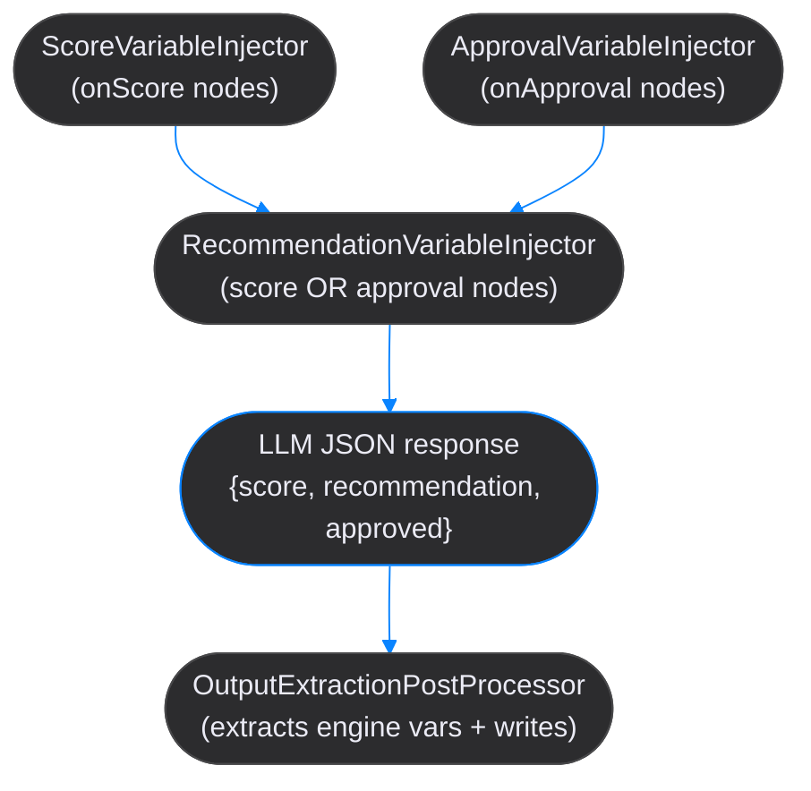

# Hensu Kotlin DSL Reference

This document provides a complete reference for the Hensu Kotlin DSL used to define AI agent workflows.

## Table of Contents

- [Workflow Structure](#workflow-structure)
- [Agents](#agents)
- [Graph](#graph)
- [Nodes](#nodes)
  - [Standard Node](#standard-node)
  - [Parallel Node](#parallel-node)
  - [Fork Node](#fork-node)
  - [Join Node](#join-node)
  - [Generic Node](#generic-node)
  - [Action Node](#action-node)
  - [Sub-Workflow Node](#sub-workflow-node)
  - [End Node](#end-node)
- [Transitions](#transitions)
- [State Variables (`writes`)](#state-variables-writes)
- [State Schema](#state-schema)
- [Engine Variables](#engine-variables)
- [Rubrics](#rubrics)
- [Human Review](#human-review)
- [Planning](#planning)
  - [Static Plans](#static-plans)
  - [Dynamic Plans](#dynamic-plans)
  - [Planning Properties](#planning-properties)
  - [Plan Failure Routing](#plan-failure-routing)
- [Available Models](#available-models)
- [External Prompt Files](#external-prompt-files)
- [Running Workflows](#running-workflows)
- [Complete Example](#complete-example)

## Workflow Structure

A workflow is the top-level container for defining an AI agent pipeline. Workflows are defined using the `workflow()` function within a working directory context.

```kotlin
fun myWorkflow() = workflow("WorkflowName") {
    description = "Description of what this workflow does"
    version = "1.0.0"

    state {
        // Typed state variable declarations (optional — enables load-time validation)
        input("topic", VarType.STRING)
        variable("summary", VarType.STRING)
    }

    agents {
        // Agent definitions
    }

    rubrics {
        // Rubric references (optional)
    }

    config {
        // Execution settings (optional)
    }

    graph {
        // Workflow graph definition
    }
}
```

### Properties

| Property      | Type    | Required | Default | Description                                |
|---------------|---------|----------|---------|--------------------------------------------|
| `description` | String? | No       | null    | Human-readable description of the workflow |
| `version`     | String  | No       | "1.0.0" | Semantic version of the workflow           |

### Top-Level Blocks

| Block         | Description                                                                                                              |
|---------------|--------------------------------------------------------------------------------------------------------------------------|
| `state { }`   | Optional typed state schema. When declared, enables load-time validation of `writes` and `{variable}` prompt references. |
| `agents { }`  | Agent definitions (models, roles, temperatures)                                                                          |
| `rubrics { }` | Rubric file references for quality evaluation                                                                            |
| `config { }`  | Workflow execution settings                                                                                              |
| `graph { }`   | Node graph (required)                                                                                                    |

## Agents

Agents are AI models that execute workflow steps. Each agent is configured with a model, role, and optional parameters.

```kotlin
agents {
    agent("agent-id") {
        role = "Agent Role"
        model = Models.CLAUDE_SONNET_4_5
        temperature = 0.7
        maxTokens = 4096
        instructions = "Additional system instructions"
        maintainContext = true
    }
}
```

### Agent Properties

| Property           | Type         | Required | Default     | Description                                                          |
|--------------------|--------------|----------|-------------|----------------------------------------------------------------------|
| `role`             | String       | Yes      | -           | Agent role description used in the system prompt                     |
| `model`            | String       | Yes      | -           | Model identifier (use `Models.*` constants or string)                |
| `temperature`      | Double       | No       | 0.7         | Sampling temperature (0.0-2.0)                                       |
| `maxTokens`        | Int?         | No       | null        | Maximum tokens in response (null = model default)                    |
| `tools`            | List<String> | No       | emptyList() | Tool identifiers available to this agent                             |
| `maintainContext`  | Boolean      | No       | false       | Whether to maintain conversation context across executions           |
| `instructions`     | String?      | No       | null        | Additional system instructions appended to role                      |
| `topP`             | Double?      | No       | null        | Top-p (nucleus) sampling parameter (0.0-1.0)                         |
| `frequencyPenalty` | Double?      | No       | null        | Frequency penalty for repetition (-2.0 to 2.0, OpenAI/DeepSeek only) |
| `presencePenalty`  | Double?      | No       | null        | Presence penalty for repetition (-2.0 to 2.0, OpenAI/DeepSeek only)  |
| `timeout`          | Long?        | No       | null        | Request timeout in seconds                                           |

## Graph

The graph defines the workflow's execution flow, including the start node and all node definitions.

```kotlin
graph {
    start at "first-node"

    node("first-node") {
        // Node definition
    }

    end("end")
}
```

### Graph Functions

| Function              | Description                                                |
|-----------------------|------------------------------------------------------------|
| `start at "nodeId"`   | Sets the workflow entry point node                         |
| `node(id) { }`        | Defines a standard agent-based node                        |
| `parallel(id) { }`    | Defines a parallel node with consensus                     |
| `fork(id) { }`        | Defines a fork node for parallel execution                 |
| `join(id) { }`        | Defines a join node to await forked paths                  |
| `generic(id) { }`     | Defines a generic node with custom executor                |
| `action(id) { }`      | Defines an action node for executing commands mid-workflow |
| `subWorkflow(id) { }` | Defines a sub-workflow delegation node                     |
| `end(id)`             | Defines an end node (workflow termination)                 |

## Nodes

### Standard Node

Standard nodes execute an agent with a prompt and transition based on the result.

```kotlin
node("node-id") {
    agent = "agent-id"
    prompt = "Your prompt with {placeholders}"
    rubric = "rubric-id"         // Optional
    writes("param1", "param2")   // Optional — declare state variables this node produces

    review(ReviewMode.OPTIONAL)  // Optional

    onSuccess goto "next-node"
    onFailure retry 3 otherwise "fallback-node"
    onApproval goto "approved-node"   // Optional — routes on boolean `approved` variable
    onRejection goto "rejected-node"  // Optional — routes when `approved` is false
}
```

#### Standard Node Properties

| Property    | Type    | Required | Description                             |
|-------------|---------|----------|-----------------------------------------|
| `agent`     | String? | Yes      | ID of the agent to execute              |
| `prompt`    | String? | Yes      | Prompt template or `.md` file reference |
| `rubric`    | String? | No       | ID of rubric to evaluate output quality |

#### Standard Node Functions

| Function             | Description                                                                                                |
|----------------------|------------------------------------------------------------------------------------------------------------|
| `writes("a", "b")`   | Declares state variables this node produces. Single name: full text stored. Multiple: JSON keys extracted. |
| `review(mode)`       | Configures human review checkpoint                                                                         |
| `onApproval goto`    | Routes when the `approved` engine variable is `true`. Falls through if absent or non-boolean.              |
| `onRejection goto`   | Routes when the `approved` engine variable is `false`. Falls through if absent or non-boolean.             |
| `onPlanFailure goto` | Routes to a fallback node when plan execution fails (planning nodes only)                                  |

### Parallel Node

Parallel nodes execute multiple branches concurrently and determine outcome via consensus.

```kotlin
parallel("review-committee") {
    branch("reviewer1") {
        agent = "reviewer"
        prompt = "Review the content: {previous-output}"
        yields("feedback", "suggestions")
    }
    branch("reviewer2") {
        agent = "reviewer"
        prompt = "Review the content: {previous-output}"
        yields("feedback", "suggestions")
    }
    branch("reviewer3") {
        agent = "reviewer"
        prompt = "Review the content: {previous-output}"
        yields("feedback", "suggestions")
    }

    consensus {
        strategy = ConsensusStrategy.MAJORITY_VOTE
        threshold = 0.5
    }

    onConsensus goto "approved"
    onNoConsensus goto "rejected"
}
```

#### Branch Properties

| Property   | Type          | Required | Description                                                                                                                                                                         |
|------------|---------------|----------|-------------------------------------------------------------------------------------------------------------------------------------------------------------------------------------|
| `agent`    | String        | Yes      | ID of the agent to execute                                                                                                                                                          |
| `prompt`   | String?       | No       | Prompt template or `.md` file reference                                                                                                                                             |
| `rubric`   | String?       | No       | ID of rubric for branch evaluation. When set, the rubric's pass/fail result determines the branch's consensus vote (APPROVE/REJECT), overriding text-based heuristics               |
| `weight`   | Double        | No       | Vote weight for `WEIGHTED_VOTE` consensus strategy. Higher values give more influence to the branch score (default: 1.0)                                                            |
| `yields()` | vararg String | No       | State variable names this branch produces as structured domain output. The agent's JSON response must include these fields; the engine extracts and merges them into workflow state |

#### Rubric-Based Consensus

When a branch declares a `rubric`, the engine evaluates the branch output against the rubric after execution. The rubric score and pass/fail status become the authoritative vote source for that branch:

- **Rubric passed** → branch votes **APPROVE** with the rubric score
- **Rubric failed** → branch votes **REJECT** with the rubric score

Branches without a rubric use engine-injected self-scoring – the agent produces `score`, `approved`, and `recommendation` fields automatically for vote-based strategies (not JUDGE_DECIDES).

#### Yield Merge Semantics

Votes and yields serve different purposes. Votes gate the transition path (`onConsensus` / `onNoConsensus`). Yields carry domain data into workflow state.

| Strategy                                      | Merge behavior                                                        |
|-----------------------------------------------|-----------------------------------------------------------------------|
| `MAJORITY_VOTE`, `UNANIMOUS`, `WEIGHTED_VOTE` | **All** branch yields merge into state, regardless of individual vote |
| `JUDGE_DECIDES`                               | Only the **winning** branch's yields merge into state                 |

When multiple branches yield the same field name, later branches overwrite earlier ones (map merge order matches branch declaration order).

#### Consensus Configuration

| Property    | Type              | Default       | Description                                                                |
|-------------|-------------------|---------------|----------------------------------------------------------------------------|
| `strategy`  | ConsensusStrategy | MAJORITY_VOTE | How to determine consensus                                                 |
| `judge`     | String?           | null          | Agent ID for JUDGE_DECIDES strategy                                        |
| `threshold` | Double?           | null          | Threshold for MAJORITY_VOTE (default: 0.5) or WEIGHTED_VOTE (default: 0.5) |

#### Consensus Strategies

| Strategy        | Description                                                                          |
|-----------------|--------------------------------------------------------------------------------------|
| `MAJORITY_VOTE` | Consensus when approvals strictly exceed `total * threshold`. Default threshold: 50% |
| `WEIGHTED_VOTE` | Weighted approval ratio must meet or exceed threshold                                |
| `UNANIMOUS`     | All branches must vote APPROVE                                                       |
| `JUDGE_DECIDES` | External judge agent reviews all branch outputs and makes final decision             |

### Fork Node

Fork nodes spawn multiple execution paths in parallel using virtual threads.

```kotlin
fork("parallel-research") {
    targets("research-area-1", "research-area-2", "research-area-3")
    waitAll = false  // Default: false (fire-and-forget, use join to wait)

    onComplete goto "join-results"
}
```

#### Fork Node Properties

| Property       | Type          | Default | Description                                               |
|----------------|---------------|---------|-----------------------------------------------------------|
| `targets(...)` | vararg String | -       | Node IDs to execute in parallel                           |
| `waitAll`      | Boolean       | false   | Whether to wait for all targets (usually false, use join) |

### Join Node

Join nodes await forked execution paths and merge their results.

```kotlin
join("merge-results") {
    await("parallel-research")  // Fork node ID to await
    mergeStrategy = MergeStrategy.COLLECT_ALL
    writes("merged_results")
    timeout = 60000  // 60 seconds
    failOnError = true

    onSuccess goto "process-results"
    onFailure retry 0 otherwise "handle-error"
}
```

#### Join Node Properties

| Property        | Type          | Default     | Description                                                                                           |
|-----------------|---------------|-------------|-------------------------------------------------------------------------------------------------------|
| `await(...)`    | vararg String | -           | Fork node IDs to await                                                                                |
| `mergeStrategy` | MergeStrategy | COLLECT_ALL | How to merge forked outputs                                                                           |
| `writes(...)`   | vararg String | -           | State variable(s) for merged output. Single-output strategies require exactly 1; MERGE_MAPS allows 1+ |
| `exports(...)`  | vararg String | (all)       | Whitelist of branch vars crossing join boundary                                                       |
| `timeout`       | Long          | 0           | Timeout in ms (0 = no timeout)                                                                        |
| `failOnError`   | Boolean       | true        | Fail join if any forked path fails                                                                    |

#### Merge Strategies

| Strategy           | Description                                                        |
|--------------------|--------------------------------------------------------------------|
| `COLLECT_ALL`      | Collect all outputs into a list                                    |
| `FIRST_SUCCESSFUL` | Use the first successful result                                    |
| `CONCATENATE`      | Concatenate all outputs as text                                    |
| `MERGE_MAPS`       | Spread each branch's map entries into individual parent state vars |

### Generic Node

Generic nodes delegate execution to user-registered handlers for custom logic.

```kotlin
generic("validate-input") {
    executorType = "validator"  // Handler identifier

    config {
        "minLength" to 10
        "maxLength" to 1000
        "required" to true
    }

    rubric = "validation-rubric"  // Optional

    onSuccess goto "process"
    onFailure retry 2 otherwise "error"
}
```

#### Generic Node Properties

| Property       | Type    | Required | Description                         |
|----------------|---------|----------|-------------------------------------|
| `executorType` | String  | Yes      | Handler identifier for lookup       |
| `config { }`   | Block   | No       | Configuration map passed to handler |
| `rubric`       | String? | No       | ID of rubric for output evaluation  |

#### Config Block Syntax

```kotlin
config {
    "key1" to "string value"
    "key2" to 42
    "key3" to true
    "key4" to listOf("a", "b", "c")
}
```

See [Generic Nodes](../docs/developer-guide-core.md#generic-nodes) in the Core Developer Guide for implementing handlers.

### Action Node

Action nodes execute commands or send data to external systems mid-workflow, then continue to the next node. Use action nodes to run git commands, send notifications, trigger webhooks, or publish events at any point during workflow execution.

```kotlin
action("commit-changes") {
    execute("git-commit")  // Command ID from commands.yaml
    send("slack", mapOf("message" to "Changes committed"))

    onSuccess goto "deploy"
    onFailure retry 2 otherwise "rollback"
}
```

#### Action Node Functions

| Function                   | Description                                  |
|----------------------------|----------------------------------------------|
| `execute(commandId)`       | Execute command by ID from commands.yaml     |
| `send(handlerId)`          | Send to registered action handler            |
| `send(handlerId, payload)` | Send with payload data to registered handler |

#### Send Action

The `send()` function delegates to registered `ActionHandler` implementations. Handlers encapsulate all configuration (endpoints, auth, protocols) and can implement any integration: HTTP calls, messaging (Slack, email), event publishing (Kafka, RabbitMQ), etc.

Payload values support `{variable}` template syntax, resolved from workflow context:

```kotlin
action("notify") {
    // Simple send
    send("slack")

    // Send with payload
    send("slack", mapOf(
        "message" to "Build completed: {status}",
        "channel" to "#deployments"
    ))

    // Multiple handlers
    send("email", mapOf("to" to "team@example.com", "subject" to "Build done"))
    send("github-dispatch", mapOf("event_type" to "deploy", "ref" to "{branch}"))

    onSuccess goto "end"
}
```

See [Action Handlers](../docs/developer-guide-core.md#action-handlers) in the Core Developer Guide for implementing handlers.

#### Example: CI/CD Pipeline with Actions

```kotlin
graph {
    start at "develop"

    node("develop") {
        agent = "coder"
        prompt = "Implement the feature"
        onSuccess goto "commit"
    }

    action("commit") {
        execute("git-commit")
        onSuccess goto "test"
    }

    node("test") {
        agent = "tester"
        prompt = "Run tests"
        onSuccess goto "deploy"
        onFailure retry 0 otherwise "end_failure"
    }

    action("deploy") {
        execute("deploy-prod")
        send("slack", mapOf("message" to "Deployed to production"))
        send("webhook", mapOf("event" to "deployed", "env" to "prod"))
        onSuccess goto "end_success"
    }

    end("end_success")
    end("end_failure", ExitStatus.FAILURE)
}
```

### Sub-Workflow Node

Sub-workflow nodes delegate execution to a nested workflow. The parent pauses at the boundary, the child runs to completion, and control returns with selected state variables mirrored back into the parent.

```kotlin
subWorkflow("delegate_summary") {
    target        = "sub-summarizer"
    targetVersion = "1.0.0"      // Optional, forward-compat with workflow versioning

    imports("draft")             // Copy from parent state into child under the same name
    writes("tl_dr")              // Mirror from child state back into parent under the same name

    onSuccess goto "publish"
    onFailure goto "handle_error"
}
```

#### Sub-Workflow Node Properties

| Property        | Type    | Required | Description                                                                                            |
|-----------------|---------|----------|--------------------------------------------------------------------------------------------------------|
| `target`        | String  | Yes      | Id of the child workflow to invoke                                                                     |
| `targetVersion` | String? | No       | Pinned version of the child workflow. Round-tripped through serialization; not enforced at runtime yet |

#### Sub-Workflow Node Functions

| Function              | Description                                                                                     |
|-----------------------|-------------------------------------------------------------------------------------------------|
| `imports("a", "b")`   | Parent state variables copied into the child under the same name                                |
| `writes("x", "y")`    | Child state variables mirrored back into the parent under the same name                         |
| `onSuccess goto`      | Route on successful child completion                                                            |
| `onFailure goto`      | Route on child failure                                                                          |

#### Same-Name Discipline

The DSL enforces identity mapping across the boundary – a name in `imports` or `writes` refers to the same key in both parent and child. The child's `state { }` schema is the contract; parents adapt their state variable names to match. This keeps sub-workflow integration explicit and greppable.

Validation rules (checked by `WorkflowBuilder.build()`):

- Every name in `imports` and `writes` must be declared in the parent workflow's `state { }` block.
- Engine variables (`score`, `approved`, `recommendation`) are rejected.
- `imports` and `writes` must not overlap.
- Duplicate names within either list are rejected.

#### Reference Graph Constraints

Sub-workflow references are validated before any node executes:

- **Cycles** – `SubWorkflowGraphValidator` rejects any cycle in the sub-workflow reference graph at load time (CLI) and push time (server).
- **Dangling references** – On the server push path, unresolved child ids are rejected alongside cycles in a single pass.
- **Depth cap** – Nested invocation is capped at depth 16 (`SubWorkflowNodeExecutor.MAX_DEPTH`). The executor throws before invoking a child beyond the cap; this is a hard guard against runaway recursion, not a tunable.
- **Tenant isolation** – `_tenant_id` is propagated from parent to child context, preserving multi-tenant isolation across the boundary.

### End Node

End nodes terminate workflow execution with a status. They contain no actions — use action nodes for command execution.

```kotlin
// Simple end node (defaults to SUCCESS)
end("exit")

// End with explicit status
end("success", ExitStatus.SUCCESS)
end("failure", ExitStatus.FAILURE)
```

#### Exit Status Types

| Type                 | Description                     |
|----------------------|---------------------------------|
| `ExitStatus.SUCCESS` | Successful completion (default) |
| `ExitStatus.FAILURE` | Failed completion               |

## Transitions

### Success Transition

```kotlin
onSuccess goto "next-node"
```

### Direct Failure Transition

```kotlin
onFailure goto "error-node"
```

Routes immediately to the target node on failure, with no retries.

### Failure with Retry

```kotlin
onFailure retry 3 otherwise "fallback-node"
```

Retries up to 3 times before transitioning to the fallback node.

### Score-Based Transitions

Route based on rubric evaluation scores:

```kotlin
onScore {
    whenScore greaterThanOrEqual 90.0 goto "excellent"
    whenScore `in` 70.0..89.0 goto "good"
    whenScore `in` 50.0..69.0 goto "needs-work"
    whenScore lessThan 50.0 goto "reject"
}
```

### Score Operators

| Operator             | Description                        |
|----------------------|------------------------------------|
| `greaterThan`        | Score > value                      |
| `greaterThanOrEqual` | Score >= value                     |
| `lessThan`           | Score < value                      |
| `lessThanOrEqual`    | Score <= value                     |
| `` `in` ``           | Score within range (use backticks) |

### Approval Transitions

Route based on the `approved` boolean engine variable. The engine injects it automatically when `onApproval` or `onRejection` routing is present — do not declare it in `writes()`:

```kotlin
node("classify") {
    agent = "classifier"
    prompt = "Evaluate the content. Output JSON: {\"approved\": true/false}"

    onApproval goto "publish"
    onRejection goto "revise"
}
```

Falls through (no match) if the `approved` key is absent or not a boolean. Both transitions are optional — you can use only `onApproval`, only `onRejection`, or combine with `onScore`.

### Consensus Transitions (Parallel Nodes)

```kotlin
onConsensus goto "approved"
onNoConsensus goto "rejected"
```

### Fork Completion Transition

```kotlin
onComplete goto "join-node"
```

## State Variables (`writes`)

The `writes()` function on a node declares which state variables that node produces. The engine routes the agent's output into context under those variable names, making them available as `{placeholder}` in subsequent prompts.

### How It Works

- **Single name** — `writes("summary")`: engine tries to parse the output as JSON and extract the key; falls back to storing the full raw text if the key is absent or output is not JSON.
- **Multiple names** — `writes("fact1", "fact2", "fact3")`: engine parses output as JSON and extracts each declared key into context.

### Example

```kotlin
node("extract_facts") {
    agent = "researcher"
    prompt = """
        Research Georgia (the country) and provide specific facts.

        Output JSON with exactly these keys:
        {"largest_lake": "...", "highest_peak": "...", "capital_population": "..."}
    """.trimIndent()

    writes("largest_lake", "highest_peak", "capital_population")

    onSuccess goto "use_facts"
}

node("use_facts") {
    agent = "writer"
    prompt = """
        Using these facts about Georgia:
        - Largest lake: {largest_lake}
        - Highest peak: {highest_peak}
        - Capital population: {capital_population}

        Write a compelling travel advertisement.
    """.trimIndent()

    onSuccess goto "end"
}
```

### Best Practices

1. **Be explicit in prompts**: Tell the agent exactly what JSON format you expect
2. **Use descriptive names**: Match `writes` names to `{placeholder}` names in downstream prompts
3. **Request JSON-only output**: Ask the agent to output only JSON for reliable extraction
4. **Lower temperature**: Use lower temperature (0.3-0.5) for more consistent JSON output
5. **Never `writes` engine variables**: `score`, `approved`, and `recommendation` are managed by the engine — declaring them in `writes()` produces duplicate instructions in the prompt.

### Supported JSON Values

- String: `"key": "value"`
- Numeric: `"key": 123`
- Boolean: `"key": true`

Nested objects and arrays are not currently extracted.

## State Schema

Declare a typed schema for all domain-specific state variables at the workflow level. When declared, the schema is validated at load time — `WorkflowBuilder.build()` throws `IllegalStateException` if any `writes` name or prompt `{variable}` is not declared.

Engine variables (`score`, `approved`, `recommendation`) are always implicitly valid — never declare them in the schema or in `writes()`. See [Engine Variables](#engine-variables) for the full contract.

```kotlin
workflow("ContentPipeline") {
    state {
        input("topic", VarType.STRING)             // required in initial context
        variable("article", VarType.STRING)        // produced by a node via writes("article")
        variable("confidence", VarType.NUMBER)     // produced by a node via writes("confidence")
    }

    // ...
}
```

### State Block Functions

| Function                            | Description                                                                                                                        |
|-------------------------------------|------------------------------------------------------------------------------------------------------------------------------------|
| `input(name, type)`                 | Declares a variable required in the initial context from the caller                                                                |
| `variable(name, type)`              | Declares a variable produced by a node via `writes`                                                                                |
| `variable(name, type, description)` | Declares a node-produced variable with a description surfaced as an LLM output hint. Prefer this when the name alone is ambiguous. |

### VarType Values

| Type          | JSON equivalent          |
|---------------|--------------------------|
| `STRING`      | `string`                 |
| `NUMBER`      | `number`                 |
| `BOOLEAN`     | `boolean`                |
| `LIST_STRING` | `array` of `string`      |

## Engine Variables

Engine variables are managed entirely by the Hensu engine — they are injected automatically into the LLM prompt and extracted from the JSON response. They are **always implicitly valid** in `{placeholder}` references. Do **not** declare them in `state { }` or `writes()`.

| Variable         | Type    | When present                                                      | Description                                                                                      |
|------------------|---------|-------------------------------------------------------------------|--------------------------------------------------------------------------------------------------|
| `score`          | Number  | Node has `onScore { }` routing (rubric-evaluated or self-scoring) | Quality score 0–100. Drives `onScore` transitions.                                               |
| `approved`       | Boolean | Node has `onApproval` / `onRejection` routing                     | `true` = approved, `false` = rejected. Falls through if absent.                                  |
| `recommendation` | String  | Node has `onScore { }` or `onApproval` / `onRejection` routing    | Improvement feedback or review reasoning. Available as `{recommendation}` in downstream prompts. |

### How engine variables flow



### Using `{recommendation}` in downstream prompts

Because `recommendation` is an engine variable, you reference it as a `{placeholder}` without declaring it anywhere:

```kotlin
node("score-content") {
    agent = "reviewer"
    prompt = "Review the article: {article}\nOutput a score and feedback."
    rubric = "content-quality"

    onScore {
        whenScore greaterThanOrEqual 80.0 goto "publish"
        whenScore lessThan 80.0 goto "revise"
    }
}

node("revise") {
    agent = "writer"
    prompt = """
        Revise the article based on this feedback: {recommendation}
        Original article: {article}
    """.trimIndent()

    writes("article")
    onSuccess goto "score-content"
}
```

## Rubrics

Rubrics define quality evaluation criteria for node outputs.

```kotlin
rubrics {
    rubric("quality-check", "quality.md")           // rubrics/quality.md
    rubric("pr-review", "templates/pr.md")          // rubrics/templates/pr.md
    rubric("docs") { file = "documentation.md" }    // Alternative syntax
}
```

Reference rubrics in nodes:

```kotlin
node("review") {
    agent = "reviewer"
    prompt = "Review this code"
    rubric = "quality-check"

    onScore {
        whenScore greaterThanOrEqual 80.0 goto "approve"
        whenScore lessThan 80.0 goto "revise"
    }
}
```

## Human Review

Add human review checkpoints to nodes.

### Simple Review

```kotlin
node("draft") {
    agent = "writer"
    prompt = "Write first draft"

    review(ReviewMode.REQUIRED)

    onSuccess goto "publish"
}
```

### Detailed Review Configuration

```kotlin
node("critical-step") {
    agent = "analyzer"
    prompt = "Analyze data"

    review {
        mode = ReviewMode.REQUIRED
        allowBacktrack = true
        allowEdit = true
    }

    onSuccess goto "next"
}
```

### Review Modes

| Mode                  | Description                 |
|-----------------------|-----------------------------|
| `ReviewMode.DISABLED` | No human review             |
| `ReviewMode.OPTIONAL` | Review only on failure      |
| `ReviewMode.REQUIRED` | Always require human review |

### Review Properties

| Property         | Type       | Default  | Description                       |
|------------------|------------|----------|-----------------------------------|
| `mode`           | ReviewMode | DISABLED | When to require review            |
| `allowBacktrack` | Boolean    | false    | Allow returning to previous nodes |
| `allowEdit`      | Boolean    | false    | Allow editing the output          |

## Planning

Nodes can execute multistep tool invocations via plans. Plans come in two flavors: **static** (predefined at compile time) and **dynamic** (generated by an LLM at runtime).

### Static Plans

Static plans define a fixed sequence of tool invocations. Each step calls a tool with specified arguments. Use `plan { }` inside a node:

```kotlin
node("process-order") {
    agent = "processor"
    prompt = "Process the order"

    plan {
        step("get_order") {
            args("id" to "{orderId}")
            description = "Fetch order details"
        }
        step("validate_order") {
            description = "Validate order data"
        }
        step("process_payment") {
            args("amount" to "{orderTotal}", "currency" to "USD")
            description = "Process payment"
        }
    }

    onSuccess goto "confirmation"
}
```

Step arguments support `{variable}` placeholders resolved from workflow context.

### Dynamic Plans

Dynamic plans let an LLM generate the execution plan at runtime based on the node's prompt and available tools. Use `planning { }` inside a node:

```kotlin
node("research") {
    agent = "researcher"
    prompt = "Research and analyze topic X"

    planning {
        dynamic()                              // LLM generates the plan
        maxSteps = 15                          // Up to 15 steps
        maxReplans = 5                         // Revise plan up to 5 times on failure
        maxDuration = Duration.ofMinutes(10)   // Timeout
    }

    onSuccess goto "synthesize"
}
```

Convenience methods simplify common configurations:

```kotlin
planning {
    dynamic()          // Sets DYNAMIC mode with sensible defaults
    withReview()       // Pause for human review before execution
    noReplan()         // Disable automatic replanning on failure
}

planning {
    static()           // Sets STATIC mode (use with plan { } block)
}
```

### Planning Properties

| Property         | Type         | Default   | Description                                     |
|------------------|--------------|-----------|-------------------------------------------------|
| `mode`           | PlanningMode | DISABLED  | DISABLED, STATIC, or DYNAMIC                    |
| `maxSteps`       | Int          | 10        | Maximum steps allowed in a plan                 |
| `maxReplans`     | Int          | 3         | Maximum plan revisions on failure               |
| `allowReplan`    | Boolean      | true      | Whether plan revision is allowed                |
| `review`         | Boolean      | false     | Pause for human review before execution         |
| `maxDuration`    | Duration     | 5 minutes | Maximum total execution time                    |
| `maxTokenBudget` | Int          | 10000     | Maximum LLM tokens for planning (0 = unlimited) |

### Plan Failure Routing

Route to a fallback node when plan execution exhausts all replans:

```kotlin
node("research") {
    agent = "researcher"
    prompt = "Research and analyze {topic}"

    planning {
        dynamic()
        maxReplans = 3
    }

    onSuccess goto "synthesize"
    onPlanFailure goto "fallback-summary"  // routes when all replans are exhausted
}
```

Without `onPlanFailure`, a plan exhaustion throws `IllegalStateException`.

### Planning Modes

| Mode                    | Description                                   |
|-------------------------|-----------------------------------------------|
| `PlanningMode.DISABLED` | No planning, direct agent execution (default) |
| `PlanningMode.STATIC`   | Use predefined plan from `plan { }` block     |
| `PlanningMode.DYNAMIC`  | LLM generates plan at runtime                 |

## Available Models

Use the `Models` object for type-safe model references:

```kotlin
// Anthropic Claude
Models.CLAUDE_OPUS_4_6          // claude-opus-4-6
Models.CLAUDE_OPUS_4_5          // claude-opus-4-5
Models.CLAUDE_SONNET_4_6        // claude-sonnet-4-6
Models.CLAUDE_SONNET_4_5        // claude-sonnet-4-5
Models.CLAUDE_HAIKU_4_5         // claude-haiku-4-5

// OpenAI
Models.GPT_4                    // gpt-4
Models.GPT_4_TURBO              // gpt-4-turbo
Models.GPT_4O                   // gpt-4o

// Google Gemini
Models.GEMINI_3_1_FLASH_LITE    // gemini-3.1-flash-lite-preview
Models.GEMINI_3_1_PRO           // gemini-3.1-pro-preview
Models.GEMINI_2_5_FLASH         // gemini-2.5-flash
Models.GEMINI_2_5_PRO           // gemini-2.5-pro

// DeepSeek
Models.DEEPSEEK_CHAT            // deepseek-chat
Models.DEEPSEEK_CODER           // deepseek-coder
```

## External Prompt Files

Prompts can be loaded from external Markdown files in the `prompts/` directory:

```kotlin
node("review") {
    agent = "reviewer"
    prompt = "review-prompt.md"  // Loaded from prompts/review-prompt.md
    onSuccess goto "end"
}

node("custom") {
    agent = "writer"
    prompt = "custom/detailed-prompt.md"  // prompts/custom/detailed-prompt.md
    onSuccess goto "end"
}
```

## Running Workflows

### Local Execution

```bash
# Execute workflow
./hensu run -d working-dir my-workflow.kt

# Execute with verbose output
./hensu run -d working-dir my-workflow.kt -v

# Execute with stub agents (no API calls)
HENSU_STUB_ENABLED=true ./hensu run -d working-dir my-workflow.kt -v

# Validate syntax
./hensu validate -d working-dir my-workflow.kt

# Visualize as text
./hensu visualize -d working-dir my-workflow.kt

# Visualize as Mermaid diagram
./hensu visualize -d working-dir my-workflow.kt --format mermaid
```

### Compile and Push to Server

```bash
# Compile DSL to JSON
./hensu build -d working-dir my-workflow.kt

# Push compiled JSON to server
./hensu push my-workflow --server http://localhost:8080

# Pull workflow from server
./hensu pull my-workflow

# List workflows on server
./hensu list
```

## Complete Example

```kotlin
fun contentPipeline() = workflow("ContentPipeline") {
    description = "Research, write, and review content with parallel review"
    version = "1.0.0"

    state {
        input("topic", VarType.STRING)
        variable("fact1", VarType.STRING)
        variable("fact2", VarType.STRING)
        variable("fact3", VarType.STRING)
        variable("article", VarType.STRING)
    }

    agents {
        agent("researcher") {
            role = "Research Analyst"
            model = Models.GEMINI_2_5_FLASH
            temperature = 0.3
        }

        agent("writer") {
            role = "Content Writer"
            model = Models.CLAUDE_SONNET_4_5
            temperature = 0.7
            maintainContext = true
        }

        agent("reviewer") {
            role = "Content Reviewer"
            model = Models.GPT_4O
            temperature = 0.5
        }
    }

    rubrics {
        rubric("content-quality", "content-quality.md")
    }

    graph {
        start at "research"

        node("research") {
            agent = "researcher"
            prompt = """
                Research {topic} and provide key facts.
            """.trimIndent()

            writes("fact1", "fact2", "fact3")

            onSuccess goto "write"
            onFailure retry 2 otherwise "end_failure"
        }

        node("write") {
            agent = "writer"
            prompt = """
                Write an article about {topic} using these facts:
                - {fact1}
                - {fact2}
                - {fact3}
            """.trimIndent()

            writes("article")

            onSuccess goto "parallel-review"
        }

        parallel("parallel-review") {
            branch("quality-review") {
                agent = "reviewer"
                prompt = "Review for quality: {article}"
                yields("quality_feedback")
            }
            branch("accuracy-review") {
                agent = "reviewer"
                prompt = "Review for accuracy: {article}"
                yields("accuracy_feedback")
            }

            consensus {
                strategy = ConsensusStrategy.MAJORITY_VOTE
                threshold = 0.5
            }

            onConsensus goto "end_success"
            onNoConsensus goto "write"
        }

        end("end_success", ExitStatus.SUCCESS)
        end("end_failure", ExitStatus.FAILURE)
    }
}
```
