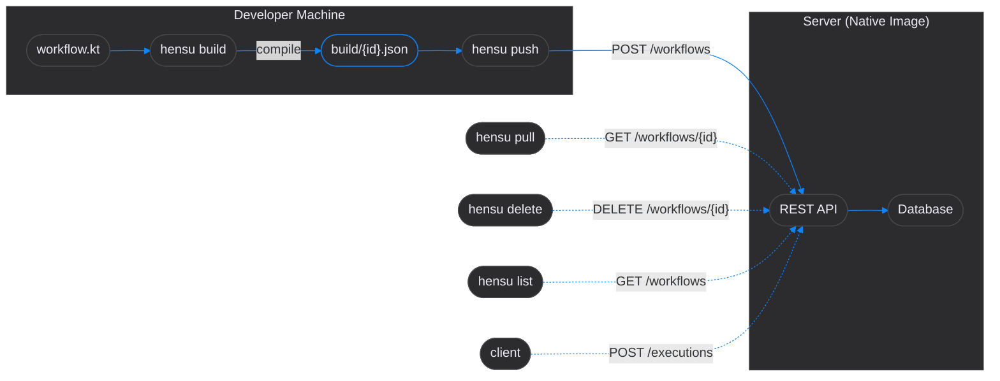
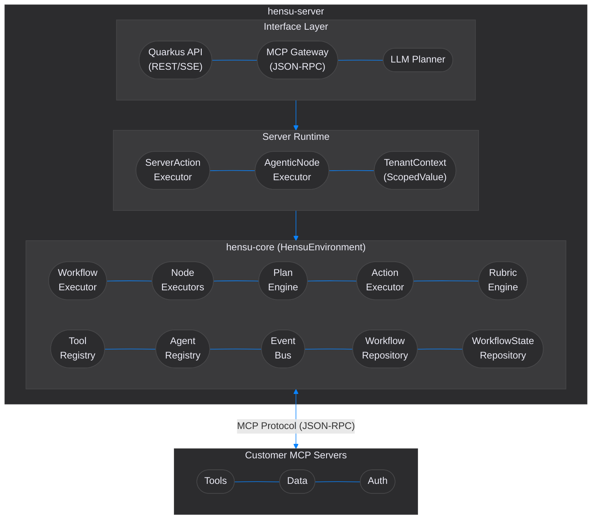
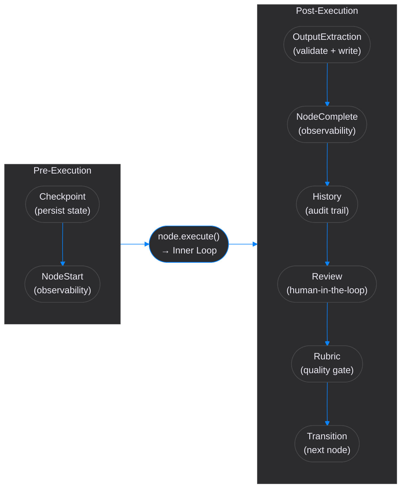
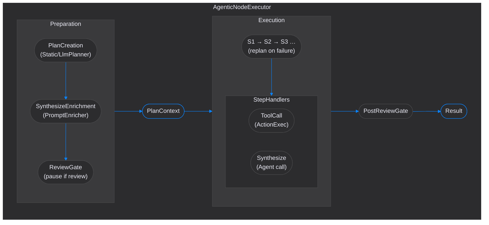
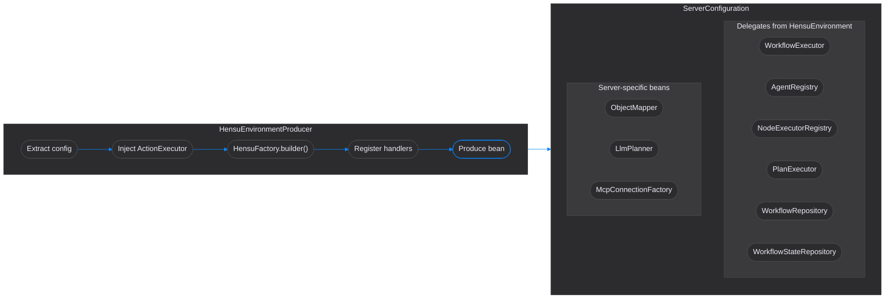

# Hensu Unified Architecture

**Hensu** separates the **authoring** of AI workflows from their **execution**. Developers describe agent behavior in a
type-safe Kotlin DSL. A compiler produces portable JSON definitions. A GraalVM native-image server executes them,
maintaining distributed lease state (`serverNodeId`, heartbeats) across the cluster. No user code ever runs on the server.

**Two layers, strictly decoupled:**

| Layer             | Responsibility                                   | Technology                            |
|:------------------|:-------------------------------------------------|:--------------------------------------|
| **Definition**    | Author and compile workflow logic                | Kotlin DSL → JSON artifacts           |
| **Orchestration** | Execute compiled workflows with tenant isolation | Pure Java core + Quarkus native image |

**Workflows operate at two levels:**

- **Macro-Graph:** The static, declarative flow defined in the DSL — which nodes run, in what order, with what
  transitions. This is the **strategy**.
- **Micro-Plan:** The dynamic, step-by-step execution logic within a single node — tool calls, replanning, reflection
  loops. This is the **tactics**.

**The Architectural Core:** The engine is **pure Java** with **zero external dependencies**. Protocol handling (MCP),
provider integrations (LLMs), persistence, and security (multi-tenancy via `ScopedValues`) are pluggable modules wired
explicitly via `HensuFactory.builder()`.

---

## Key Architectural Decisions

### 1. Client-Side Compilation (Terraform/kubectl Pattern)

The server is deployed as a **GraalVM native image** - it cannot include the Kotlin DSL compiler.
Workflow compilation happens on the developer machine:



### 2. Centralized Bootstrap (`HensuFactory`)

All core components are assembled through a single builder — `HensuFactory.builder()` — that produces an immutable
`HensuEnvironment` container. This enforces a consistent wiring strategy across both CLI and Server deployments:
agent providers, action executors, repositories, and configuration are resolved once at startup.

The builder is the only place where deployment-specific behavior diverges: the CLI wires a local bash executor and
the LangChain4j provider; the server wires an action executor that dispatches `Action.Send` to any registered
`ActionHandler` (falling back to MCP for unrecognized handlers) while rejecting `Action.Execute` (local bash),
and delegates all components via CDI producers.

See [Core Developer Guide](developer-guide-core.md) for usage patterns.

### 3. Zero-Trust Execution (MCP Only)

The server is a **pure orchestrator** — it has no shell, no `eval`, no script runner. All side effects
(tool calls, database writes, API requests) are routed to tenant-owned MCP servers via the **Split-Pipe**
transport:

- **Downstream (SSE):** The server pushes JSON-RPC tool requests to the connected tenant client.
- **Upstream (HTTP POST):** The client executes the tool locally and returns the result.

This means tenant clients connect *outbound* — no inbound ports, no firewall rules, no VPN.
The server never sees raw credentials or executes user-supplied code. LLM output is treated with
equal suspicion — `AgentOutputValidator` sanitizes all agent responses for control characters,
Unicode manipulation, and excessive payload size before the output is written to workflow state.

### 4. Non-Linear Graph Execution

Workflows are not limited to linear chains. The graph engine supports:

| Capability                | Mechanism                                                                                                                                                                                                           |
|:--------------------------|:--------------------------------------------------------------------------------------------------------------------------------------------------------------------------------------------------------------------|
| **Conditional branching** | `ScoreTransition` routes based on rubric scores; `SuccessTransition` / `FailureTransition` route on result                                                                                                          |
| **Loops**                 | `LoopNode` with configurable break conditions and max iterations                                                                                                                                                    |
| **Parallel fan-out**      | `ParallelNode` executes branches concurrently on virtual threads                                                                                                                                                    |
| **Fork / Join**           | `ForkNode` spawns independent parallel paths; `JoinNode` awaits and merges results                                                                                                                                  |
| **Consensus**             | Majority vote, unanimous, weighted vote, or judge-decides strategies. Branches declare domain output via `yields()`. Vote strategies merge all branch yields; JUDGE_DECIDES merges only the winning branch's yields |
| **Backtracking**          | Review decisions can jump to any previous node, restoring state from execution history                                                                                                                              |
| **Sub-workflows**         | `SubWorkflowNode` with input/output mapping for hierarchical composition                                                                                                                                            |
| **Pause / Resume**        | Any node returning `PENDING` checkpoints state (including `PlanSnapshot` — micro-plan step index — alongside node position); `executeFrom()` resumes from snapshot                                                  |

For non-agent steps, `GenericNode` runs custom synchronous logic registered by `executorType`;
`ActionNode` dispatches asynchronous tasks to external systems via a registered `ActionHandler`
(e.g., webhooks, git operations, notifications).

### 5. Structured Concurrency (Preview API)

All parallel execution – `ParallelNodeExecutor`, `ForkNodeExecutor` – uses Java's
`StructuredTaskScope` (preview, JEP 453) instead of raw `ExecutorService`.
This is a deliberate trade-off: preview API in exchange for three structural guarantees.

**Why preview:** `StructuredTaskScope` enforces a parent–child relationship between the
spawning thread and its subtasks. When the scope closes, all subtasks are guaranteed to have
completed or been canceled – there is no "fire and forget" leak path. With raw
`ExecutorService`, a forgotten `Future` or a missed `shutdown()` silently leaks threads.
In a workflow engine where every fork spawns N virtual threads running LLM calls, that leak
compounds per execution.

**What it buys us:**

| Guarantee                          | `ExecutorService`                        | `StructuredTaskScope`          |
|:-----------------------------------|:-----------------------------------------|:-------------------------------|
| Subtask lifetime bounded by parent | Manual (`shutdown` + `awaitTermination`) | Automatic (scope close)        |
| First failure cancels siblings     | Manual (`Future.cancel` loop)            | Built-in (`ShutdownOnFailure`) |
| Thread dumps show parent–child     | No – flat pool                           | Yes – structured hierarchy     |

**Operational consequence:** `--enable-preview` is required everywhere – Gradle compile tasks,
CLI launcher scripts, daemon `ProcessBuilder`, Quarkus dev mode, and native image build args.
The install scripts and build config handle this automatically; manual `java -jar` invocations
must include the flag.

Each parallel execution creates and closes its own `StructuredTaskScope` within the node
executor method, scoped to that single fork/parallel operation. No shared thread pool exists.

### 6. Quality Gates (Rubric Evaluation)

Node outputs can be evaluated against markdown rubric definitions before the workflow transitions. The
`RubricEngine` coordinates evaluation through `ScoreExtractingEvaluator`, which reads the `score`
engine variable written directly to context by the agent's synthesis step — no JSON parsing required.
`ScoreTransition` rules route based on thresholds, enabling self-correcting loops where low-scoring
outputs are sent back for revision. The evaluator also accumulates feedback into the `recommendation`
engine variable, which `RecommendationVariableInjector` injects into the next agent's prompt
automatically when a `ScoreTransition` or `ApprovalTransition` is present on the node.

### 7. Storage Architecture

Repository interfaces and in-memory defaults live in **hensu-core**:

- `WorkflowRepository` (`io.hensu.core.workflow`) — Tenant-scoped workflow definition storage
- `WorkflowStateRepository` (`io.hensu.core.state`) — Tenant-scoped execution state snapshots

`HensuFactory.builder()` wires in-memory implementations by default. The server delegates these from
`HensuEnvironment` via `@Produces @Singleton` — it never creates instances directly. Production deployments can
substitute database-backed implementations through the builder.

### 8. Distributed Execution & Recovery

In a multi-instance deployment, each server node holds a **lease** on the executions it is
currently running. Leases are tracked via two columns in `hensu.execution_states`:

- `server_node_id` — the UUID of the server node owning the execution (`NULL` when idle or complete)
- `last_heartbeat_at` — timestamp last refreshed by the owning node

Three components implement the lease lifecycle:

| Component               | Responsibility                                                                                                                                                               |
|:------------------------|:-----------------------------------------------------------------------------------------------------------------------------------------------------------------------------|
| `ExecutionLeaseManager` | Acquires, renews, and atomically claims leases; generates and holds `server_node_id`                                                                                         |
| `ExecutionHeartbeatJob` | Runs every `hensu.lease.heartbeat-interval` (default `30s`) — bumps `last_heartbeat_at` for all active leases on this node                                                   |
| `WorkflowRecoveryJob`   | Runs every `hensu.lease.recovery-interval` (default `60s`) — claims any execution whose heartbeat is older than `hensu.lease.stale-threshold` (default `90s`) and resumes it |


**Concurrency safety**: `claimStaleExecutions` uses a single `UPDATE … WHERE last_heartbeat_at < threshold
RETURNING …`. Under PostgreSQL's default `READ COMMITTED` isolation, two concurrent sweepers racing on the
same stale row cannot both claim it — the second re-evaluates the `WHERE` clause against the committed row
(fresh heartbeat) and silently skips it. No application-level locking is required.

The lease is **automatically cleared** (set to `NULL`) when an execution reaches a terminal state —
`"completed"`, `"paused"` (human review), `"failed"`, or `"rejected"`. The `%inmem` test profile
disables the scheduler entirely (`%inmem.quarkus.scheduler.enabled=false`).

**Server vs CLI daemon review semantics:** The server's `"paused"` state is stateless — it drops
the lease and relies on an external `POST /resume` call. The CLI daemon's `AWAITING_REVIEW` state
is **not terminal** (`isTerminal() == false`): the execution's virtual thread remains alive and
blocked, holding no lease but retaining in-process state. A client `hensu attach` resumes the
review inline without replaying from a checkpoint.

### 9. REST API Separation

All path/query identifiers are validated by `@ValidId`; workflow request bodies by `@ValidWorkflow`
(deep-validates the entire object graph for safe identifiers and control-character-free text);
free-text inputs by `@ValidMessage`. `LogSanitizer` strips CR/LF at every log call site.
Violations return `400 Bad Request`. See [Server Developer Guide — Input Validation](developer-guide-server.md#input-validation).

```
/api/v1/workflows    → WorkflowResource (definition management - CLI integration)
├── POST   /                    Push workflow (create/update)
├── GET    /                    List workflows
├── GET    /{workflowId}        Pull workflow
└── DELETE /{workflowId}        Delete workflow

/api/v1/executions   → ExecutionResource (runtime operations - client integration)
├── POST   /                          Start execution (202 Accepted — async; progress via SSE)
├── GET    /{executionId}             Get execution status
├── GET    /{executionId}/events      Subscribe to execution events (SSE stream)
├── POST   /{executionId}/resume      Resume paused execution
├── GET    /{executionId}/plan        Get pending plan
├── GET    /{executionId}/result      Get final output (public context, _-keys stripped)
└── GET    /paused                    List paused executions
```

---

## Architecture Overview



---

## Module Structure

### hensu-core (Pure Execution Runtime)

Zero-dependency Java library. Contains:

- `HensuFactory` / `HensuEnvironment` — Builder and container for all core components
- `WorkflowExecutor` — Graph traversal, node dispatch, pause/resume via `executeFrom()`
- `NodeExecutorRegistry` — Pluggable node type executors
- `AgentRegistry` / `AgentFactory` — Agent management with explicit provider wiring
- `ActionExecutor` — Pluggable action dispatch (Send/Execute)
- `PlanPipeline` / `PlanProcessor` / `PlanContext` — Pipeline-driven plan execution:
  `AgenticNodeExecutor` runs a preparation pipeline (`PlanCreationProcessor` →
  `SynthesizeEnrichmentProcessor` → `ReviewGateProcessor`) then an execution pipeline
  (`PlanExecutionProcessor` → `PostExecutionReviewGateProcessor`); `PlanContext` is the mutable
  carrier flowing through both
- `PlanExecutor` / `StepHandlerRegistry` / `StepHandler` — `PlanExecutor` iterates plan steps
  dispatching each `PlanStepAction` via registry lookup; built-in handlers: `ToolCallStepHandler`
  and `SynthesizeStepHandler`
- `StaticPlanner` / `LlmPlanner` — Planner implementations: `StaticPlanner` resolves predefined
  DSL steps; `LlmPlanner` generates and revises plans dynamically via an LLM agent
- `ToolRegistry` / `ToolDefinition` — Protocol-agnostic tool descriptors for MCP integration
- `RubricEngine` / `ScoreExtractingEvaluator` — Quality evaluation: reads `score` engine variable
  from context; accumulates feedback into `recommendation`; no JSON parsing
- `EngineVariables` — SSOT for engine variable names (`score`, `approved`, `recommendation`)
- `AgentLifecycleRunner` — Composition-based agent call: prompt enrichment → execution → output extraction
- `EngineVariablePromptEnricher` — Composite enricher running 6 injectors before each agent call:
  `RubricPromptInjector` → `ScoreVariableInjector` → `ApprovalVariableInjector` →
  `RecommendationVariableInjector` → `WritesVariableInjector` → `YieldsVariableInjector`.
  Score/Approval/Recommendation injectors fire for both transition-based nodes and consensus branches
  (via `BranchExecutionConfig.needsSelfScoring()`)
- `WorkflowRepository` / `WorkflowStateRepository` — Tenant-scoped storage interfaces with in-memory defaults
- `HensuState` / `HensuSnapshot` / `ExecutionHistory` — Mutable runtime state, immutable checkpoints, execution trace
- Workflow model, Node types (including `SubWorkflowNode`), Transition rules

### hensu-dsl (Kotlin DSL)

Kotlin DSL for workflow definitions. Contains:

- `HensuDSL.kt` - Top-level `workflow { }` entry point
- `KotlinScriptParser` - Compiles `.kt` files via embedded Kotlin compiler
- Type-safe builders for all node types, transitions, and configurations
- `Models` constants for supported AI model identifiers

**Client-side only.** Never runs on the server (no Kotlin compiler in native image).

### hensu-server (Quarkus Native Image)

Extends core with HTTP, MCP, and multi-tenancy:

- `HensuEnvironmentProducer` — CDI producer using `HensuFactory.builder()`
- `ServerConfiguration` — Delegates core components from `HensuEnvironment` via `@Produces @Singleton`
- `ServerActionExecutor` — Send-action dispatcher (routes to registered handlers, falls back to MCP; rejects `Action.Execute`)
- `WorkflowService` — Service layer: start/resume executions, snapshot management
- `WorkflowResource` — Workflow definition management (push/pull/delete/list)
- `ExecutionResource` — Execution runtime (start/resume/status/plan)
- `McpSidecar` / `McpGateway` — MCP protocol integration
- `TenantContext` — Java 25 `ScopedValue` carrying tenant identity for the scope of a request; `TenantContext.runAs()` is the safe propagation entry point
- `ExecutionLeaseManager` / `ExecutionHeartbeatJob` / `WorkflowRecoveryJob` — Distributed recovery: heartbeat emission and orphaned-execution sweeper
- `JdbcWorkflowRepository` / `JdbcWorkflowStateRepository` — PostgreSQL-backed storage (JSONB workflow definitions, execution state + lease columns)

### hensu-serialization (JSON Serialization)

Jackson-based JSON serialization shared by CLI and server:

- `WorkflowSerializer` - Entry point: `toJson()`, `fromJson()`, `createMapper()`
- `HensuJacksonModule` - Custom serializers/deserializers for Node, TransitionRule, Action type hierarchies
- Jackson mixins for builder-based deserialization (Workflow, AgentConfig)
- GraalVM-safe: explicit registrations via `SimpleModule` (no reflective scanning)

### hensu-cli (Quarkus CLI)

Developer-facing CLI tool:

- Uses `hensu-dsl` for Kotlin DSL compilation (workflow.kt → JSON)
- `hensu build` - Compile DSL to JSON (`{working-dir}/build/`)
- `hensu push` / `pull` / `delete` / `list` - Server workflow management
- Local execution mode (uses full HensuEnvironment with local action executor)
- `HensuEnvironmentProducer` (CLI variant - wires LangChain4jProvider, bash execution)
- `DaemonReviewHandler` / `CLIReviewHandler` / `ReviewTerminal` — Human-in-the-loop review over the daemon socket or inline

#### Daemon Architecture

The CLI ships a background `DaemonServer` to eliminate JVM and Kotlin compiler cold-start latency.
`DaemonClient` communicates with it over a **bidirectional** Unix domain socket
(`~/.hensu/daemon.sock`). Workflow executions run in virtual threads inside the warm JVM; output is
buffered in an `OutputRingBuffer` so clients can detach (`Ctrl+C`) and re-attach (`hensu attach`)
without losing output.

**Interactive review over the socket:** When a node has `review = true`, the daemon sends a
`review_request` frame to the attached client and blocks the execution's virtual thread until a
`review_response` frame arrives. `DaemonReviewHandler` coordinates this lifecycle:

- If a client is attached, it renders the review prompt via `ReviewTerminal` and collects
  Approve / Reject / Backtrack decisions.
- If the client detaches (`Ctrl+C`) mid-review, the execution remains in `AWAITING_REVIEW` —
  the virtual thread stays blocked until a new client attaches and submits a response, or the
  30-minute fallback timeout triggers.
- `CLIReviewHandler` provides the inline (non-daemon) fallback for `--no-daemon` runs.

---

## Core Concepts

### 1. Macro-Graph (DSL Level)

The static workflow defined by users:

```kotlin
workflow("OrderProcessing") {
    agents { ... }

    graph {
        start at "validate"

        node("validate") { ... }
        node("process") { ... }
        node("notify") { ... }

        end("complete")
    }
}
```

### 2. Micro-Plan (Node Level)

Internal execution strategy within a node. Two modes:

**Predefined Plan (Static):**

```kotlin
node("process-order") {
    agent = "processor"

    plan {
        step("get_order", mapOf("id" to "{orderId}"))
        step("validate_payment", mapOf("amount" to "{order.total}"))
        step("reserve_inventory", mapOf("items" to "{order.items}"))
        step("confirm_order", mapOf("id" to "{orderId}"))
    }

    onSuccess goto "notify"
    onPlanFailure goto "manual-review"
}
```

**Dynamic Plan (LLM-Generated):**

```kotlin
node("research-topic") {
    agent = "researcher"
    tools = listOf("search", "analyze", "summarize")

    planning {
        mode = PlanningMode.DYNAMIC
        maxSteps = 5
        allowReplan = true
        review = false
    }

    prompt = "Research {topic} comprehensively"
    onSuccess goto "publish"
    onPlanFailure goto "fallback"
}
```

### 3. The Execution Loop

`WorkflowExecutor` separates every node traversal into two distinct concerns: the **outer
processor pipeline** that wraps each node, and the **inner plan-step loop** within it.

**Outer Pipeline** (`ProcessorPipeline`) — every node traversal:



Any processor can short-circuit by returning a terminal `ExecutionResult`.

**Inner Plan Loop** — what `node.execute()` runs for `StandardNode` via `AgenticNodeExecutor`:



### 4. State Schema Validation

Workflows optionally declare a `WorkflowStateSchema` — a typed registry of domain variables
(`writes` declarations) and their expected types. At load time, `WorkflowValidator` verifies
the schema against all node `writes` declarations and prompt template bindings (e.g., `{orderId}`),
preventing runtime binding failures before execution begins.

Three **engine variables** (`score`, `approved`, `recommendation`) are predefined in
`WorkflowStateSchema.ENGINE_VARIABLES` — they must never appear in user `state { }` declarations
or `writes()` calls. They are injected into and extracted from context automatically by the
`EngineVariablePromptEnricher` pipeline and `OutputExtractionPostProcessor`.

Each domain variable can carry an optional `description` — a plain-English hint for the LLM:

```kotlin
state {
    input("topic",   VarType.STRING)
    variable("article", VarType.STRING, "the full written article text")
}
```

`WritesVariableInjector` reads these descriptions from the schema and appends structured output
requirements to the agent prompt, so the LLM knows exactly what format each written field expects.

### 5. Execution Observability (SSE)

Workflow visibility is provided via Server-Sent Events separate from the MCP split-pipe transport.
`ExecutionEventBroadcaster` receives engine events (`step.started`, `step.completed`, `plan.revised`,
`execution.completed`, etc.) and fans them out to HTTP clients subscribed via `ExecutionEventResource`.

To safely route events from background virtual threads back to the correct execution, the broadcaster
binds the current `executionId` in a Java 25 `ScopedValue` — no `ThreadLocal`, no manual ID passing.

---

## Server Initialization

The server wires core infrastructure through CDI:



---

## GraalVM Design Constraints

Hensu is deployed as a **GraalVM native image** — this is not just a deployment detail, it shapes
core architecture. GraalVM performs static analysis at build time; patterns that require runtime
reflection, classpath scanning, or dynamic class generation fail silently or crash.

### The No-Go List (hensu-core)

| Pattern                                     | Problem                              | Rule                                          |
|:--------------------------------------------|:-------------------------------------|:----------------------------------------------|
| `Class.forName()` / `field.setAccessible()` | Requires runtime reflection metadata | Never in `hensu-core`                         |
| `Proxy.newProxyInstance()`                  | Generates classes at runtime         | Never                                         |
| Jackson `@JsonTypeInfo(use = CLASS)`        | Encodes class names as strings       | Never; use `SimpleModule` type discriminators |
| Classpath scanning / `ServiceLoader`        | Scans at runtime                     | Explicit wiring via `HensuFactory.builder()`  |

### Quarkus Relaxations (hensu-server)

Quarkus extensions generate GraalVM metadata at build time, so these patterns work safely
within `hensu-server`:

- CDI injection (`@Inject`, `@Produces`) — ArC resolves beans at build time
- `@ConfigProperty` — processed at build time
- JAX-RS resources (`@Path`, `@GET`) — REST layer is build-time wired
- LangChain4j AI services — `quarkus-langchain4j` extensions register metadata

### Explicit Wiring as a Design Principle

The prohibition on classpath scanning is why `HensuFactory.builder()` uses explicit wiring.
`AgentProvider`, `NodeExecutorRegistry`, and `ActionExecutor` instances are declared at call
sites — GraalVM's static analysis can follow every reference.

Classes in `hensu-core` that Jackson needs reflectively (builder constructors, setter methods)
are registered in `NativeImageConfig` in `hensu-server` via `@RegisterForReflection`. No
Quarkus or Jackson annotations ever enter `hensu-core`.

See [Server Developer Guide — GraalVM Native Image](developer-guide-server.md#graalvm-native-image).

---

## Jackson Serialization Contract

### The Core Boundary Rule

`hensu-core` contains **zero Jackson imports**. Domain models (`Workflow`, `Node`, `AgentConfig`)
are plain Java records and builder classes — no `@JsonProperty`, `@JsonDeserialize`,
`@JsonTypeInfo`. This is a deliberate decoupling contract: the core engine is a pure Java
library, testable and deployable without any JSON framework.

### How Serialization Is Wired

`hensu-serialization` owns the entire Jackson configuration:

| Component            | Role                                                                                                                                        |
|:---------------------|:--------------------------------------------------------------------------------------------------------------------------------------------|
| `WorkflowSerializer` | Entry point: `toJson()`, `fromJson()`, `createMapper()` — the single `ObjectMapper` factory                                                 |
| `HensuJacksonModule` | `SimpleModule` registering all custom serializers/deserializers for `Node`, `TransitionRule`, `Action` hierarchies — no reflective scanning |
| `mixin/` package     | Jackson mixins enabling builder-based deserialization without annotating core models                                                        |

`WorkflowSerializer.createMapper()` is the **single `ObjectMapper` factory** for CLI and server.
`ServerConfiguration` exposes it as a CDI bean via `@Produces @Singleton`.

### GraalVM Implication

Jackson mixins are a runtime event — Quarkus cannot trace them at build time. `NativeImageConfig`
in `hensu-server` is the single `@RegisterForReflection` registration point for all `hensu-core`
builder classes that the mixin machinery needs.

See [hensu-serialization Developer Guide](developer-guide-serialization.md) for the `treeToValue` rule.

---

## Testing Strategy

Each layer has a dedicated testing approach exercising real code at the appropriate scope.

### Unit Tests (Pure JVM)

Isolated class tests using Mockito. `StubAgentProvider` (priority 1000) intercepts all agent
creation and returns a `StubAgent` backed by `StubResponseRegistry`. No AI API calls, no network,
no containers.

### Integration Tests (Quarkus InMemory)

`@QuarkusTest` with `@TestProfile(InMemoryTestProfile.class)` boots the full server — API,
CDI wiring, `WorkflowExecutor`, `TenantContext` — against in-memory repositories. The `inmem`
profile disables PostgreSQL, Flyway, and the scheduler (no Docker required).

All integration tests extend `IntegrationTestBase`, which provides CDI injection, per-test
state cleanup, and helpers (`registerStub`, `pushAndExecute`, `resolveRubricPath`).

### Repository Tests (Testcontainers PostgreSQL)

Tests in `io.hensu.server.persistence` extend `JdbcRepositoryTestBase`, which starts a real
PostgreSQL container and runs Flyway migrations — no Quarkus context involved. These tests
cover CRUD, UPSERT semantics, FK constraints, tenant isolation, lease column behavior, and
distributed recovery operations.

### Test Coverage Map

| Layer       | Mechanism                      | Scope                                                |
|:------------|:-------------------------------|:-----------------------------------------------------|
| Unit        | Mockito, pure JVM              | Class-level logic, edge cases                        |
| Integration | `@QuarkusTest` + inmem profile | CDI wiring, API contracts, end-to-end workflow logic |
| Persistence | Testcontainers + Flyway        | SQL correctness, schema migrations, tenant isolation |

---

## Summary

The unified architecture provides:

1. **Pure Core** — Zero-dependency Java engine, protocol-agnostic
2. **Build-Then-Push** — Client-side compilation (Kotlin DSL → JSON); server receives pre-compiled artifacts
3. **Centralized Bootstrap** — `HensuFactory.builder()` as the single entry point for all core infrastructure
4. **Zero-Trust Execution** — Server has no shell; `Action.Execute` is rejected; side effects route via registered `ActionHandler`s (MCP by default) to tenant clients
5. **Non-Linear Graphs** — Loops, conditional branches, fork/join, parallel fan-out with consensus, backtracking
6. **Structured Concurrency** — `StructuredTaskScope` (preview) for all parallel execution; no `ExecutorService`, no thread pool lifecycle
7. **Rubric Evaluation** — Quality gates that score outputs and route on thresholds for self-correcting loops
8. **Pause / Resume** — Workflows checkpoint at any node (including micro-plan step index via `PlanSnapshot`) and resume; the lease protocol protects against data races when the owning node crashes
9. **Distributed Recovery** — Heartbeat/sweeper lease protocol for crashed-node detection; atomic PostgreSQL `UPDATE…RETURNING` claim
10. **Sub-Workflows** — Hierarchical composition via `SubWorkflowNode` with input/output mapping
11. **Flexible Planning** — Static (predefined) or Dynamic (LLM-generated) execution plans within nodes
12. **Human Review** — Checkpoints for manual approval at both plan and execution levels
13. **Multi-Tenancy** — Java 25 `ScopedValues` for safe tenant context propagation and isolation
14. **Storage in Core** — Repository interfaces with in-memory defaults; server delegates via CDI
15. **Shared Serialization** — `hensu-serialization` provides consistent JSON format; zero Jackson in `hensu-core`
16. **API Separation** — Workflow definitions and executions are distinct REST resources
17. **GraalVM-First Design** — No-reflection core; explicit wiring enables static analysis
18. **Three-Layer Testing** — Unit (Mockito), Integration (inmem + stubs), Persistence (Testcontainers)
19. **State Schema Validation** — `WorkflowStateSchema` + `WorkflowValidator` enforce typed variable declarations and prompt bindings at load time
20. **Execution Observability** — `ExecutionEventBroadcaster` fans out engine events to SSE subscribers; `ScopedValue` routes events across virtual threads without `ThreadLocal`
21. **CLI Daemon** — `DaemonServer` keeps the JVM and Kotlin compiler warm; `OutputRingBuffer` allows detach/re-attach without losing execution output
