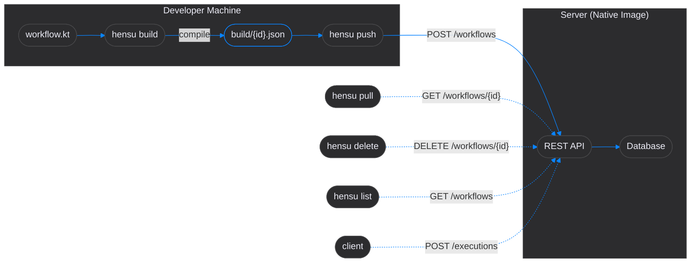
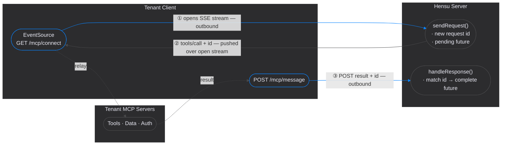
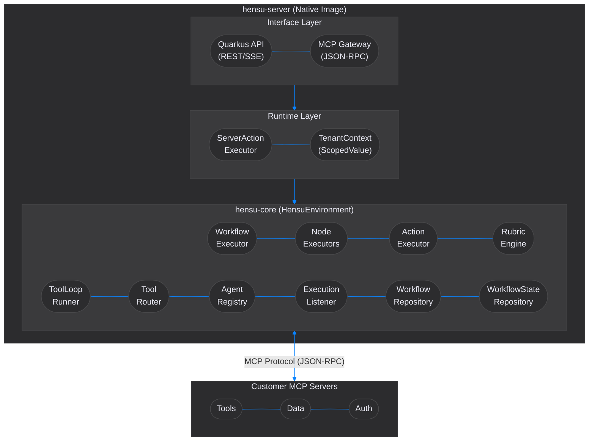
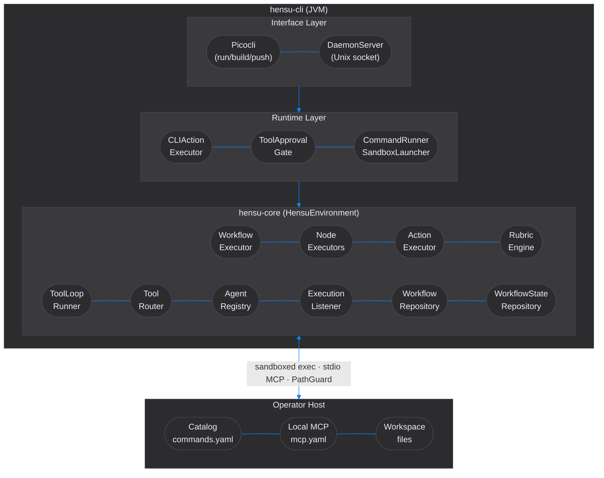
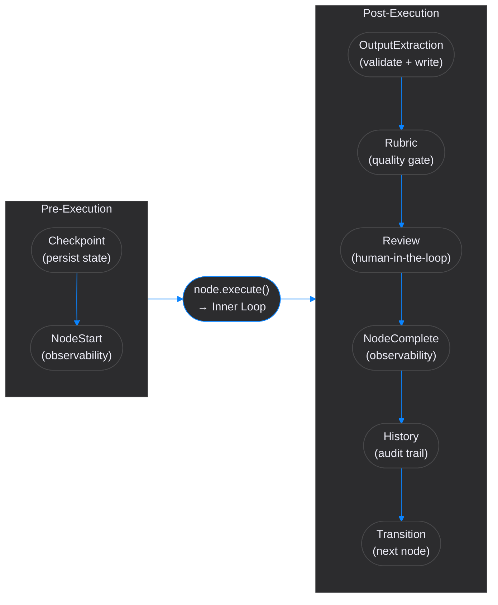
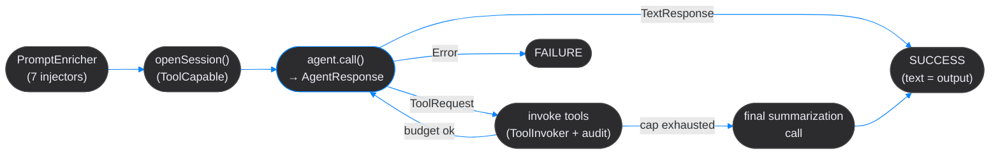
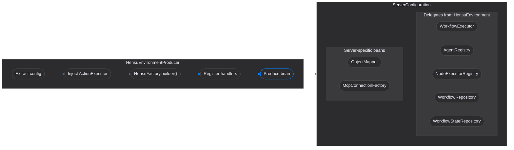

# Hensu Unified Architecture

**Hensu** separates the **authoring** of AI workflows from their **execution**. Developers describe agent behavior in a
type-safe Kotlin DSL, and a compiler produces portable JSON definitions. The same engine then executes those
definitions in one of **two runtimes**: a GraalVM native-image server that runs tenant workloads across a cluster, or a
JVM CLI that runs a workflow on the operator's own machine. Both embed `hensu-core` unchanged, and neither is a
degraded mode of the other.

**Two runtimes, one engine:**

| Runtime                     | Executes                                                        | How side effects reach the world                                                                                            | Packaging                                                          |
|:----------------------------|:----------------------------------------------------------------|:----------------------------------------------------------------------------------------------------------------------------|:-------------------------------------------------------------------|
| **Server** (`hensu-server`) | Many tenants' workloads, multi-instance, leased and recoverable | Tenant-owned MCP servers over the split-pipe transport. No shell, no `eval`, no user code on the box (Decision 3)           | GraalVM native image (Quarkus)                                     |
| **CLI** (`hensu-cli`)       | One operator's workloads, on that operator's own host           | A declared command catalog and local MCP servers under an OS sandbox, plus file tools contained by `PathGuard` (Decision 4) | JVM uber-jar plus launcher script – embeds the Kotlin DSL compiler |

The split is load-bearing rather than a packaging detail. It is the entire subject of Decisions 3 and 4, it is why one
`HensuFactory.builder()` produces two different wirings (Decision 2), and it is why "Hensu executes a workflow" has two
correct answers. Where a section applies to only one runtime, it says so in its title.

**Authoring and execution stay decoupled:**

| Layer             | Responsibility                    | Technology                                                      |
|:------------------|:----------------------------------|:----------------------------------------------------------------|
| **Definition**    | Author and compile workflow logic | Kotlin DSL → JSON artifacts, client-side only                   |
| **Orchestration** | Execute compiled workflows        | `hensu-core` – pure Java, zero dependencies – in either runtime |

**Workflows operate at two levels:**

- **Macro-Graph:** The static, declarative flow defined in the DSL — which nodes run, in what order, with what
  transitions. This is the **strategy**.
- **Micro-Tactics:** The dynamic execution logic within a single node — an **agent-native tool loop**
  (`ToolLoopRunner`) where the agent drives tool calls directly via `ToolCapable` / `ToolSession`. This is the **tactics**.

**The Architectural Core:** The engine is **pure Java** with **zero external dependencies**. Protocol handling (MCP),
provider integrations (LLMs), persistence, and security (multi-tenancy via `ScopedValues`) are pluggable modules wired
explicitly via `HensuFactory.builder()`.

---

## Key Architectural Decisions

### 1. Client-Side Compilation (Terraform/kubectl Pattern)

The server is deployed as a **GraalVM native image** - it cannot include the Kotlin DSL compiler.
Workflow compilation happens on the developer machine:


```mermaid
flowchart LR
    subgraph dev["Developer Machine"]
        direction TB
        wf(["workflow.kt"]) --> build(["hensu build"])
        build -->|"compile"| json(["build/{id}.json"])
        json --> push(["hensu push"])
    end

    subgraph srv["Server (Native Image)"]
        direction TB
        api(["REST API"]) --> db(["Database"])
    end

    push -->|"POST /workflows"| api
    pull(["hensu pull"]) -.->|"GET /workflows/{id}"| api
    del(["hensu delete"]) -.->|"DELETE /workflows/{id}"| api
    list(["hensu list"]) -.->|"GET /workflows"| api
    client(["client"]) -.->|"POST /executions"| api

    style dev fill:#2c2c2e, stroke:#3a3a3c, color:#ebebf5, stroke-width:1px
    style srv fill:#2c2c2e, stroke:#3a3a3c, color:#ebebf5, stroke-width:1px
    style wf fill:#2c2c2e, stroke:#48484a, color:#ebebf5, stroke-width:1px
    style build fill:#2c2c2e, stroke:#48484a, color:#ebebf5, stroke-width:1px
    style json fill:#2c2c2e, stroke:#0A84FF, color:#ebebf5, stroke-width:1px
    style push fill:#2c2c2e, stroke:#48484a, color:#ebebf5, stroke-width:1px
    style api fill:#2c2c2e, stroke:#48484a, color:#ebebf5, stroke-width:1px
    style db fill:#2c2c2e, stroke:#48484a, color:#ebebf5, stroke-width:1px
    style pull fill:#2c2c2e, stroke:#48484a, color:#ebebf5, stroke-width:1px
    style del fill:#2c2c2e, stroke:#48484a, color:#ebebf5, stroke-width:1px
    style list fill:#2c2c2e, stroke:#48484a, color:#ebebf5, stroke-width:1px
    style client fill:#2c2c2e, stroke:#48484a, color:#ebebf5, stroke-width:1px

    linkStyle default stroke:#0A84FF, stroke-width:1px
```

This diagram covers the **server** path only, which is why the developer machine appears in it as a build-and-push
client. It is not the whole picture of what the CLI does: `hensu run` compiles and then executes the workflow in
process, without a server being involved at all. Compilation is client-side in both runtimes because the Kotlin
compiler is a client-side thing; execution is a separate question, answered twice.

### 2. Centralized Bootstrap (`HensuFactory`)

All core components are assembled through a single builder — `HensuFactory.builder()` — that produces an immutable
`HensuEnvironment` container. This enforces a consistent wiring strategy across both runtimes:
agent providers, action executors, repositories, and configuration are resolved once at startup.

The builder is the only place where runtime-specific behavior diverges: both CLI and server wire the LangChain4j
provider for LLM access. The CLI additionally wires a local bash executor (`CLIActionExecutor`); the server wires
`ServerActionExecutor` that dispatches `Action.Send` to any registered `ActionHandler` (falling back to MCP for
unrecognized handlers) while rejecting `Action.Execute` (local bash), and delegates all components via CDI producers.
Each runtime also supplies its own `ToolProvider` instances, composed into the `ToolRouter` the engine calls for
agent tool use. The engine ships one of its own, `FileToolProvider`, whose file tools need no catalog and no launch.

See [Core Developer Guide](developer-guide-core.md) for usage patterns.

### 3. Zero-Trust Execution (Server: MCP Only)

This decision is about the **server** runtime specifically. The server is a **pure orchestrator** — it
has no shell, no `eval`, no script runner. All side effects (tool calls, database writes, API requests)
are routed to tenant-owned MCP servers via the **Split-Pipe** transport. The CLI runtime executes
locally and answers the same question a different way; see Decision 4.

- **Downstream (SSE):** The Hensu server pushes each JSON-RPC tool request — tagged with a unique request id — over the tenant client's open `/mcp/connect` stream.
- **Upstream (HTTP POST):** The tenant client relays the request to its own MCP servers, then posts the JSON-RPC result to `/mcp/message`. `McpSessionManager` correlates the response by request id, completing the matching pending future (60 s timeout; futures are cancelled if the client disconnects).


```mermaid
flowchart LR
    subgraph client["Tenant Client"]
        direction TB
        es(["EventSource\nGET /mcp/connect"])
        post(["POST /mcp/message"])
    end

    subgraph server["Hensu Server"]
        direction TB
        send(["sendRequest()\n· new request id\n· pending future"])
        handle(["handleResponse()\n· match id → complete future"])
    end

    subgraph backends["Tenant MCP Servers"]
        direction TB
        tools(["Tools · Data · Auth"])
    end

    es -->|"① opens SSE stream — outbound"| send
    send -->|"② tools/call + id — pushed over open stream"| es
    post -->|"③ POST result + id — outbound"| handle
    es -.->|"relay"| tools
    tools -.->|"result"| post

    style client fill:#2c2c2e, stroke:#3a3a3c, color:#ebebf5, stroke-width:1px
    style server fill:#2c2c2e, stroke:#3a3a3c, color:#ebebf5, stroke-width:1px
    style backends fill:#2c2c2e, stroke:#3a3a3c, color:#ebebf5, stroke-width:1px
    style es fill:#2c2c2e, stroke:#0A84FF, color:#ebebf5, stroke-width:1px
    style post fill:#2c2c2e, stroke:#0A84FF, color:#ebebf5, stroke-width:1px
    style send fill:#2c2c2e, stroke:#48484a, color:#ebebf5, stroke-width:1px
    style handle fill:#2c2c2e, stroke:#48484a, color:#ebebf5, stroke-width:1px
    style tools fill:#2c2c2e, stroke:#48484a, color:#ebebf5, stroke-width:1px

    linkStyle 0,2 stroke:#0A84FF, stroke-width:1px
    linkStyle 1,3,4 stroke:#48484a, stroke-width:1px
```

Both pipes (①, ③) are **opened by the tenant client** — the accent arrows point *into* Hensu.
The only server→client traffic (②) is tool-call data pushed back over the SSE stream the client
already opened. Hensu never initiates a connection to the tenant, so tenants expose **no inbound
ports, no firewall rules, no VPN**.
The server never sees raw credentials or executes user-supplied code. LLM output is treated with
equal suspicion — `AgentOutputValidator` sanitizes all agent responses for control characters,
Unicode manipulation, and excessive payload size before the output is written to workflow state.
That sanitization is runtime-agnostic and applies to the CLI as well.

### 4. Contained Execution (CLI: Catalog and Sandbox)

The CLI runs on the operator's own machine, and that is the product rather than an implementation
detail: an engine an operator can grant controlled reach into their own host – its files, its
processes, its network – for whatever the job happens to be. It therefore cannot borrow the server's
answer of "execute nothing locally". The question is not whether a process runs, but what an
operator granted it and what contains it.

Two mechanisms answer two different questions, and neither is sufficient alone.

**The catalog** (`commands.yaml`, compiled by `CommandRegistry` at startup) answers *which binary may
run, with which argument shape*. Entries compile at load time: executables resolve to absolute paths so
a later `PATH` change cannot swap them, argv templates are checked, and every parameter carries a
declared schema. One broken entry fails the whole file with its line number — there is no partial load,
because a half-loaded allowlist is one nobody has reviewed.

**`mcp.yaml`** is the same grant for a server rather than a binary: a declaration the operator wrote,
naming what may be launched and how far it reaches. It differs where a long-lived process forces it to —
containment is decided once, at launch, because a process that outlives the call cannot be contained per
call — and a server that is not installed is a runtime absence the run reports, not a load failure.

**The sandbox** (`SandboxLauncher`, applied by `CommandRunner`) answers *how far the process tree
reaches*. The per-entry policy compiles to kernel mechanisms — bubblewrap namespaces and bind mounts on
Linux, an SBPL profile under `sandbox-exec` on macOS — so it constrains children and grandchildren
rather than inspecting what the agent typed. Each call gets a private `$HOME`, the environment is
rebuilt from an allowlist instead of inherited, and `commands.yaml` / `mcp.yaml` are re-bound read-only
*after* the writable subtrees, so a command granted `write: ["."]` still cannot rewrite the catalog that
decides what it may run.


```mermaid
flowchart LR
    subgraph bg [" "]
        direction LR
        agent(["Agent tool call"])
        cat(["Catalog<br/>which binary"])
        rung(["Rung<br/>agent writes the line"])
        sbx(["Sandbox<br/>how far it reaches"])
        proc(["Process tree"])
    end

    agent --> cat
    agent --> rung
    cat --> sbx
    rung --> sbx
    sbx --> proc

    style bg    fill:#1c1c1e, stroke:none
    style agent fill:#2c2c2e, stroke:#48484a, color:#ebebf5, stroke-width:1px
    style cat   fill:#2c2c2e, stroke:#0A84FF, color:#ebebf5, stroke-width:1px
    style rung  fill:#2c2c2e, stroke:#48484a, color:#ebebf5, stroke-width:1px
    style sbx   fill:#2c2c2e, stroke:#0A84FF, color:#ebebf5, stroke-width:1px
    style proc  fill:#2c2c2e, stroke:#48484a, color:#ebebf5, stroke-width:1px

    linkStyle default stroke:#0A84FF, stroke-width:1px
```

Three command forms exist, and one of them is a deliberate exception:

| Form          | Command text written by | What the agent contributes                       |
|---------------|-------------------------|--------------------------------------------------|
| `exec:`       | the operator            | argv elements, bound whole — never syntax        |
| `shell: true` | the operator            | `HENSU_PARAM_*` values, which no shell re-parses |
| `rung: true`  | **the agent**           | the command line itself                          |

The first two make injection inexpressible rather than filtered: `execve` takes an array, so `&&`,
`$()`, and `|` inside an argument are inert bytes and there is nothing to escape. The rung gives that
property up on purpose, and the reasoning belongs here because it is the one place the model is not
safe purely by construction:

> **On a path where the agent authors the code being executed, the sandbox is the security boundary and
> the catalog governs grants rather than reachability.**

This is not a claim about software development. Many useful grants hand the agent a binary that
executes *content*: an interpreter runs a script, a build tool runs a build file, a migration runner
runs migrations, a query tool runs SQL. Wherever the agent can write that content, the catalog has
already granted arbitrary code execution inside the sandbox — it arrives as data rather than as a
command line, which changes how it looks and not what it can do. Refusing a rung on such a path buys
close to nothing in containment while taxing every honest step.

Unattended software development is the sharpest instance, and the one the policies are designed
against: the agent's whole job is editing the files a build then executes, and nobody is watching.
It is an instance of the rule, not its scope.

So the rung exists — it does not exist unless an operator declares it, it carries the
closed policy pinned in `CommandDefinition`'s constructor rather than merged from configuration, and
what it costs is legibility rather than containment: anything reached through it is invisible to
per-entry `unattended:` and `approval:` policy, and its audit record is an opaque command line rather
than a command id with bound parameters.

On every other path — deploy, release, migrate, anything whose code the agent did not author — the
catalog is a genuine allowlist and the statement above does not apply. The layer table is read per
path, not globally.

One structural guard backs all of it: `CommandRunner.bind` is the only place in the tree that builds a
`/bin/sh` command line, and `NoShellOnTheAgentPathTest` reads the sources and fails the build when a
second one appears. Containment is never optional — a host with no working backend does not run the
command unsandboxed. It demotes the call to approval, so a human can authorise that one uncontained
invocation, and refuses it outright in a run with nobody to ask. The deployment-wide override stays
`toolexec.allowUnsandboxed`, which logs loudly and is never a default.

Local stdio MCP servers launch under the same supervisor and the same policy schema. There is one
containment mechanism, not two.

**Where a human fits, and where one does not.** The engine has no notion of human presence and does
not gain one: attendedness is a property of the runtime, which the CLI derives from
`--interactive` / `--unattended` and passes as a single boolean to `ToolApprovalGate`. That gate is
consulted by one `ApprovalToolProvider` decorator wrapping every discovered provider in the CLI's
producer, so the policy is written once rather than once per source, and a provider added later is
gated by being wrapped. The decorator reads the entry's own `unattended:` and `approval:`
declarations through `PreviewCapable`, which is also what lets a reviewer see the fully resolved
argv rather than the template.

An unattended run **refuses rather than escalates**. A refusal is not a failure, so
`ToolLoopRunner` appends a record to the reserved `_capability_gaps` state key and keeps
`_capability_gap_count` in step — and an ordinary `ConditionTransition` routes the blocked run,
because nodes do work and transitions route (Rule 9). Both keys are engine-owned: declaring either
in `writes` is a build error, or the agent's own output could erase the evidence that it was
blocked.

The profile half of this model is CLI-only, deliberately. Server-side MCP tools run ungated inside
the calling tenant's own catalog, where there is no reviewer to reach and containment belongs to the
tenant's server. The audit half is engine-wide: every invocation flows through the
`ExecutionListener` hooks and into a durable sink — `runtime.tool_audit` on the server, a JSON-lines
file on the CLI — composed unconditionally rather than behind the verbosity flag.

Operator-facing reference: [`docs/command-catalog.md`](command-catalog.md) and
[`docs/cli-tool-execution-security-model.md`](cli-tool-execution-security-model.md), which covers
the CLI side of it.

### 5. Non-Linear Graph Execution

Workflows are not limited to linear chains. The graph engine supports:

| Capability                | Mechanism                                                                                                                                                                                                                                                                                                                                                                                                                                                                                                                                                                                                                                                                                                 |
|:--------------------------|:----------------------------------------------------------------------------------------------------------------------------------------------------------------------------------------------------------------------------------------------------------------------------------------------------------------------------------------------------------------------------------------------------------------------------------------------------------------------------------------------------------------------------------------------------------------------------------------------------------------------------------------------------------------------------------------------------------|
| **Conditional branching** | `ScoreTransition` routes on rubric scores; `ConditionTransition` routes on any declared output variable via typed predicates (`onCondition` in DSL); `SuccessTransition` / `FailureTransition` route on result; `NoConsensusTransition` routes when a parallel node misses consensus; `AlwaysTransition` is the `otherwise` else-arm — catches every successful result the arms above it did not; `RubricFailTransition` for rubric-specific failure; `ApprovalTransition` for review-gated routing — on the human reviewer's verdict when one exists, else on the agent-written `approved`; `BoundedTransition` decorates any trigger with a per-node retry budget + escalation (the `revise` mechanism) |
| **Loops**                 | Condition-routed revise loops — a node re-executes itself under a bounded `revise` budget until an exit arm matches (the ralph-loop pattern)                                                                                                                                                                                                                                                                                                                                                                                                                                                                                                                                                              |
| **Parallel fan-out**      | `ParallelNode` executes branches concurrently on virtual threads                                                                                                                                                                                                                                                                                                                                                                                                                                                                                                                                                                                                                                          |
| **Fork / Join**           | `ForkNode` spawns independent parallel paths; `JoinNode` awaits and merges results                                                                                                                                                                                                                                                                                                                                                                                                                                                                                                                                                                                                                        |
| **Consensus**             | Majority vote, unanimous, weighted vote, or judge-decides strategies. Branches declare domain output via `yields()`. Vote strategies merge all branch yields; JUDGE_DECIDES merges only the winning branch's yields                                                                                                                                                                                                                                                                                                                                                                                                                                                                                       |
| **Backtracking**          | Review decisions can jump to any previous node, restoring state from execution history                                                                                                                                                                                                                                                                                                                                                                                                                                                                                                                                                                                                                    |
| **Sub-workflows**         | `SubWorkflowNode` delegates to another workflow by id with input/output mapping; `SubWorkflowGraphValidator` rejects cycles and dangling refs at push, `SubWorkflowNodeExecutor.MAX_DEPTH = 16` bounds recursion, `_tenant_id` propagates into the child                                                                                                                                                                                                                                                                                                                                                                                                                                                  |
| **Pause / Resume**        | Any node returning `PENDING` checkpoints state (node position and context); `executeFrom()` resumes from snapshot. The SSE stream is closed on pause (reviews may take days); clients re-subscribe after submitting a resume                                                                                                                                                                                                                                                                                                                                                                                                                                                                              |

For non-agent steps, `GenericNode` runs custom synchronous logic registered by `executorType`;
`ActionNode` dispatches asynchronous tasks to external systems via a registered `ActionHandler`
(e.g., webhooks, git operations, notifications).

### 6. Structured Concurrency (Preview API)

All parallel execution – `ParallelNodeExecutor`, `ForkNodeExecutor` – uses Java's
`StructuredTaskScope` (preview, JEP 453) instead of raw `ExecutorService`.
This is a deliberate trade-off: preview API in exchange for three structural guarantees.

**Why preview:** `StructuredTaskScope` enforces a parent–child relationship between the
spawning thread and its subtasks. When the scope closes, all subtasks are guaranteed to have
completed or been canceled – there is no "fire and forget" leak path. With raw
`ExecutorService`, a forgotten `Future` or a missed `shutdown()` silently leaks threads.
In a workflow engine where every fork spawns N virtual threads running LLM calls, that leak
compounds per execution.

**What it buys us:**

| Guarantee                          | `ExecutorService`                        | `StructuredTaskScope`          |
|:-----------------------------------|:-----------------------------------------|:-------------------------------|
| Subtask lifetime bounded by parent | Manual (`shutdown` + `awaitTermination`) | Automatic (scope close)        |
| First failure cancels siblings     | Manual (`Future.cancel` loop)            | Built-in (`ShutdownOnFailure`) |
| Thread dumps show parent–child     | No – flat pool                           | Yes – structured hierarchy     |

**Operational consequence:** `--enable-preview` is required everywhere – Gradle compile tasks,
CLI launcher scripts, daemon `ProcessBuilder`, Quarkus dev mode, and native image build args.
The install scripts and build config handle this automatically; manual `java -jar` invocations
must include the flag.

Each parallel execution creates and closes its own `StructuredTaskScope` within the node
executor method, scoped to that single fork/parallel operation. No shared thread pool exists.

### 7. Quality Gates (Rubric Evaluation)

Node outputs can be evaluated against markdown rubric definitions before the workflow transitions. The
`RubricEngine` coordinates evaluation through `ScoreExtractingEvaluator`, which reads the `score`
engine variable written directly to context by the agent's synthesis step — no JSON parsing required.
`ScoreTransition` rules route based on thresholds, enabling self-correcting loops where low-scoring
outputs are sent back for revision. The evaluator also accumulates feedback into the `recommendation`
engine variable; `FeedbackContextInjector` then surfaces it to the next agent automatically as a
`### Previous Feedback` section whenever the feedback is preserved across the transition (backtracking
`revise` arms preserve it; a plain forward `goto` clears it unless marked `withFeedback`).

### 8. Storage Architecture

Repository interfaces and in-memory defaults live in **hensu-core**:

- `WorkflowRepository` (`io.hensu.core.workflow`) — Tenant-scoped workflow definition storage
- `WorkflowStateRepository` (`io.hensu.core.state`) — Tenant-scoped execution state snapshots

`HensuFactory.builder()` wires in-memory implementations by default. The server delegates these from
`HensuEnvironment` via `@Produces @Singleton` — it never creates instances directly. Production deployments can
substitute database-backed implementations through the builder.

### 9. Distributed Execution & Recovery

In a multi-instance deployment, each server node holds a **lease** on the executions it is
currently running. Leases are tracked via two columns in `hensu.execution_states`:

- `server_node_id` — the UUID of the server node owning the execution (`NULL` when idle or complete)
- `last_heartbeat_at` — timestamp last refreshed by the owning node

Three components implement the lease lifecycle:

| Component               | Responsibility                                                                                                                                                               |
|:------------------------|:-----------------------------------------------------------------------------------------------------------------------------------------------------------------------------|
| `ExecutionLeaseManager` | Acquires, renews, and atomically claims leases; generates and holds `server_node_id`                                                                                         |
| `ExecutionHeartbeatJob` | Runs every `hensu.lease.heartbeat-interval` (default `30s`) — bumps `last_heartbeat_at` for all active leases on this node                                                   |
| `WorkflowRecoveryJob`   | Runs every `hensu.lease.recovery-interval` (default `60s`) — claims any execution whose heartbeat is older than `hensu.lease.stale-threshold` (default `90s`) and resumes it |


```mermaid
flowchart LR
    save(["save(checkpoint)"]) -->|"node_id set"| hb(["updateHeartbeats()"])
    hb -->|"every 30s"| crash(["node crashes"])
    crash -->|"stale threshold"| claim(["claimStaleExecutions()"])
    claim -->|"new node claims"| resume(["resumeExecution()"])
    resume -->|"node_id = NULL"| done(["lease cleared"])

    style save fill:#2c2c2e, stroke:#48484a, color:#ebebf5, stroke-width:1px
    style hb fill:#2c2c2e, stroke:#48484a, color:#ebebf5, stroke-width:1px
    style crash fill:#2c2c2e, stroke:#0A84FF, color:#ebebf5, stroke-width:1px
    style claim fill:#2c2c2e, stroke:#48484a, color:#ebebf5, stroke-width:1px
    style resume fill:#2c2c2e, stroke:#48484a, color:#ebebf5, stroke-width:1px
    style done fill:#2c2c2e, stroke:#48484a, color:#ebebf5, stroke-width:1px

    linkStyle default stroke:#0A84FF, stroke-width:1px
```

**Concurrency safety**: `claimStaleExecutions` uses a single `UPDATE … WHERE last_heartbeat_at < threshold
RETURNING …`. Under PostgreSQL's default `READ COMMITTED` isolation, two concurrent sweepers racing on the
same stale row cannot both claim it — the second re-evaluates the `WHERE` clause against the committed row
(fresh heartbeat) and silently skips it. No application-level locking is required.

The lease is **automatically cleared** (set to `NULL`) when an execution reaches a terminal state —
`"completed"`, `"paused"` (human review), `"failed"`, or `"rejected"`. The `%inmem` test profile
disables the scheduler entirely (`%inmem.quarkus.scheduler.enabled=false`).

**Server vs CLI daemon review semantics:** The server's `"paused"` state is stateless — it drops
the lease and relies on an external `POST /resume` call. The CLI daemon's `AWAITING_REVIEW` state
is **not terminal** (`isTerminal() == false`): the execution's virtual thread remains alive and
blocked, holding no lease but retaining in-process state. A client `hensu attach` resumes the
review inline without replaying from a checkpoint.

### 10. REST API Separation

All path/query identifiers are validated by `@ValidId`; workflow request bodies by `@ValidWorkflow`
(deep-validates the entire object graph for safe identifiers and control-character-free text);
free-text inputs by `@ValidMessage`. `LogSanitizer` strips CR/LF at every log call site.
Violations return `400 Bad Request`. See [Server Developer Guide — Input Validation](developer-guide-server.md#input-validation).

```
/api/v1/workflows    → WorkflowResource (definition management - CLI integration)
├── POST   /                    Push workflow (create/update; validates sub-workflow graph under push lock)
├── GET    /                    List workflows
├── GET    /{workflowId}        Pull workflow
└── DELETE /{workflowId}        Soft-delete workflow (sets deleted_at; FK constraints prevent hard-delete)

/api/v1/executions   → ExecutionResource (runtime operations - client integration)
├── POST   /                          Start execution (202 Accepted — async; progress via SSE)
├── GET    /{executionId}             Get execution status
├── GET    /{executionId}/events      Subscribe to execution events (SSE stream)
├── POST   /{executionId}/resume      Resume paused execution
├── GET    /{executionId}/result      Get final output (public context, _-keys stripped)
├── GET    /paused                    List paused executions
└── GET    /events                   Subscribe to all tenant execution events (SSE stream)

/mcp                     → McpGatewayResource (MCP split-pipe transport)
├── GET    /connect?clientId=...          SSE stream for tool call requests
├── POST   /message                       Submit JSON-RPC responses
├── GET    /status                        Gateway status (connected clients, pending requests)
└── GET    /clients/{clientId}/status     Status of a specific MCP client connection
```

---

## Runtime Architectures

Two runtimes, one engine. The `hensu-core` block is byte-identical in both diagrams below —
everything wrapped around it is what differs. Read them as a pair.

### Server Runtime

Multi-tenant, clustered, and reaching the outside world only through the tenant's own MCP servers.


```mermaid
flowchart TD
    subgraph server["hensu-server (Native Image)"]
        direction TB
        subgraph iface["Interface Layer"]
            direction LR
            qapi(["Quarkus API\n(REST/SSE)"]) ~~~ mcpgw(["MCP Gateway\n(JSON-RPC)"])
        end

        subgraph runtime["Runtime Layer"]
            direction LR
            sae(["ServerAction\nExecutor"]) ~~~ tc(["TenantContext\n(ScopedValue)"])
        end

        subgraph core["hensu-core (HensuEnvironment)"]
            direction LR
            we(["Workflow\nExecutor"]) ~~~ ne(["Node\nExecutors"]) ~~~ ae(["Action\nExecutor"]) ~~~ re(["Rubric\nEngine"])
            tlr(["ToolLoop\nRunner"]) ~~~ tr(["Tool\nRouter"]) ~~~ ar(["Agent\nRegistry"]) ~~~ el(["Execution\nListener"]) ~~~ wr(["Workflow\nRepository"]) ~~~ wsr(["WorkflowState\nRepository"])
        end
    end

    subgraph ext["Customer MCP Servers"]
        direction LR
        tools(["Tools"]) ~~~ data(["Data"]) ~~~ auth(["Auth"])
    end

    iface --> runtime --> core
    core <-->|"MCP Protocol (JSON-RPC)"| ext

    style server fill:#2c2c2e, stroke:#3a3a3c, color:#ebebf5, stroke-width:1px
    style iface fill:#3a3a3c, stroke:#48484a, color:#ebebf5, stroke-width:1px
    style runtime fill:#3a3a3c, stroke:#48484a, color:#ebebf5, stroke-width:1px
    style core fill:#3a3a3c, stroke:#48484a, color:#ebebf5, stroke-width:1px
    style ext fill:#2c2c2e, stroke:#3a3a3c, color:#ebebf5, stroke-width:1px

    style qapi fill:#2c2c2e, stroke:#48484a, color:#ebebf5, stroke-width:1px
    style mcpgw fill:#2c2c2e, stroke:#48484a, color:#ebebf5, stroke-width:1px
    style sae fill:#2c2c2e, stroke:#48484a, color:#ebebf5, stroke-width:1px
    style tc fill:#2c2c2e, stroke:#48484a, color:#ebebf5, stroke-width:1px
    style we fill:#2c2c2e, stroke:#48484a, color:#ebebf5, stroke-width:1px
    style ne fill:#2c2c2e, stroke:#48484a, color:#ebebf5, stroke-width:1px
    style ae fill:#2c2c2e, stroke:#48484a, color:#ebebf5, stroke-width:1px
    style re fill:#2c2c2e, stroke:#48484a, color:#ebebf5, stroke-width:1px
    style tlr fill:#2c2c2e, stroke:#48484a, color:#ebebf5, stroke-width:1px
    style tr fill:#2c2c2e, stroke:#48484a, color:#ebebf5, stroke-width:1px
    style ar fill:#2c2c2e, stroke:#48484a, color:#ebebf5, stroke-width:1px
    style el fill:#2c2c2e, stroke:#48484a, color:#ebebf5, stroke-width:1px
    style wr fill:#2c2c2e, stroke:#48484a, color:#ebebf5, stroke-width:1px
    style wsr fill:#2c2c2e, stroke:#48484a, color:#ebebf5, stroke-width:1px
    style tools fill:#2c2c2e, stroke:#48484a, color:#ebebf5, stroke-width:1px
    style data fill:#2c2c2e, stroke:#48484a, color:#ebebf5, stroke-width:1px
    style auth fill:#2c2c2e, stroke:#48484a, color:#ebebf5, stroke-width:1px

    linkStyle default stroke:#0A84FF, stroke-width:1px
```

### CLI Runtime

Single-operator, in-process, and reaching the outside world through grants the operator declared on
that same host. The interface layer is a terminal and a Unix socket rather than HTTP; the runtime
layer contains rather than forwards; the repositories are the in-memory defaults, so execution state
lives and dies with the process (the daemon is what keeps it alive between commands).


```mermaid
flowchart TD
    subgraph cli["hensu-cli (JVM)"]
        direction TB
        subgraph cif["Interface Layer"]
            direction LR
            pico(["Picocli\n(run/build/push)"]) ~~~ dmn(["DaemonServer\n(Unix socket)"])
        end

        subgraph crt["Runtime Layer"]
            direction LR
            cae(["CLIAction\nExecutor"]) ~~~ gate(["ToolApproval\nGate"]) ~~~ crn(["CommandRunner\nSandboxLauncher"])
        end

        subgraph ccore["hensu-core (HensuEnvironment)"]
            direction LR
            cwe(["Workflow\nExecutor"]) ~~~ cne(["Node\nExecutors"]) ~~~ cax(["Action\nExecutor"]) ~~~ cre(["Rubric\nEngine"])
            ctl(["ToolLoop\nRunner"]) ~~~ ctr(["Tool\nRouter"]) ~~~ car(["Agent\nRegistry"]) ~~~ cel(["Execution\nListener"]) ~~~ cwr(["Workflow\nRepository"]) ~~~ cws(["WorkflowState\nRepository"])
        end
    end

    subgraph host["Operator Host"]
        direction LR
        cat(["Catalog\ncommands.yaml"]) ~~~ lmc(["Local MCP\nmcp.yaml"]) ~~~ wsf(["Workspace\nfiles"])
    end

    cif --> crt --> ccore
    ccore <-->|"sandboxed exec · stdio MCP · PathGuard"| host

    style cli fill:#2c2c2e, stroke:#3a3a3c, color:#ebebf5, stroke-width:1px
    style cif fill:#3a3a3c, stroke:#48484a, color:#ebebf5, stroke-width:1px
    style crt fill:#3a3a3c, stroke:#48484a, color:#ebebf5, stroke-width:1px
    style ccore fill:#3a3a3c, stroke:#48484a, color:#ebebf5, stroke-width:1px
    style host fill:#2c2c2e, stroke:#3a3a3c, color:#ebebf5, stroke-width:1px

    style pico fill:#2c2c2e, stroke:#48484a, color:#ebebf5, stroke-width:1px
    style dmn fill:#2c2c2e, stroke:#48484a, color:#ebebf5, stroke-width:1px
    style cae fill:#2c2c2e, stroke:#48484a, color:#ebebf5, stroke-width:1px
    style gate fill:#2c2c2e, stroke:#48484a, color:#ebebf5, stroke-width:1px
    style crn fill:#2c2c2e, stroke:#48484a, color:#ebebf5, stroke-width:1px
    style cwe fill:#2c2c2e, stroke:#48484a, color:#ebebf5, stroke-width:1px
    style cne fill:#2c2c2e, stroke:#48484a, color:#ebebf5, stroke-width:1px
    style cax fill:#2c2c2e, stroke:#48484a, color:#ebebf5, stroke-width:1px
    style cre fill:#2c2c2e, stroke:#48484a, color:#ebebf5, stroke-width:1px
    style ctl fill:#2c2c2e, stroke:#48484a, color:#ebebf5, stroke-width:1px
    style ctr fill:#2c2c2e, stroke:#48484a, color:#ebebf5, stroke-width:1px
    style car fill:#2c2c2e, stroke:#48484a, color:#ebebf5, stroke-width:1px
    style cel fill:#2c2c2e, stroke:#48484a, color:#ebebf5, stroke-width:1px
    style cwr fill:#2c2c2e, stroke:#48484a, color:#ebebf5, stroke-width:1px
    style cws fill:#2c2c2e, stroke:#48484a, color:#ebebf5, stroke-width:1px
    style cat fill:#2c2c2e, stroke:#48484a, color:#ebebf5, stroke-width:1px
    style lmc fill:#2c2c2e, stroke:#48484a, color:#ebebf5, stroke-width:1px
    style wsf fill:#2c2c2e, stroke:#48484a, color:#ebebf5, stroke-width:1px

    linkStyle default stroke:#0A84FF, stroke-width:1px
```

Placing them side by side makes the actual difference legible: the server's runtime layer exists to
**forward** a side effect to somebody else's machine, and the CLI's exists to **contain** one on this
machine. Everything below that line is shared.

---

## Module Structure

### hensu-core (Pure Execution Engine)

Zero-dependency Java library — the engine both runtimes embed. It is not itself a runtime: it has no
main method, no transport, and no opinion about where a side effect lands. Contains:

- `HensuFactory` / `HensuEnvironment` — Builder and container for all core components
- `WorkflowExecutor` — Graph traversal, node dispatch, pause/resume via `executeFrom()`
- `NodeExecutorRegistry` — Pluggable node type executors
- `AgentRegistry` / `AgentFactory` — Agent management with explicit provider wiring
- `ActionExecutor` — Pluggable action dispatch (Send/Execute)
- `ToolCapable` / `ToolSession` — Narrow interface for agents that support tool sessions; `ToolSession` is call-scoped (not stateful on the agent) for `ParallelNodeExecutor` safety
- `ToolLoopRunner` — Stateless driver dispatched from `AgentLifecycleRunner` when a node declares tools and the agent implements `ToolCapable`. Iterates the sealed `AgentResponse` hierarchy (`TextResponse` = done, `ToolRequest` = continue, `Error` = done), invoking each tool through the context's `ToolInvoker` and reporting every request and outcome to the `ExecutionListener`. Enforces `AgentConfig.maxToolCalls` budget (default 10, counting executed calls). Cap exhaustion → one final summarization call → `SUCCESS` or hard `FAILURE`
- `ToolCallResult` / `ToolCallStatus` — Record `(toolName, status, output, error, exitCode)` with a derived `success()`; the status is one vocabulary across every layer, so a refusal, a timeout and a broken tool stay distinguishable
- `ToolProvider` / `ToolInvoker` — Runtime-agnostic tool seam: a provider owns a catalog and the invocation of the tools in it. `settledTools()` reports only what is already live, so composing a router never forces a lazy provider to start what it manages
- `BuiltInToolProvider` — Marker for a provider present without anyone opting into it: the engine's own file tools, which yield a contested name instead of failing start-up
- `ToolRouter` — Composes providers into one surface implementing both `ToolRegistry` and `ToolInvoker`. A provider that throws while reporting its catalog is skipped rather than propagated, so one unreachable source fails a node instead of the execution; duplicate tool names across configured providers are rejected, while a built-in name a configured provider also claims is dropped with a warning
- `ToolRegistry` / `ToolDefinition` — Protocol-agnostic tool descriptors used by agent-native tool loops and MCP integration; the registry is discovery-only
- `RubricEngine` / `ScoreExtractingEvaluator` — Quality evaluation: reads `score` engine variable
  from context; accumulates feedback into `recommendation`; no JSON parsing
- `EngineVariables` — SSOT for engine variable names (`score`, `approved`, `recommendation`)
- `AgentLifecycleRunner` — Composition-based agent call: prompt enrichment → execution → output extraction. When the node declares tools and the agent implements `ToolCapable`, dispatches to `ToolLoopRunner` for agent-native tool execution
- `EngineVariablePromptEnricher` — Composite enricher running 7 injectors before each agent call:
  `FeedbackContextInjector` → `RubricPromptInjector` → `ScoreVariableInjector` →
  `ApprovalVariableInjector` → `RecommendationVariableInjector` → `WritesVariableInjector` →
  `YieldsVariableInjector`. `FeedbackContextInjector` runs first and surfaces preserved feedback
  as a `### Previous Feedback` section.
  Score/Approval/Recommendation injectors fire for both transition-based nodes and consensus branches
  (via `BranchExecutionConfig.needsSelfScoring()`)
- `WorkflowRepository` / `WorkflowStateRepository` — Tenant-scoped storage interfaces with in-memory defaults
- `HensuState` / `HensuSnapshot` / `ExecutionHistory` — Mutable runtime state, immutable checkpoints, execution trace
- Workflow model, Node types (including `SubWorkflowNode`), Transition rules
- `WorkflowValidator` (`workflow/validation`) — validates transition targets exist unconditionally; validates `writes` and prompt `{variable}` refs against schema when declared
- `SubWorkflowGraphValidator` (`workflow/validation`) — cycle + dangling-ref detection across the sub-workflow reference graph, single-DFS with `globallyVisited`; `SubWorkflowNodeExecutor` enforces `MAX_DEPTH = 16` and propagates `_tenant_id` into the child context

### hensu-dsl (Kotlin DSL)

Kotlin DSL for workflow definitions. Contains:

- `HensuDSL.kt` - Top-level `workflow { }` entry point
- `KotlinScriptParser` - Compiles `.kt` files via embedded Kotlin compiler
- Type-safe builders for all node types, transitions, and configurations
- `Models` constants for supported AI model identifiers

**Client-side only.** Never runs on the server (no Kotlin compiler in native image).

### hensu-server (Native-Image Execution Runtime)

The first runtime. Extends the engine with HTTP, MCP, multi-tenancy, and durable state — everything
that only makes sense when the workflow belongs to somebody who is not at the keyboard:

- `HensuEnvironmentProducer` — CDI producer using `HensuFactory.builder()`
- `ServerConfiguration` — Delegates core components from `HensuEnvironment` via `@Produces @Singleton`
- `ServerActionExecutor` — Send-action dispatcher for DSL-authored actions (routes to registered handlers, falls back to MCP; rejects `Action.Execute`). Agent tool calls do not pass through it
- `WorkflowService` — Service layer facade: start/resume executions, snapshot management
- `WorkflowRegistryService` — Push pipeline: wraps save in `WorkflowPushLock` and invokes `SubWorkflowGraphValidator` lazily resolving sub-workflow ids through the repository
- `WorkflowPushLock` — Cluster-wide push mutex (`pg_advisory_xact_lock` with JVM `ReentrantLock` fallback) preventing concurrent pushes on different nodes from introducing cycles
- `WorkflowResource` — Workflow definition management (push/pull/delete/list)
- `ExecutionResource` — Execution runtime (start/resume/status)
- `McpSidecar` / `McpGatewayResource` — MCP protocol integration
- `TenantContext` — Java 25 `ScopedValue` carrying tenant identity for the scope of a request; `TenantContext.runAs()` is the safe propagation entry point
- `ExecutionLeaseManager` / `ExecutionHeartbeatJob` / `WorkflowRecoveryJob` — Distributed recovery: heartbeat emission and orphaned-execution sweeper
- `JdbcWorkflowRepository` / `JdbcWorkflowStateRepository` — PostgreSQL-backed storage (JSONB workflow definitions, execution state + lease columns)

### hensu-langchain4j-adapter (LLM Provider Bridge)

Bridges `hensu-core`'s `Agent` / `AgentProvider` abstraction with LangChain4j model implementations:

- `LangChain4jProvider` — `AgentProvider` that creates `LangChain4jAgent` instances from `AgentConfig`
- `LangChain4jAgent` — Wraps a LangChain4j `ChatModel` as a Hensu `Agent`; implements `ToolCapable` to support agent-native tool loops
- `LangChain4jToolSession` — `ToolSession` implementation with multi-tool queue draining and `ReentrantLock`-guarded history (virtual-thread safe)
- Programmatic `ChatModel` construction via builders (not CDI) – requires explicit native-image registration in `hensu-server` (`LangChain4j*NativeConfig` classes)

Wired by both CLI and server via `HensuFactory.builder().agentProviders(List.of(new LangChain4jProvider()))`.

### hensu-serialization (JSON Serialization)

Jackson-based JSON serialization shared by CLI and server:

- `WorkflowSerializer` - Entry point: `toJson()`, `fromJson()`, `createMapper()`
- `HensuJacksonModule` - Custom serializers/deserializers for Node, TransitionRule, Action type hierarchies
- Jackson mixins for builder-based deserialization (Workflow, AgentConfig, ExecutionStep, NodeResult, BacktrackEvent, ExecutionHistory)
- GraalVM-safe: explicit registrations via `SimpleModule` (no reflective scanning)

### hensu-cli (JVM Execution Runtime)

The second runtime, not a thin client for the first. It compiles workflows, and it also executes them
on the operator's machine with no server involved — `hensu push` / `pull` / `list` / `delete` are the
subset of its surface that talks to a server at all. Shipped as a JVM uber-jar with a launcher script
rather than a native image, because it embeds the Kotlin compiler and a native image cannot.

- Uses `hensu-dsl` for Kotlin DSL compilation (workflow.kt → JSON)
- `hensu run` — Execute a workflow (daemon-aware; inline fallback)
- `hensu validate` — Validate workflow syntax and detect unreachable nodes
- `hensu visualize` — Render workflow graph as text or Mermaid diagram
- `hensu build` — Compile DSL to JSON (`{working-dir}/build/`)
- `hensu push` / `pull` / `delete` / `list` — Server workflow management
- `hensu daemon` (start / stop / status) — Background daemon lifecycle
- `hensu ps` / `attach` / `cancel` — Daemon execution management
- `hensu credentials` (set / list / unset) — API key management
- Local execution — a full `HensuEnvironment` in this process, on the in-memory repository defaults
- `HensuEnvironmentProducer` (CLI variant — wires `LangChain4jProvider`, `CLIActionExecutor`, and every discovered `ToolProvider` behind one `ApprovalToolProvider` decorator)
- `DaemonReviewHandler` / `CLIReviewHandler` / `ReviewTerminal` — Human-in-the-loop review over the daemon socket or inline
- `io.hensu.cli.sandbox` — `CommandRunner` (two-phase prepare/execute), `SandboxLauncher` with bubblewrap and Seatbelt backends, `ProcessProbe`: the contained execution path of Decision 4

#### Daemon Architecture

The CLI ships a background `DaemonServer` to eliminate JVM and Kotlin compiler cold-start latency.
`DaemonClient` communicates with it over a **bidirectional** Unix domain socket
(`~/.hensu/daemon.sock`). Workflow executions run in virtual threads inside the warm JVM; output is
buffered in an `OutputRingBuffer` so clients can detach (`Ctrl+C`) and re-attach (`hensu attach`)
without losing output.

**Interactive review over the socket:** When a node declares a review gate
(`review(ReviewMode.REQUIRED)`), the daemon sends a
`review_request` frame to the attached client and blocks the execution's virtual thread until a
`review_response` frame arrives. `DaemonReviewHandler` coordinates this lifecycle:

- If a client is attached, it renders the review prompt via `ReviewTerminal` and collects
  Approve / Reject / Backtrack decisions.
- If the client detaches (`Ctrl+C`) mid-review, the execution remains in `AWAITING_REVIEW` —
  the virtual thread stays blocked until a new client attaches and submits a response, or the
  30-minute timeout rejects the review. The timeout fails closed: nobody was reached, so nobody
  approved, and approving on an absent reviewer's behalf would grant exactly what the checkpoint
  existed to withhold.
- `CLIReviewHandler` provides the inline (non-daemon) fallback for `--no-daemon` runs.

---

## Core Concepts

### 1. Macro-Graph (DSL Level)

The static workflow defined by users:

```kotlin
workflow("OrderProcessing") {
    agents { ... }

    graph {
        start at "validate"

        node("validate") { ... }
        node("process") { ... }
        node("notify") { ... }

        end("complete")
    }
}
```

### 2. Micro-Tactics (Node Level)

Internal execution strategy within a node:

**Agent-Native Tool Loop:**

When a node declares `tools` and its agent implements `ToolCapable`, `AgentLifecycleRunner` dispatches
to `ToolLoopRunner`. The agent drives tool calls directly — the sealed `AgentResponse` hierarchy controls
flow: `TextResponse` terminates with success, `ToolRequest` continues the loop, `Error` terminates with
failure. Budget enforced by `AgentConfig.maxToolCalls` (default 10, counting executed calls not round-trips).
Tools are invoked through the context's `ToolInvoker`, wired from the same `ToolRouter` as the
catalog so an agent can never be handed tools it does not execute against. Every request and
outcome reaches the `ExecutionListener` as a `ToolCallEvent` / `ToolResultEvent` pair. The records
are bounded, deep-copied and redacted at the source, and each runtime consumes them: the server
logs them and republishes them as `tool.invoked` / `tool.settled` SSE events, the CLI prints them
under `--verbose`.

```kotlin
node("research-topic") {
    agent = "researcher"
    tools = listOf("search", "analyze", "summarize")
    maxToolCalls = 15

    prompt = "Research {topic} comprehensively"
    onSuccess goto "publish"
    onFailure goto "fallback"
}
```

### 3. The Execution Loop

`WorkflowExecutor` wraps every node traversal in a **processor pipeline**:

**Outer Pipeline** (`ProcessorPipeline`) — every node traversal:


```mermaid
flowchart LR
    subgraph pre["Pre-Execution"]
        direction TB
        cp(["Checkpoint\n(persist state)"]) --> ns(["NodeStart\n(observability)"])
    end

    exec(["node.execute()\n→ Inner Loop"])

    subgraph post["Post-Execution"]
        direction TB
        oe(["OutputExtraction\n(validate + write)"]) --> rbp(["Rubric\n(quality gate)"])
        rbp --> rp(["Review\n(human-in-the-loop)"])
        rp --> nc(["NodeComplete\n(observability)"])
        nc --> hp(["History\n(audit trail)"])
        hp --> tp(["Transition\n(next node)"])
    end

    pre --> exec --> post

    style pre fill:#2c2c2e, stroke:#3a3a3c, color:#ebebf5, stroke-width:1px
    style post fill:#2c2c2e, stroke:#3a3a3c, color:#ebebf5, stroke-width:1px
    style cp fill:#2c2c2e, stroke:#48484a, color:#ebebf5, stroke-width:1px
    style ns fill:#2c2c2e, stroke:#48484a, color:#ebebf5, stroke-width:1px
    style exec fill:#2c2c2e, stroke:#0A84FF, color:#ebebf5, stroke-width:1px
    style oe fill:#2c2c2e, stroke:#48484a, color:#ebebf5, stroke-width:1px
    style nc fill:#2c2c2e, stroke:#48484a, color:#ebebf5, stroke-width:1px
    style hp fill:#2c2c2e, stroke:#48484a, color:#ebebf5, stroke-width:1px
    style rp fill:#2c2c2e, stroke:#48484a, color:#ebebf5, stroke-width:1px
    style rbp fill:#2c2c2e, stroke:#48484a, color:#ebebf5, stroke-width:1px
    style tp fill:#2c2c2e, stroke:#48484a, color:#ebebf5, stroke-width:1px

    linkStyle default stroke:#0A84FF, stroke-width:1px
```

Any processor can short-circuit by returning a terminal `ExecutionResult`.

**Inner Execution** — what `node.execute()` runs for `StandardNode`. `AgentLifecycleRunner` enriches
the prompt, then dispatches to `ToolLoopRunner` when the node declares tools and the agent implements
`ToolCapable`; otherwise it runs a single agent call.

**Tool Loop** (`ToolLoopRunner`):


```mermaid
flowchart LR
    enrich(["PromptEnricher\n(7 injectors)"]) --> open(["openSession()\n(ToolCapable)"])
    open --> agentcall(["agent.call()\n→ AgentResponse"])
    agentcall -->|"TextResponse"| done(["SUCCESS\n(text = output)"])
    agentcall -->|"ToolRequest"| exec(["invoke tools\n(ToolInvoker + audit)"])
    exec -->|"budget ok"| agentcall
    exec -->|"cap exhausted"| summary(["final summarization\ncall"])
    summary --> done
    agentcall -->|"Error"| fail(["FAILURE"])

    style enrich fill:#2c2c2e, stroke:#48484a, color:#ebebf5, stroke-width:1px
    style open fill:#2c2c2e, stroke:#48484a, color:#ebebf5, stroke-width:1px
    style agentcall fill:#2c2c2e, stroke:#0A84FF, color:#ebebf5, stroke-width:1px
    style done fill:#2c2c2e, stroke:#48484a, color:#ebebf5, stroke-width:1px
    style exec fill:#2c2c2e, stroke:#48484a, color:#ebebf5, stroke-width:1px
    style summary fill:#2c2c2e, stroke:#48484a, color:#ebebf5, stroke-width:1px
    style fail fill:#2c2c2e, stroke:#48484a, color:#ebebf5, stroke-width:1px

    linkStyle default stroke:#0A84FF, stroke-width:1px
```

### 4. State Schema Validation

Workflows optionally declare a `WorkflowStateSchema` — a typed registry of domain variables
(`writes` declarations) and their expected types. At load time, `WorkflowValidator` performs
two categories of checks: **structural** — every transition target must reference an existing
node in the workflow — and **schema** — all node `writes` declarations and prompt template
bindings (e.g., `{orderId}`) must be declared in the schema. Structural validation runs
unconditionally; schema validation is a no-op when no schema is declared.

Three **engine variables** (`score`, `approved`, `recommendation`) are predefined in
`WorkflowStateSchema.ENGINE_VARIABLES` — `writes()` rejects them at build time and again at load
time, and declaring one in `state { }` is redundant. They are injected into and extracted from context automatically by the
`EngineVariablePromptEnricher` pipeline and `OutputExtractionPostProcessor`.

Each domain variable can carry an optional `description` — a plain-English hint for the LLM:

```kotlin
state {
    input("topic",   VarType.STRING)
    variable("article", VarType.STRING, "the full written article text")
}
```

`WritesVariableInjector` reads these descriptions from the schema and appends structured output
requirements to the agent prompt, so the LLM knows exactly what format each written field expects.

### 5. Execution Observability (SSE)

Workflow visibility is provided via Server-Sent Events separate from the MCP split-pipe transport.
`ExecutionEventBroadcaster` receives engine events (`node.started`, `node.completed`,
`execution.completed`, etc.) and fans them out to HTTP clients subscribed via `ExecutionEventResource`.

To safely route events from background virtual threads back to the correct execution, the broadcaster
binds the current `executionId` in a Java 25 `ScopedValue` — no `ThreadLocal`, no manual ID passing.

---

## Server Initialization

The server wires core infrastructure through CDI:


```mermaid
flowchart LR
    subgraph producer["HensuEnvironmentProducer"]
        direction LR
        p1(["Extract config"]) --> p2(["Inject ActionExecutor"]) --> p3(["HensuFactory.builder()"]) --> p4(["Register handlers"]) --> p5(["Produce bean"])
    end

    subgraph config["ServerConfiguration"]
        direction TB
        subgraph delegates["Delegates from HensuEnvironment"]
            direction LR
            d1(["WorkflowExecutor"])
            d2(["AgentRegistry"])
            d3(["NodeExecutorRegistry"])
            d5(["WorkflowRepository"])
            d6(["WorkflowStateRepository"])
        end
        subgraph server_beans["Server-specific beans"]
            direction LR
            s1(["ObjectMapper"])
            s3(["McpConnectionFactory"])
        end
    end

    producer --> config

    style producer fill:#2c2c2e, stroke:#3a3a3c, color:#ebebf5, stroke-width:1px
    style config fill:#2c2c2e, stroke:#3a3a3c, color:#ebebf5, stroke-width:1px
    style delegates fill:#3a3a3c, stroke:#48484a, color:#ebebf5, stroke-width:1px
    style server_beans fill:#3a3a3c, stroke:#48484a, color:#ebebf5, stroke-width:1px

    style p1 fill:#2c2c2e, stroke:#48484a, color:#ebebf5, stroke-width:1px
    style p2 fill:#2c2c2e, stroke:#48484a, color:#ebebf5, stroke-width:1px
    style p3 fill:#2c2c2e, stroke:#48484a, color:#ebebf5, stroke-width:1px
    style p4 fill:#2c2c2e, stroke:#48484a, color:#ebebf5, stroke-width:1px
    style p5 fill:#2c2c2e, stroke:#0A84FF, color:#ebebf5, stroke-width:1px
    style d1 fill:#2c2c2e, stroke:#48484a, color:#ebebf5, stroke-width:1px
    style d2 fill:#2c2c2e, stroke:#48484a, color:#ebebf5, stroke-width:1px
    style d3 fill:#2c2c2e, stroke:#48484a, color:#ebebf5, stroke-width:1px
    style d5 fill:#2c2c2e, stroke:#48484a, color:#ebebf5, stroke-width:1px
    style d6 fill:#2c2c2e, stroke:#48484a, color:#ebebf5, stroke-width:1px
    style s1 fill:#2c2c2e, stroke:#48484a, color:#ebebf5, stroke-width:1px
    style s3 fill:#2c2c2e, stroke:#48484a, color:#ebebf5, stroke-width:1px

    linkStyle default stroke:#0A84FF, stroke-width:1px
```

---

## GraalVM Design Constraints

Hensu is deployed as a **GraalVM native image** — this is not just a deployment detail, it shapes
core architecture. GraalVM performs static analysis at build time; patterns that require runtime
reflection, classpath scanning, or dynamic class generation fail silently or crash.

### The No-Go List (hensu-core)

| Pattern                                     | Problem                              | Rule                                          |
|:--------------------------------------------|:-------------------------------------|:----------------------------------------------|
| `Class.forName()` / `field.setAccessible()` | Requires runtime reflection metadata | Never in `hensu-core`                         |
| `Proxy.newProxyInstance()`                  | Generates classes at runtime         | Never                                         |
| Jackson `@JsonTypeInfo(use = CLASS)`        | Encodes class names as strings       | Never; use `SimpleModule` type discriminators |
| Classpath scanning / `ServiceLoader`        | Scans at runtime                     | Explicit wiring via `HensuFactory.builder()`  |

### Quarkus Relaxations (hensu-server)

Quarkus extensions generate GraalVM metadata at build time, so these patterns work safely
within `hensu-server`:

- CDI injection (`@Inject`, `@Produces`) — ArC resolves beans at build time
- `@ConfigProperty` — processed at build time
- JAX-RS resources (`@Path`, `@GET`) — REST layer is build-time wired
- LangChain4j AI services — `quarkus-langchain4j` extensions register metadata

### Explicit Wiring as a Design Principle

The prohibition on classpath scanning is why `HensuFactory.builder()` uses explicit wiring.
`AgentProvider`, `NodeExecutorRegistry`, and `ActionExecutor` instances are declared at call
sites — GraalVM's static analysis can follow every reference.

Classes in `hensu-core` that Jackson needs reflectively (builder constructors, setter methods)
are registered in `CoreModelNativeConfig` in `hensu-server` via `@RegisterForReflection`. No
Quarkus or Jackson annotations ever enter `hensu-core`.

See [Server Developer Guide — GraalVM Native Image](developer-guide-server.md#graalvm-native-image).

---

## Jackson Serialization Contract

### The Core Boundary Rule

`hensu-core` contains **zero Jackson imports**. Domain models (`Workflow`, `Node`, `AgentConfig`)
are plain Java records and builder classes — no `@JsonProperty`, `@JsonDeserialize`,
`@JsonTypeInfo`. This is a deliberate decoupling contract: the core engine is a pure Java
library, testable and deployable without any JSON framework.

### How Serialization Is Wired

`hensu-serialization` owns the entire Jackson configuration:

| Component            | Role                                                                                                                                                                                 |
|:---------------------|:-------------------------------------------------------------------------------------------------------------------------------------------------------------------------------------|
| `WorkflowSerializer` | Entry point: `toJson()`, `fromJson()`, `createMapper()` — the single `ObjectMapper` factory                                                                                          |
| `HensuJacksonModule` | `SimpleModule` registering custom serializers/deserializers for `Node`, `TransitionRule`, `Action`, `ExecutionPhase` hierarchies plus `WorkflowStateSchema` — no reflective scanning |
| `mixin/` package     | Jackson mixins enabling builder-based deserialization without annotating core models                                                                                                 |

`WorkflowSerializer.createMapper()` is the **single `ObjectMapper` factory** for CLI and server.
`ServerConfiguration` exposes it as a CDI bean via `@Produces @Singleton`.

### GraalVM Implication

Jackson mixins are a runtime event — Quarkus cannot trace them at build time. `CoreModelNativeConfig`
in `hensu-server` is the single `@RegisterForReflection` registration point for all `hensu-core`
builder classes that the mixin machinery needs.

See [hensu-serialization Developer Guide](developer-guide-serialization.md) for the `treeToValue` rule.

---

## Testing Strategy

Each layer has a dedicated testing approach exercising real code at the appropriate scope. Both
runtimes are covered, and they are covered differently: the server's risk is wiring, SQL, and tenant
isolation, so it is tested by booting it; the CLI's risk is what a granted process can reach, so it
is tested by running commands against real sandbox backends.

### Unit Tests (Pure JVM)

Isolated class tests using Mockito. `StubAgentProvider` (priority 1000) intercepts all agent
creation and returns a `StubAgent` backed by `StubResponseRegistry`. No AI API calls, no network,
no containers.

### CLI Runtime Tests (Pure JVM)

`hensu-cli` tests are plain JUnit 5 with Mockito and no containers; `ToolProviderWiringTest` is the
single `@QuarkusTest`, and it exists to assert the CDI wiring — that every discovered `ToolProvider`
reaches the engine wrapped in the approval decorator, including one added later.

A few of them guard properties that no amount of careful coding preserves on its own:

- `NoShellOnTheAgentPathTest` scans the Java sources of both `hensu-cli` and `hensu-core` and fails
  the build if a shell command-line construction site appears anywhere outside `CommandRunner`.
  Nothing is launched — it is a structural assertion about the codebase.
- `SandboxContainmentTest` launches genuinely contained processes and asserts on the result: writes
  outside the declared subtrees are refused, `$HOME` is private, undeclared network is blocked, and
  background processes do not outlive the call. Containment is measured against the kernel rather
  than against the policy object.
- `SeatbeltProfileTest` asserts the generated SBPL text everywhere — deny-default first, the
  read-only catalog re-bind ordered after the writable subtrees — and asserts actual `sandbox-exec`
  behavior only where it can run.
- `CommittedCatalogTest` loads the repository's own `working-dir/commands.yaml`. That file lives
  outside the module, so `hensu-cli/build.gradle.kts` declares it as an explicit task input —
  otherwise Gradle would report the test task up to date and a broken catalog would pass the build
  meant to catch it.

The behavioral halves are platform-gated (`@EnabledOnOs`, plus an availability probe that skips when
the backend is absent), so bubblewrap is exercised on Linux and Seatbelt on macOS. A single-platform
run proves containment for that platform and only the profile text for the other one.

### Server Integration Tests (Quarkus InMemory)

`@QuarkusTest` with `@TestProfile(InMemoryTestProfile.class)` boots the full server — API,
CDI wiring, `WorkflowExecutor`, `TenantContext` — against in-memory repositories. The `inmem`
profile disables PostgreSQL, Flyway, and the scheduler (no Docker required).

All integration tests extend `IntegrationTestBase`, which provides CDI injection, per-test
state cleanup, and helpers (`registerStub`, `pushAndExecute`).

### Server Repository Tests (Testcontainers PostgreSQL)

Tests in `io.hensu.server.persistence` extend `JdbcRepositoryTestBase`, which starts a real
PostgreSQL container and runs Flyway migrations — no Quarkus context involved. These tests
cover CRUD, UPSERT semantics, FK constraints, tenant isolation, lease column behavior, and
distributed recovery operations.

### Test Coverage Map

| Layer              | Mechanism                          | Scope                                                    |
|:-------------------|:-----------------------------------|:---------------------------------------------------------|
| Unit               | Mockito, pure JVM                  | Class-level logic, edge cases                            |
| CLI runtime        | Pure JUnit + real sandbox backends | Catalog compilation, containment, approval wiring, audit |
| Server integration | `@QuarkusTest` + inmem profile     | CDI wiring, API contracts, end-to-end workflow logic     |
| Server persistence | Testcontainers + Flyway            | SQL correctness, schema migrations, tenant isolation     |

---

## Summary

The unified architecture provides:

1. **Pure Core** — Zero-dependency Java engine, protocol-agnostic
2. **Build-Then-Push** — Client-side compilation (Kotlin DSL → JSON); server receives pre-compiled artifacts
3. **Centralized Bootstrap** — `HensuFactory.builder()` as the single entry point for all core infrastructure
4. **Two Runtimes** — The server has no shell and routes every side effect via registered `ActionHandler`s (MCP by default) to tenant clients. The CLI executes locally through the `commands.yaml` allowlist under an OS sandbox; where the agent authors the executed code, the sandbox is the boundary and the catalog governs grants. Its agent-facing surface is three sources — catalog commands, `mcp.yaml` servers, and built-in file tools that run in-process and are contained by `PathGuard` rather than by the kernel
5. **Non-Linear Graphs** — Condition-routed loops with bounded revise budgets, conditional branches, fork/join, parallel fan-out with consensus, backtracking
6. **Structured Concurrency** — `StructuredTaskScope` (preview) for all parallel execution; no `ExecutorService`, no thread pool lifecycle
7. **Rubric Evaluation** — Quality gates that score outputs and route on thresholds for self-correcting loops
8. **Pause / Resume** — Workflows checkpoint at any node and resume via `executeFrom()`. The lease protocol protects against data races when the owning node crashes
9. **Distributed Recovery** — Heartbeat/sweeper lease protocol for crashed-node detection; atomic PostgreSQL `UPDATE…RETURNING` claim
10. **Sub-Workflows** — Hierarchical composition via `SubWorkflowNode` with input/output mapping; `SubWorkflowGraphValidator` rejects cycles and dangling refs at push (under `WorkflowPushLock`); recursion bounded by `MAX_DEPTH = 16`; tenant isolation preserved across the boundary via `_tenant_id` propagation
11. **Agent-Native Tool Loop** — `ToolLoopRunner` via `ToolCapable` / `ToolSession` for direct tool driving with budget enforcement, fed by runtime-supplied `ToolProvider` instances and audited through the `ExecutionListener`
12. **Human Review** — Checkpoints for manual approval at node execution level
13. **Multi-Tenancy** — Java 25 `ScopedValues` for safe tenant context propagation and isolation
14. **Storage in Core** — Repository interfaces with in-memory defaults; server delegates via CDI
15. **Shared Serialization** — `hensu-serialization` provides consistent JSON format; zero Jackson in `hensu-core`
16. **API Separation** — Workflow definitions and executions are distinct REST resources
17. **GraalVM-First Design** — No-reflection core; explicit wiring enables static analysis
18. **Three-Layer Testing** — Unit (Mockito), Integration (inmem + stubs), Persistence (Testcontainers)
19. **Workflow Validation** — `WorkflowValidator` enforces transition target existence unconditionally; `WorkflowStateSchema` adds typed variable declarations and prompt binding checks at load time
20. **Execution Observability** — `ExecutionEventBroadcaster` fans out engine events to SSE subscribers; `ScopedValue` routes events across virtual threads without `ThreadLocal`
21. **CLI Daemon** — `DaemonServer` keeps the JVM and Kotlin compiler warm; `OutputRingBuffer` allows detach/re-attach without losing execution output
