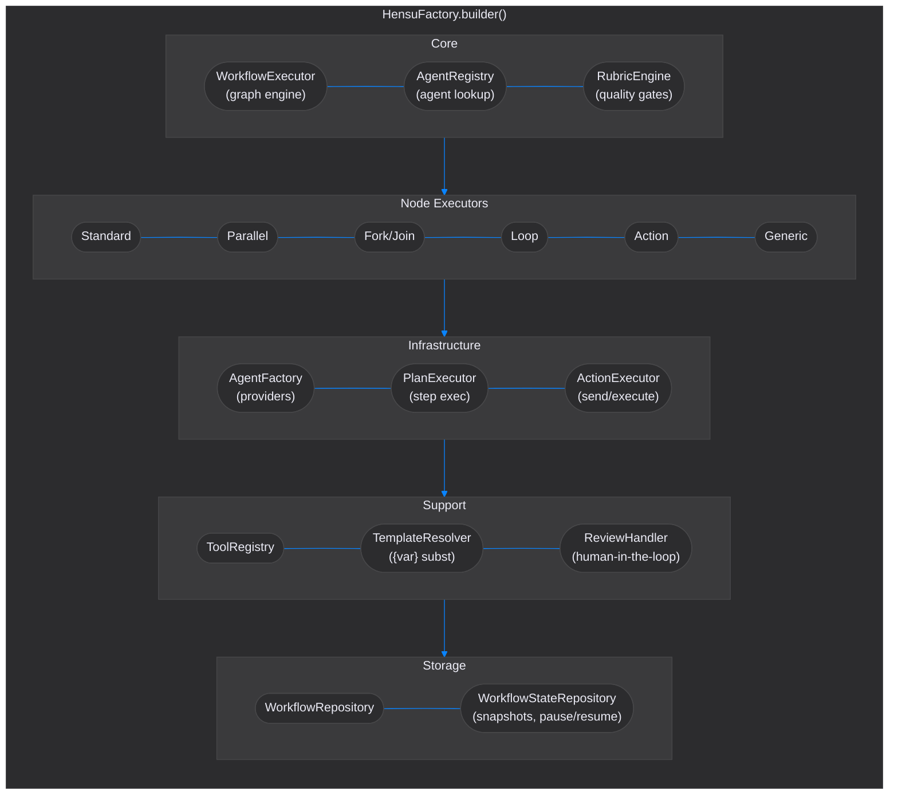
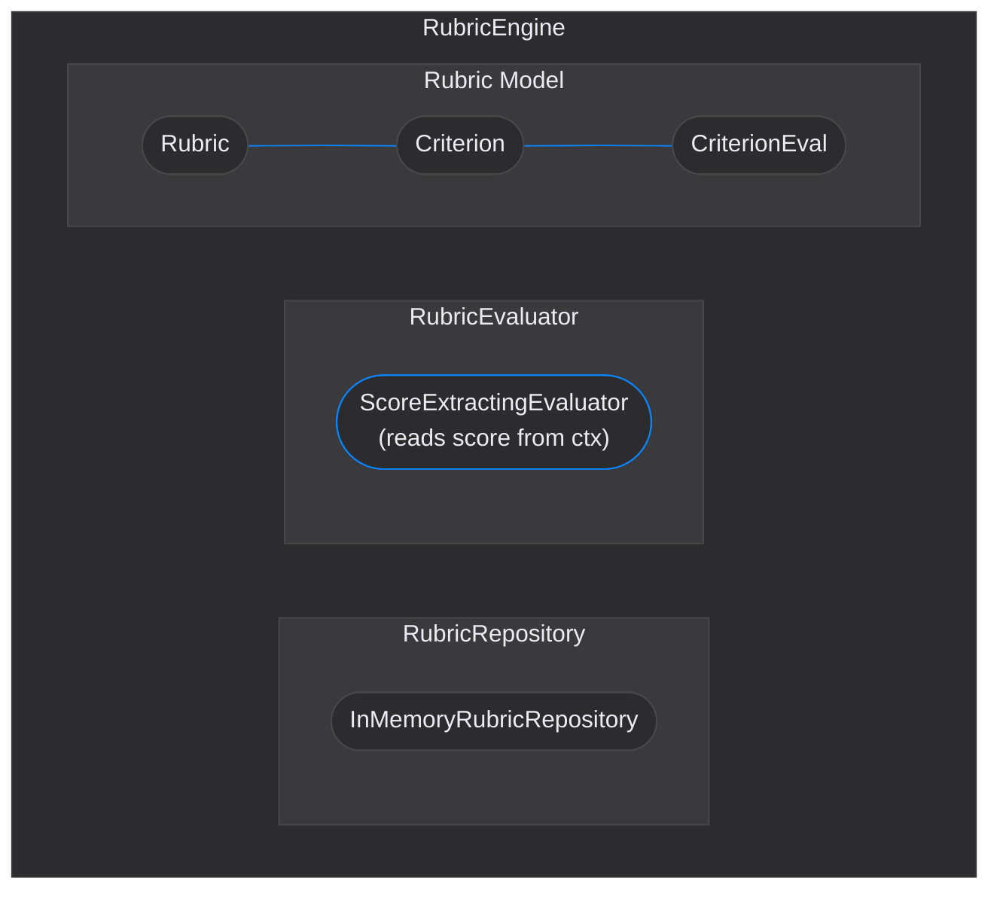
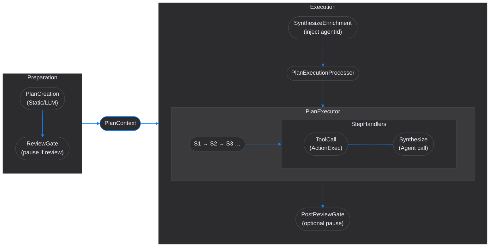

# Hensu Core

Pure Java workflow execution runtime with zero external dependencies.

## Overview

The `hensu-core` module is the execution engine at the heart of Hensu. It provides:

- **Workflow Execution** — Directed graph traversal with branching, looping, and parallel execution
- **Agent Abstraction** — Provider-agnostic AI agent interface with pluggable backends
- **Rubric Engine** — Quality evaluation with weighted criteria, score-based routing, and LLM-based assessment
- **Plan Engine** — Static or LLM-generated step-by-step plan execution within nodes
- **Tool Registry** — Protocol-agnostic tool descriptors for plan generation and MCP integration
- **Human Review** — Optional or required review checkpoints at any workflow step
- **Action System** — Extensible action dispatch (send, execute) with pluggable executors
- **Template Resolution** — `{variable}` placeholder substitution in prompts
- **State Snapshots** — Serializable execution state for persistence and time-travel debugging
- **Generic Nodes** — Extensible node types for custom workflow operations
- **Agentic Output Validation** — Defense-in-depth safety checks applied to all LLM-generated node outputs before they enter workflow state (ASCII control chars, Unicode manipulation chars, payload size)
- **State Schema & Validation** — Optional typed schema declaration for domain-specific state variables, with load-time validation of `writes` declarations and prompt `{variable}` references

## Architecture



## Key Design Principles

- **Zero external dependencies** — enforced by Gradle (`configurations.api` check fails the build on any dependency
  leak)
- **Provider-agnostic** — AI provider integration happens through `AgentProvider` interface, implemented in adapter
  modules
- **GraalVM native-image safe** — no reflection, no classpath scanning, explicit wiring only
- **Thread-safe after construction** — immutable components wired via `HensuFactory`
- **Storage interfaces in core** — `WorkflowRepository` and `WorkflowStateRepository` with in-memory defaults; server delegates via CDI

## Quick Start

```java
// Standalone (env vars for credentials, stub provider only)
var env = HensuFactory.createEnvironment();

// With explicit providers (recommended)
var env = HensuFactory.builder()
    .config(HensuConfig.builder().useVirtualThreads(true).build())
    .loadCredentials(properties)
    .agentProviders(List.of(new LangChain4jProvider()))
    .build();

// Execute a workflow
ExecutionResult result = env.getWorkflowExecutor().execute(workflow, initialContext);
```

## Rubric Engine

Quality evaluation engine for rubric-based output assessment. Evaluates workflow node outputs against configurable
rubrics to determine quality scores and pass/fail status.



**Key types:**

| Type               | Description                                                       |
|--------------------|-------------------------------------------------------------------|
| `RubricEngine`     | Orchestrates evaluation using repository and evaluator            |
| `RubricRepository` | Stores rubric definitions (in-memory by default)                  |
| `RubricEvaluator`  | Evaluates output against criteria (self-eval or external LLM)     |
| `Rubric`           | Immutable rubric definition with pass threshold and criteria list |
| `Criterion`        | Single evaluation dimension with weight and minimum score         |
| `RubricEvaluation` | Complete evaluation result with per-criterion scores              |

Score-based routing: nodes can use `ScoreTransition` to route based on evaluation scores (e.g., score >= 80 goto "approve", else goto "revise"). Nodes that write a boolean `approved` variable can use `ApprovalTransition` (`onApproval` / `onRejection` in DSL) for binary decision routing.

## Plan Engine

Pipeline-driven multi-step execution within a single `StandardNode`. `AgenticNodeExecutor`
runs two sequential `PlanPipeline` instances sharing a `PlanContext` carrier:



**Planning modes:**

| Mode       | Description                                    |
|------------|------------------------------------------------|
| `DISABLED` | No planning, direct agent execution (default)  |
| `STATIC`   | Predefined plan from DSL `plan { }` block      |
| `DYNAMIC`  | LLM generates plan at runtime via `LlmPlanner` |

**Key types:**

| Type                  | Description                                                  |
|-----------------------|--------------------------------------------------------------|
| `Plan`                | Sequence of steps with constraints and metadata              |
| `PlannedStep`         | Single step carrying a `PlanStepAction`                      |
| `PlanStepAction`      | Sealed type: `ToolCall` or `Synthesize`                      |
| `PlanPipeline`        | Executes an ordered chain of `PlanProcessor`s                |
| `PlanContext`         | Mutable carrier: node, active plan, execution context        |
| `PlanExecutor`        | Iterates plan steps via `StepHandlerRegistry`, emits events  |
| `StepHandlerRegistry` | Dispatches each step action to its `StepHandler`             |
| `Planner`             | Interface: `createPlan` / `revisePlan`                       |
| `StaticPlanner`       | Resolves predefined DSL steps (`STATIC` mode)                |
| `LlmPlanner`          | Generates and revises plans via LLM agent (`DYNAMIC` mode)   |
| `PlanObserver`        | Callback for monitoring plan lifecycle events                |

## Tool Registry

Protocol-agnostic tool descriptors used by plan generation and execution. The core defines tool shapes; actual
invocation happens through `ActionHandler` implementations at the application layer.

```java
// Register tools
ToolRegistry registry = new DefaultToolRegistry();
registry.register(ToolDefinition.simple("search", "Search the web"));
registry.register(ToolDefinition.of("analyze", "Analyze data",
    List.of(ParameterDef.required("input", "string", "Data to analyze"))));

// Tools are used by planners for step generation
// and by ActionExecutor for step execution
```

**Key types:**

| Type                  | Description                                                      |
|-----------------------|------------------------------------------------------------------|
| `ToolDefinition`      | Tool descriptor with name, description, and parameters           |
| `ParameterDef`        | Parameter type with name, type, required flag, and default value |
| `ToolRegistry`        | Interface for tool registration and lookup                       |
| `DefaultToolRegistry` | Thread-safe ConcurrentHashMap implementation                     |

The server layer populates the tool registry from MCP server connections. Tools discovered via MCP become available for
plan generation and execution.

## Module Structure

```
hensu-core/src/main/java/io/hensu/core/
├── HensuFactory.java              # Entry point — builder for HensuEnvironment
├── HensuEnvironment.java          # Component container (executor, registry, etc.)
├── HensuConfig.java               # Configuration (threading, storage)
├── agent/
│   ├── Agent.java                 # Core agent interface
│   ├── AgentConfig.java           # Agent configuration (model, temperature, etc.)
│   ├── AgentFactory.java          # Creates agents from explicit providers
│   ├── AgentProvider.java         # Provider interface for pluggable AI backends
│   ├── AgentRegistry.java         # Agent lookup interface
│   ├── DefaultAgentRegistry.java  # Thread-safe ConcurrentHashMap implementation
│   └── stub/
│       ├── StubAgentProvider.java # Testing provider (priority 1000 when enabled)
│       ├── StubAgent.java         # Mock agent returning stub responses
│       └── StubResponseRegistry.java
├── execution/
│   ├── WorkflowExecutor.java          # Main graph traversal engine (execute + executeFrom for resume)
│   ├── executor/
│   │   ├── NodeExecutor.java              # Interface for node type executors
│   │   ├── NodeExecutorRegistry.java      # Registry interface for node executor lookup
│   │   ├── DefaultNodeExecutorRegistry.java # Default implementation
│   │   ├── NodeResult.java                # Primary return type for all node executors
│   │   ├── ExecutionContext.java           # Per-execution context carrier (state + tenant)
│   │   ├── AgentLifecycleRunner.java      # Composition-based agent call: enrich → execute → extract
│   │   ├── AgenticNodeExecutor.java       # Drives preparation + execution PlanPipelines for StandardNode
│   │   ├── StandardNodeExecutor.java      # LLM prompt execution (no planning)
│   │   ├── ParallelNodeExecutor.java      # Concurrent branch execution
│   │   ├── ForkNodeExecutor.java          # Fork into parallel paths
│   │   ├── JoinNodeExecutor.java          # Merge parallel results
│   │   ├── LoopNodeExecutor.java          # Iterative execution
│   │   ├── ActionNodeExecutor.java        # Action dispatch
│   │   ├── GenericNodeExecutor.java       # Custom node handlers
│   │   ├── SubWorkflowNodeExecutor.java   # Nested workflow execution
│   │   └── EndNodeExecutor.java           # Terminal nodes
│   ├── EngineVariables.java                   # SSOT for engine variable names (score, approved, recommendation)
│   ├── enricher/
│   │   ├── EngineVariableInjector.java        # Single-injector interface
│   │   ├── EngineVariablePromptEnricher.java  # Composite enricher — runs injector chain before each agent call
│   │   ├── RubricPromptInjector.java          # Injects rubric criteria when node.rubricId is set
│   │   ├── ScoreVariableInjector.java         # Injects `score` requirement on ScoreTransition nodes or consensus branches
│   │   ├── ApprovalVariableInjector.java      # Injects `approved` requirement on ApprovalTransition nodes or consensus branches
│   │   ├── RecommendationVariableInjector.java # Injects `recommendation` on score/approval nodes or consensus branches
│   │   ├── WritesVariableInjector.java        # Injects field requirements for writes() variables with optional description hints
│   │   └── YieldsVariableInjector.java        # Injects field requirements for branch yields() variables
│   ├── pipeline/
│   │   ├── NodeExecutionProcessor.java          # Base processor interface
│   │   ├── PreNodeExecutionProcessor.java       # Pre-execution processor marker interface
│   │   ├── PostNodeExecutionProcessor.java      # Post-execution processor marker interface
│   │   ├── ProcessorContext.java                # Per-iteration context (node + result + state)
│   │   ├── ProcessorPipeline.java               # Orchestrates pre/post processor chains
│   │   ├── CheckpointPreProcessor.java          # Fires listener.onCheckpoint for crash-recovery persistence
│   │   ├── NodeStartPreProcessor.java           # Fires listener.onNodeStart for observability
│   │   ├── OutputExtractionPostProcessor.java   # Validates then stores node output in state context
│   │   ├── NodeCompletePostProcessor.java       # Fires listener.onNodeComplete for observability
│   │   ├── HistoryPostProcessor.java            # Records execution steps for audit
│   │   ├── ReviewPostProcessor.java             # Human-in-the-loop review checkpoints
│   │   ├── RubricPostProcessor.java             # Quality evaluation + auto-backtrack
│   │   └── TransitionPostProcessor.java         # Evaluates transition rules, sets next node
│   ├── action/
│   │   ├── Action.java            # Sealed interface: Send | Execute
│   │   ├── ActionExecutor.java    # Action dispatch interface
│   │   └── ActionHandler.java     # Per-action-type handler
│   ├── result/
│   │   ├── ExecutionResult.java   # Workflow execution outcome
│   │   ├── ExecutionHistory.java  # Step-by-step execution trace
│   │   └── ExecutionStep.java     # Single node execution record
│   └── parallel/
│       ├── Branch.java            # Parallel branch definition
│       ├── BranchResult.java      # Result of a single branch execution
│       ├── ConsensusStrategy.java # Multi-branch agreement strategy enum
│       ├── ConsensusConfig.java   # Consensus configuration (strategy, threshold)
│       ├── ConsensusEvaluator.java # Evaluates branch results against consensus rules
│       ├── ConsensusResult.java   # Outcome of consensus evaluation
│       ├── BranchExecutionConfig.java # Typed branch metadata on ExecutionContext (consensus, yields)
│       ├── FailureMarker.java     # Sentinel for failed branches in fork/join
│       └── ForkJoinContext.java   # Shared fork/join state
├── workflow/
│   ├── Workflow.java              # Workflow definition (agents + graph + optional state schema)
│   ├── WorkflowRepository.java   # Tenant-scoped workflow storage interface
│   ├── InMemoryWorkflowRepository.java  # Default in-memory implementation
│   ├── node/                      # Node types: Standard, Parallel, Fork, etc.
│   ├── transition/                # Transition rules: Success, Failure, Score, Approval, Always, etc.
│   ├── state/
│   │   ├── WorkflowStateSchema.java      # Typed state variable schema (optional per-workflow)
│   │   ├── StateVariableDeclaration.java # Variable declaration record (name, type, isInput)
│   │   └── VarType.java                  # Type enum: STRING, NUMBER, BOOLEAN, LIST_STRING
│   └── validation/
│       └── WorkflowValidator.java        # Load-time validator for writes + prompt {variable} refs
├── rubric/                        # Quality evaluation engine
│   ├── RubricEngine.java          # Evaluation orchestrator
│   ├── RubricRepository.java      # Rubric storage interface
│   ├── RubricParser.java          # Markdown rubric file parser
│   ├── model/                     # Rubric, Criterion, ScoreCondition, etc.
│   └── evaluator/
│       ├── RubricEvaluator.java          # Evaluator interface
│       └── ScoreExtractingEvaluator.java # Reads score engine variable from context; accumulates recommendation feedback
├── tool/                          # Protocol-agnostic tool descriptors
│   ├── ToolDefinition.java        # Tool shape (name, params, return type)
│   ├── ToolRegistry.java          # Tool registration/lookup interface
│   └── DefaultToolRegistry.java   # Thread-safe ConcurrentHashMap implementation
├── plan/                          # Agentic planning engine
│   ├── Plan.java                  # Plan model (steps + constraints)
│   ├── PlannedStep.java           # Single step with PlanStepAction
│   ├── PlanStepAction.java        # Sealed type: ToolCall | Synthesize
│   ├── PlanPipeline.java          # Executes ordered PlanProcessor chain
│   ├── PlanProcessor.java         # Single-phase processor interface
│   ├── PlanContext.java           # Mutable state carrier for plan pipelines
│   ├── PlanExecutor.java          # Iterates steps via StepHandlerRegistry
│   ├── StepHandlerRegistry.java   # Interface for PlanStepAction dispatch
│   ├── DefaultStepHandlerRegistry.java # Default implementation
│   ├── StepHandler.java           # Handler interface for one action type
│   ├── ToolCallStepHandler.java   # Handles ToolCall via ActionExecutor
│   ├── SynthesizeStepHandler.java # Handles Synthesize via agent invocation
│   ├── Planner.java               # Plan creation/revision interface
│   ├── StaticPlanner.java         # Resolves DSL plan {} steps (STATIC mode)
│   ├── LlmPlanner.java            # LLM-based plan generation (DYNAMIC mode)
│   ├── PlanningMode.java          # DISABLED, STATIC, DYNAMIC
│   ├── PlanningConfig.java        # Planning constraints configuration
│   ├── PlanResponseParser.java    # Parses LLM response into PlannedStep list
│   ├── PlanObserver.java          # Event callback interface
│   └── PlanEvent.java             # Plan lifecycle events
├── review/                        # Human review support
├── template/                      # {variable} placeholder resolution
├── util/
│   ├── AgentOutputValidator.java  # LLM output safety checks (control chars, Unicode tricks, size)
│   └── JsonUtil.java              # Dependency-free JSON extraction utilities
└── state/                         # Execution state and persistence
    ├── HensuState.java            # Mutable runtime state during execution
    ├── HensuSnapshot.java         # Immutable checkpoint record for persistence
    ├── WorkflowStateRepository.java     # Tenant-scoped state storage interface
    └── InMemoryWorkflowStateRepository.java  # Default in-memory implementation
```

## Node Types

| Node              | Description                                                                                                        |
|-------------------|--------------------------------------------------------------------------------------------------------------------|
| `StandardNode`    | Executes an LLM prompt, optionally writes structured state variables via `writes`, and transitions based on result |
| `ParallelNode`    | Runs multiple branches concurrently; branches declare domain output via `yields()` which merge into workflow state |
| `ForkNode`        | Splits execution into parallel paths                                                                               |
| `JoinNode`        | Merges parallel results with configurable strategy                                                                 |
| `LoopNode`        | Iterates until a condition or max iterations                                                                       |
| `ActionNode`      | Dispatches actions (send HTTP, execute command)                                                                    |
| `GenericNode`     | Custom handler for extensible operations                                                                           |
| `SubWorkflowNode` | Delegates to another workflow                                                                                      |
| `EndNode`         | Terminal node                                                                                                      |

## Transition Rules

| Rule                   | Description                                                               |
|------------------------|---------------------------------------------------------------------------|
| `SuccessTransition`    | Routes on successful execution                                            |
| `FailureTransition`    | Routes on execution failure                                               |
| `ScoreTransition`      | Routes based on rubric evaluation score                                   |
| `ApprovalTransition`   | Routes on the `approved` boolean engine variable (fall-through if absent) |
| `AlwaysTransition`     | Unconditional transition                                                  |
| `RubricFailTransition` | Routes when rubric evaluation itself fails                                |

## Agent Provider Interface

Implement `AgentProvider` to add support for new AI backends:

```java
public class MyProvider implements AgentProvider {
    public String getName() { return "my-provider"; }
    public boolean supportsModel(String model) { return model.startsWith("my-"); }
    public Agent createAgent(String id, AgentConfig config, Map<String, String> credentials) {
        return new MyAgent(id, config, credentials.get("MY_API_KEY"));
    }
}
```

Wire providers explicitly via `HensuFactory.builder().agentProviders(...)`. The built-in `StubAgentProvider` is always
included automatically for testing support.

## Stub Mode

Enable stub mode for testing without API calls:

```bash
export HENSU_STUB_ENABLED=true
```

Or via properties: `hensu.stub.enabled=true`

When enabled, `StubAgentProvider` (priority 1000) intercepts all model requests, returning mock responses.

## Documentation

| Document                                           | Description                                                |
|----------------------------------------------------|------------------------------------------------------------|
| [Developer Guide](../docs/developer-guide-core.md) | Architecture deep-dive, extension points, testing patterns |

## Dependencies

- **None** — zero external dependencies enforced at build time
- Test dependencies: JUnit 5, Mockito, AssertJ
