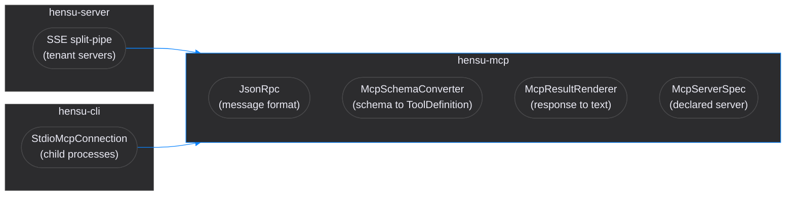

# Hensu MCP

Runtime-agnostic Model Context Protocol surface shared by the CLI and the server.

## Overview

The `hensu-mcp` module holds the parts of MCP that do not depend on how a connection is
established: the JSON-RPC message format, the translation between MCP's JSON Schema and the
engine's `ToolDefinition`, and the rendering of a `tools/call` response into text an agent can
read.

Transport stays with whoever owns it. The server reaches tenant MCP servers over an SSE
split-pipe and pools those connections; the CLI launches stdio servers as child processes through
`StdioMcpConnection`. Both speak the same protocol above that line, so everything above it lives
here and neither runtime reimplements it.

The stdio client lives here rather than in the CLI because it is protocol work, but it must not
drag a sandbox implementation into a module the server also compiles against. It therefore takes
the containment it applies to a launch as a `UnaryOperator<List<String>>`, and the CLI passes its
own `SandboxLauncher` in.

The module carries no CDI annotations and no framework types. Its classes are plain objects the
server publishes through producers and the CLI constructs directly.



## Entry Points

### `JsonRpc` — message construction and parsing

```java
JsonRpc jsonRpc = new JsonRpc(mapper);

String request = jsonRpc.createRequest(id, "tools/call", params);
Map<String, Object> result = jsonRpc.parseResult(responseJson);   // throws McpException on error
```

Parsing stays on Jackson's tree model (`readTree`), never data binding, so no reflective
deserialization enters the native image. The class is deliberately not a CDI bean: the server
exposes it via a `@Produces` method in `ServerConfiguration`, and the CLI constructs one.

### `McpSchemaConverter` — MCP schema to engine model

```java
ToolDefinition tool = McpSchemaConverter.convert(descriptor);
```

Reads the parts of JSON Schema the engine can act on — property name, `type`, `description`,
`default`, and membership in the schema's `required` array. Richer constructs are left to the MCP
server to enforce. A malformed schema degrades to "no parameters" rather than throwing, so one bad
descriptor cannot take down a whole catalog.

Discovered parameters are never marked `sensitive`: MCP has no way to express that a value is a
secret, and claiming otherwise would make the audit trail redact values the server itself
publishes in plain schema. Only locally declared tools can make that claim.

### `McpResultRenderer` — response to agent-readable text

```java
ToolCallResult result = McpResultRenderer.toResult(toolName, response);
```

An MCP result is an ordered array of typed content blocks. Passing that map to a model directly
would put a Java `Map.toString` — braces, equals signs, identity hashes — into the context window.
The renderer flattens it instead:

| Block                            | Rendered as                             |
|----------------------------------|-----------------------------------------|
| `text`                           | its text, in array order, one per line  |
| `image`, `audio`                 | `[image: image/png]`                    |
| `resource`, `resource_link`      | `[resource: file:///etc/hosts (text/plain)]` |
| unrecognized payload             | canonical JSON                          |

Non-text blocks carry bytes a text completion cannot consume, so only the block type and whatever
locates it survive. A response setting `isError: true` becomes `ToolCallStatus.FAILURE` carrying
the rendered text as its error message, so the agent sees what went wrong.

### `StdioMcpConnection` — a server process this run owns

```java
McpConnection connection = StdioMcpConnection.open(
        spec, workingDirectory, launcher::wrapForServer, System.getenv());
```

Launches the declared argv, speaks line-delimited JSON-RPC over the child's standard input and
output, and kills the process tree on `close()`. Four properties follow from the server outliving
any single call:

- **Containment is applied once, at launch.** A long-lived process cannot be sandboxed per request,
  so the caller supplies the wrapper and decides — before starting anything — what happens when no
  backend is available.
- **The environment is hermetic.** The child starts empty and receives
  `HermeticEnvironment.PASSTHROUGH` plus the server's own `env:`. Nothing that authenticates the
  operator reaches an MCP server.
- **Each request carries its own deadline.** `McpServerSpec.requestTimeoutMs` bounds every
  `initialize`, `tools/list` and `tools/call`; a lapsed request drops its correlation entry and
  raises `McpException` instead of pinning the workflow thread.
- **Standard error is drained.** A server that logs would otherwise block on a full pipe and look
  like a hang.

## Module Structure

```
hensu-mcp/src/main/java/io/hensu/mcp/
├── JsonRpc.java                # JSON-RPC 2.0 message construction and tree-model parsing
├── McpConnection.java          # Connection contract + McpToolDescriptor record
├── McpConnectionFactory.java   # Transport-specific connection establishment
├── McpException.java           # Protocol, connection, and tool-invocation failures
├── McpSchemaConverter.java     # MCP JSON Schema to ToolDefinition
├── McpResultRenderer.java      # tools/call response to ToolCallResult
├── McpServerSpec.java          # One locally launched server, as a deployment declared it
└── StdioMcpConnection.java     # stdio transport: launch, speak JSON-RPC, kill the tree
```

Test fixtures live in `src/testFixtures`: `FakeMcpServer` is a real process the stdio tests launch,
and the CLI reuses it rather than growing a second copy.

## Consumers

| Runtime        | Transport                         | Provider                                         | Status |
|----------------|-----------------------------------|--------------------------------------------------|--------|
| `hensu-server` | SSE split-pipe, pooled per tenant | `McpToolProvider` — tenant-scoped catalog        | wired  |
| `hensu-cli`    | stdio child processes             | `LocalMcpToolProvider` — servers from `mcp.yaml` | wired  |

Each contributes a `ToolProvider` to the engine's `ToolRouter`, so an agent cannot tell which
transport produced a result. That is the reason the rendering rules above live in this module
rather than beside either transport.

## Dependencies

- `hensu-core` (API dependency) — for `ToolDefinition`, `ToolCallResult`, `ToolCallStatus`
- Jackson BOM 2.20.1 (`jackson-databind`) — resolved by the Quarkus BOM inside `hensu-server`
- Test: JUnit 5, AssertJ

## See Also

- [Server Developer Guide](../docs/developer-guide-server.md) — MCP transport, tenant scoping, dynamic tool discovery
- [Core Developer Guide](../docs/developer-guide-core.md) — the `ToolProvider` seam and the agent tool loop
